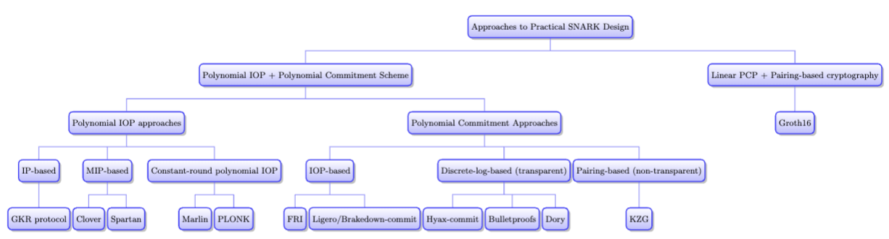

# Chapter 19: Bird’s Eye View of Practical Arguments

## 19.1 A Taxonomy of SNARKs

Outside of the **linear-PCP-based SNARKs**, most known **SNARKs** are obtained by combining some **[IP](../../terms/ip.md)**,  **MIP**,
 or **constant-round polynomial IOP** with a **polynomial commitment** scheme.

For example:

| Polynomial IOP approaches | Polynomial Commitment Approaches | SNARK |
| ---- | ---- | ---- |
| IPs | FRI-based (multilinear) polynomial commitments | Virgo |
| IPs | Discrete-log-based (multilinear) polynomial commitments (Bulletproofs, Hyrax-commit) | Hyrax |
| IPs | KZG-based (multilinear) polynomial commitments | zk-vSQL and Libra |
| MIPs | Discrete-logarithm-based multilinear commitments | Spartan, Xiphos, Kopis. |
| MIPs | Brakedown-commitment | Brakedown |
| MIPs | Ligero-commitment. | Shockwave |
| Constant-round polynomial IOP | Ligero | Ligero |
| Constant-round polynomial IOPs | FRI-based (univariate) polynomial commitments | Aurora, Fractal, and Redshift |
| Constant-round polynomial IOPs | KZG-based (univariate) polynomial commitments | Marlin |

Beside that, the most popular variant of the SNARK derived from GGPR’s linear PCP is
Groth16.

**More SNARKs via composition**: On top of the taxonomy of SNARKs delineated above, one can take any two SNARKs designed via one of the
above approaches, and compose them one or more times. Such compositions are growing increasingly popular and already yield
state-of-the-art performance.

For example, PlonKy2 self-composes the SNARK obtained by combining the [PlonK](../../docs/plonk.md) polynomial IOP with the FRI
polynomial commitment scheme, Polygon Hermez is composing such a FRI-based SNARK with Groth16, Orion composes Brakedown with Virgo to
reduce proof size, etc.

## 19.2 Pros and Cons of the Approaches

Sections 10.6 discussed the pros and cons of the **IP, MIP,** and **constant-round polynomial IOP**, while sections 16.3 discussed
those of
polynomial commitment scheme. In this section, our aim is to do the same for the various combinations and for SNARKs derived from
linear **PCPs**.

**Approaches Minimizing Proof Size**

There are 2 approaches that achieve proofs consisting of a constant
number(i.e., the smallest proof size) of group elements:

1. Linear PCPs: smallest proof size (3 group elements).
2. Constant-round polynomial IOPs combined with KZG-based polynomial commitments.

The downsides of these are:

1. They both require a [trusted setup](../../terms/trusted_setup.md). For [SRS](../../terms/structured_reference_string.md), it is
suniversal and updatable for Constant-round polynomial IOPs, computation-specific for Linear PCPs.
2. Computationally expensive for the prover.

**Transparency**: (depend on the polynomial commitment scheme)

All of the remaining approaches are transparent unless they choose to use KZG-based polynomial commitments. They use uniform reference
string ([URS](../../terms/uniform_reference_string.md)) rather than a [SRS](../../terms/structured_reference_string.md), and hence no
toxic waste is produced.

**Post-quantum security**:

The approaches that are plausibly post-quantum secure are comprised of those
that utilize an IOP-based polynomial commitment (FRI, Ligero, Brakedown).

The others are not due to their reliance on the hardness of discrete log.

**Dominant contributor to cost: polynomial commitments**

Normally, the polynomial commitment dominates the most relevant costs: prover time, proof length, and verifier time when combined with
MIPs and constant-round polynomial IOPs.  

> [!NOTE]
There is an exception that, if an MIP is combined with KZG commitments, it is the MIP and not the polynomial commitment that dominates
verification costs.

Here is a brief summary of how concrete costs compare. Prover costs:

1. FRI and Bulletproofs are the most expensive polynomial commitment schemes.
2. Pairings (Dory and KZG commitments).
3. Hyrax, Ligero and Brakedown’s commitments are similar.
4. Brakedown is slightly faster.

Commitment size and evaluation proof length:

1. Brakedown > Ligero > Hyrax: roughly square-root size proofs.
2. FRI: polylogarithmic proof size.
3. Dory and Bulletproofs: logarithmic size proofs.
4. KZG-commitments for univariate polynomials (constant size).

**Constant-round IOPs vs. MIPs and IPs.**

**Constant-round IOPs**:  much slower and more space intensive for the prover because they require to commit to many polynomials
($\ge 10$), while in **MIPs and IPs**, prover needs to commit only single polynomial.

**On pre-processing and work-saving for the verifier**.

The approaches requiring an [SRS](../../terms/structured_reference_string.md) inherently require a pre-processing phase to generate
the SRS and this take time proportional to the size of the circuit.
But the other approaches (combining any IP, MIP, or IOP with IOP-based or discrete-log-based polynomial commitments) can achieve a
work-saving verifier without pre-processing.

**Prover time in holographic vs. non-holographic SNARKs**

See the definition of holographic system [here](../../terms/holography.md).

Non-holographic systems may achieve faster prover time as measured on a per-gate basis, but they may have to use much bigger circuits.

## 19.3 Other Issues Affecting Concrete Efficiency

### 19.3.1 Field Choice

The designer’s choice of field to work over can be limited:

1. Many cryptographic applications naturally work over fields that do not satisfy the
   properties required by many SNARKs.
2. For certain fields, addition and multiplication are particularly efficient on modern computers.

**Guaranteeing soundness**

All of the **IPs, IOPs, MIPs**, and **linear PCPs** that we have covered have soundness error that is at least $1/|F|$ (and often
larger by significant factors). So, $|F|$ must be chosen sufficiently large to ensure the desired level of soundness.

**Limitations coming from discrete-logarithm-based or KZG-based polynomial commitments**

SNARKs making use of discrete-logarithm-based or **KZG**-based polynomial commitments or **linear PCPs** must use a field of size
equal to the order of the cryptographic group that the polynomial commitment is defined over.

**Limitations coming from [FFTs](../../terms/fast_fourier_transforms.md)**

SNARKs derived from **IOPs** and **linear PCPs** require the prover to perform FFTs over large vectors, so they need finite fields
that support FFT algorithm. In particular, standard FFT algorithms running in time $\tilde O(n)$ on vectors of length $n$
work only for prime fields $F_p$ if $p-1$ has many small prime factors.  

**Limitations coming from program-to-circuit transformations**

IOP-derived SNARKs that aim to emulate arbitrary computer programs (Random Access Machines (RAMs)),  save computational work for the
verifier and avoid pre-processing that only work over fields of [characteristic](../../terms/characteristic) 2.

**Other considerations in field choice.**

Arithmetic-heavy computations may be more efficiently simulated when working over prime fields while computations heavy on bitwise
operations may be better suited to fields of characteristic 2.

### 19.3.2 Relative Efficiency of Different Operations

The bottleneck for the prover is performing FFTs over the field or group operations or the field choice.

For example:

- SNARKs for R1CS derived from constant-round polynomial IOP: Prover performs FFT over a vector of length $Θ(K)$ ($O(KlogK)$ runtime)
and build one or more Merkle trees over vectors of length $Θ(K)$ ($O(K)$ runtime) where $K$ is the number of nonzero matrix entries of
the R1CS system.
- An MIP which combined with many of the discrete-logarithm-based or KZG-based polynomial commitment schemes needs to perform one
multi-exponentation of size proportional to $K$ ($O(Klog(|G|)/logK)$ group multiplications).

### 19.3.3 Intermediate Representations (IRs) Other than Arithmetic Circuits and R1CS

SNARKs based on polynomial IOPs can be modified to support more general intermediate representations.

The use of expanded gate sets can be fruitful. If we allow gates computing degree-3-operations instead of $2$, the size of $S$ will be
reduced by a factor of $2$, meanwhile the prover's runtime increases by a factor of $4/3$.

The use of more expensive and idiosyncratic IRs may yield important efficiency gains. However, it may increase the burden on protocol d
esigners or render it more difficult to develop or reuse infrastructure.
