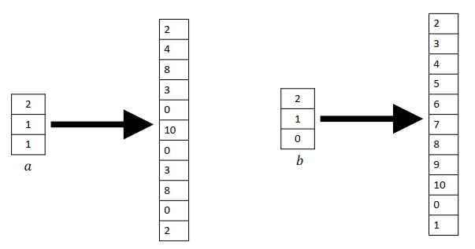

# Chapter 2

## Reed-Solomon Fingerprinting `rid-'solomon`

In Reed-Solomon Fingerprinting, Alice optimizes data transfer by sending only hashes to Bob instead of the entire file.
The integrity check involves comparing the hash values, providing Bob with a high level of confidence in file equality.

### The Setting

| Symbol          | Definition                     | Note                |
|-----------------|--------------------------------|---------------------|
| a               | Alice's file                   |                     |
| b               | Bob's file                     |                     |
| n               | number of characters           |                     |
| m               | number of possible characters  |                     |
| $a_1$,...,$a_n$ | Alice's characters             |                     |
| $b_1$,...,$b_n$ | Bob's characters               |                     |
| H               | hash functions family          |                     |
| h(x)            | hash function                  |                     |
| p               | modulo                         | $p\geq\max(m, n^2)$ |
| $\mathbb{F}_p$  | finite field over p            |                     |
| r               | random value in $\mathbb{F}_p$ |                     |
| v               | $h_r(a)$                       |                     |

## Freivalds' Algorithm `f'rei volz`

Freivalds' Algorithm involves verifying the equality of matrices C and D received from the prover.

### The Setting

| Symbol         | Definition                      | Note                |
|----------------|---------------------------------|---------------------|
| p              | modulo                          | $p\geq\max(m, n^2)$ |
| $\mathbb{F}_p$ | finite field over p             |                     |
| r              | random value in $\mathbb{F}_p$  |                     |
| x              | $x = (1,r,r^2,...,r^{n-1})$     |                     |
| n              | number of rows/cols in a matrix |                     |
| C              | prover's result matrix          |                     |
| D              | the real result matrix          |                     |

### Steps

1. Calculate y = Cx (see example).
2. Calculate z = A.Bx.
3. Compare y == z?

This approach shortens the comparison time:

- A.B ($n^{2.37}$)
- Cx ($n^2$), A.Bx ($2n^2$), y == z ($2n$) => Total runtime: $n^2$

## Examples

1. Multiply a matrix by a vector

   Consider matrices:

   $A = \begin{bmatrix} 1 & 2 & 3 \\ 4 & 5 & 6 \\ 7 & 8 & 9 \end{bmatrix}$
   $B = \begin{bmatrix} 1 \\ r \\ r ^ 2 \end{bmatrix}$

   The product $C$ is obtained as follows:

   $C_{1,1} = 3r^2 + 2r + 1$
   $C_{2,1} = 6r^2 + 5r + 4$
   $C_{3,1} = 9r^2 + 8r + 7$

   Resulting in:

   $C = \begin{bmatrix} 3r^2 + 2r + 1 \\ 6r^2 + 5r + 4 \\ 9r^2 + 8r + 7 \end{bmatrix}$

## An Alternative View of Fingerprinting and Freivalds’ Algorithm

Suppose we want to compare two vectors, \(a\) and \(b\). We first convert them into two polynomials over the field \(\mathbb{F}_p\), where \(p\) is much larger than \(n\). As can be seen from the image below, if we evaluate these two polynomials at any points, the results are likely to differ from each other.

## Univariate Lagrange Interpolation

