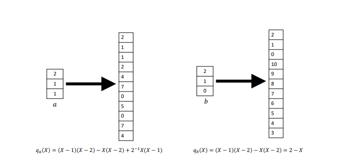

# Chapter 2: The Power of Randomness (Fingerprinting and Freivalds’ Algorithm)

## Reed-Solomon Fingerprinting

Explore more details in the [Reed-Solomon Fingerprinting documentation](../../docs/reed_solomon_fingerprinting.md).

## Freivalds' Algorithm `f'rei volz`

Freivalds' Algorithm involves verifying the equality of matrices $C$ and $D$ received from the prover.

### The Setting

| Symbol         | Definition                      | Note                |
|----------------|---------------------------------|---------------------|
| p              | modulo                          | $p\geq\max(m, n^2)$ |
| $\mathbb{F}_p$ | finite field over p             |                     |
| r              | random value in $\mathbb{F}_p$  |                     |
| x              | $x = (1,r,r^2,...,r^{n-1})$     |                     |
| n              | number of rows/cols in a matrix |                     |
| $C$            | prover's result matrix          |                     |
| $D$            | the real result matrix          |                     |

### Steps

1. Calculate $y = Cx$ (see example).
2. Calculate $z = A.Bx$.
3. Compare $y == z$?

### Runtime

This approach shortens the comparison time:

- A.B ($n^{2.37}$)
- Cx ($n^2$), A.Bx ($2n^2$), y == z ($2n$) => Total runtime: $n^2$

Reason: The time complexity of multiplying a (n x n) matrix and a vector of size n is $O(n^2)$.

## Examples

1. Multiply a matrix by a vector

   Consider matrices:

   $`A = \begin{bmatrix} 1 & 2 & 3 \\ 4 & 5 & 6 \\ 7 & 8 & 9 \end{bmatrix}`$

   $`B = \begin{bmatrix} 1 \\ r \\ r ^ 2 \end{bmatrix}`$

   The product $C$ is obtained as follows:

   $C_{1,1} = 3r^2 + 2r + 1$

   $C_{2,1} = 6r^2 + 5r + 4$

   $C_{3,1} = 9r^2 + 8r + 7$

   Resulting in:

   $`C = \begin{bmatrix} 3r^2 + 2r + 1 \\ 6r^2 + 5r + 4 \\ 9r^2 + 8r + 7 \end{bmatrix}`$

## An Alternative View of Fingerprinting and Freivalds’ Algorithm

Suppose we want to compare two vectors, $a$ and $b$. We first convert them into two polynomials over the field
$\mathbb{F}_p$, where $p$ is much larger than $n$. As can be seen from the image below, if we evaluate these two
polynomials at any points, the results are likely to differ from each other.

## Univariate Lagrange Interpolation

There are other ways to interpret $a$ as the description of a univariate polynomial $q_a$ of degree $n−1$.

**Lemma 2.3**: For any vector $a = (a_1,...,a_n)$ ∈ $F_n$, there is a unique univariate polynomial $q_a$ of degree at
most $n−1$ such that:
$q_a(i)  = a_{i + 1}$ for i: 0 -> n - 1

Now, use Lagrange basis polynomials to find $q_a$
$δ_i(X) = \prod_{k: 0-> n - 1, k != i} (X - k) / (i - k)$

Then:
$q_a(X) = \Sigma_{i = 0}^{n - 1} a_{j + 1} * δ_i(X)$

$q_a$ is often called the univariate low-degree extension (LDE) of $a$

### Runtime

O(n) additions, multiplications, and inversions over $F_p$. The reason is that $δ_i(r)$ can be computed from $δ_{i - 1}(
r)$:

$δ_i(r) = δ_{i−1}(r)·(r −(i−1))·(r −i)^{-1}·i^{-1}·(−(n−i))$
