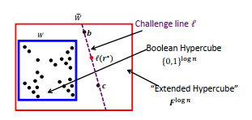

# Chapter 4 - Interactive Proofs

 In this chapter, our primary focus is on the Sum-check protocol and GKR protocol. While other parts are not as crucial, it is
 important to read them to fully understand the Interactive Proof.

## 4.1 The Sum-Check Protocol

You should read the definition of Sum-Check protocol [here](../../terms/sumcheck_protocol.md)

## 4.2 SAT $\in$ IP

First, we should see the definitions of [Boolean circuit](../../terms/boolean_circuit.md) and
[Boolean formula](../../terms/boolean_formula.md)

The **SAT** problem:
$\phi$ is any Boolean formula on $n$ variables of size $S$ = poly($n$) ($S$ is bounded above by O($n^k$)). We also use $\phi$ to refer
the function on $\{0, 1\}^n$ that the formula computes.

**GOAL**:  compute the number of satisfying assignments of $\phi$:  $\sum_{x \in \{0, 1\}^n} \phi (x)$

**Interactive proof for # SAT**
Define $g$ as an extension of $\phi$, $$\sum_{x \in \{0, 1\}^n} g(x)  = \sum_{x \in \{0, 1\}^n} \phi(x)$$

Turn $\phi$ into an *arithmetic circuit* $\psi$ over $F$ that computes the extension $g$ of $\phi$. The process of replacing the
Boolean formula $\phi$ to $\psi$ is called ==arithmetization==.

Replace:

- AND($y, z$) = $y·z$
- OR($y, z$) = $y + z - y·z$
- $\overline y$ = 1 - $y$

Number of gates in $\psi$ at most $3S$.

For the polynomial $g$ computed by $\psi$ ,  $\sum^n_{i=1}deg_i(g) \le S$.

The cost:

| Communication         | Rounds | $V$ time | $P$ time |
| --------------------- | ------ | -------- | -------- |
| $O(S)$ field elements | $n$       | $O(S)$         | $O(S^2 \cdot 2^n)$         |

**IP = PSPACE**
See [Adleman's Theorem](../../terms/adleman_theorem.md)

## 4.3 Second Application: A Simple IP for Counting Triangles in Graphs

You should read the definition of doubly-efficient [here](../../terms/doubly_efficient.md)

**The problem:**

Let $G=(V, E)$ be a simple graph (undirected, unweighted, no self-loops, no repeat edges) on $n$ vertices. Let $A \in \{0,1\}^{n*n}$
be the adjacency matrix of $G$.

**Input**: $A$

**Output**: the number of unordered node triples which are all connected to each other.

We view $A$ as a function $f_A$ :  $\{0, 1\}^{logn} × \{0, 1\}^{logn}  \rightarrow \{0, 1\}$.
The number of triangles: $$\Delta = \frac{1}{6} \sum_{x, y,z \in \{0,1\}^{logn}} f_A(x, y)· f_A(y, z)· f_A(x, z)$$ Let $F$ be a finite
field of size $p \ge 6n^3$. Recalling that $\tilde f_A$ is the MLE of $f_A$ over $F$, define the ($3logn$)-variate polynomial $g$:
$$g(X, Y, Z) = \tilde f_A(X, Y) \cdot \tilde f_A(Y, Z) \cdot \tilde f_A(Z, X)$$.
So we have:
$$6\Delta = \sum_{x, y, z \in \{0, 1\}^{logn}} g(x, y, z)$$
Then, we apply [sum-check protocol](../../terms/sumcheck_protocol.md) to compute $\Delta$.

**Cost**:

- $3logn$ round. Communication cost is O($logn$).
- Verifiers run at O($n^2$).
- Provers run at O($n^5$).

## 4.4 Third Application: Super-Efficient IP for MATMULT (matrix multiplication)

Given two n×n input matrices $A, B$ over field $F$, the goal of $MATMULT$ is to compute: $C = A·B$.

If [Freivalds' Algorithm](chapter_2.md#Freivalds'%20Algorithm%20`f'rei%20volz`) is used to verify the matrix multiplication, for each
step the product matrix must be sent, necessitating $\Omega(n^2)$ communication. In $MATMULT$, $P$ does not need to send the full
answer matrix and the communication cost is O($log n$).

**Advantages:**

- It does not care how the prover finds the right answer.
- The prover in the protocol of this section simply finds the right answer and then does O($n^2$) extra work to prove correctness.

**The protocol**
First, we interpret $A$, $B$, and $C$ as the functions $f_A, f_B, f_C$ mapping $\{0,1\}^{logn} ×\{0,1\}^{logn}$ to $F$:
$$f_A(i_1,...,i_{logn}, j_1,...,j_{logn}) = A_{ij}$$ and $\tilde f_A, \tilde f_B, \tilde f_C$ denote the MLEs of their.
We can see this protocol as a protocol for evaluating $\tilde f_C$ at any given point ($r1,r2$).

We also have: $\tilde f_C(x,y) = \sum_{b \in \{0, 1\}^{logn}} \tilde f_A(x, b) · \tilde f_B(b, y)$ (Because MLE of $C$ is unique
([see here](../../terms/uniqueness_of_multilinear_extension.md)), so the left and right hand sides of this equation agree for Boolean
vector $i, j \in \{0, 1\}^{logn}$).
Hence, we compute $\tilde f_C(r1, r2)$ by applying the [sum-check protocol](../../terms/sumcheck_protocol.md) to the ($logn$)-variate
polynomial:
$$g(z):= \tilde f_A(r_1, z) · \tilde f_B(z, r_2)$$

**Discussion of costs**

- Since $g$ is a ($logn$)-variate polynomial of degree 2, so the total communication is O($logn$).
- $V$: $g$ can be evaluate at any point in O($n^2$) time.
- $P$: because in each round $k$, $P$ sends a quadratic polynomial $g_k(X_k)$ claim to equal:
$$\sum_{b_{k+1} \in \{0, 1\}}...\sum_{b_{logn} \in \{0, 1\}} g(r_{3, 1},...r_{3,k-1},X_k,b_{k+1},...b_{logn})$$ Then, $P$ just sends
the value $g_k(0), g_k(1),g_k(2)$. So there are: $3 \times n / 2^k$ points in round $k$.

There are 3 methods to perform these evaluations:

### Method 1

$g$ can be evaluate in O($n^2$) at any point, so the total runtime:  O($\sum_k n^3 / 2^k$) = O($n^3$)

### Method 2

$P$ can update: $\tilde f_A(z) \leftarrow \tilde f_A(z) + A_{ij}χ_{i,j}(z)$ for the three relevant values of $z$. The runtime is
$\Theta (n^2)$ per round and the total runtime is O($nlogn$)

### Method 3

**Informal fact:** If two entries $(i, j), (i', j') \in \{0, 1\}^{logn} \times \{0, 1\}^{logn}$  agree in their last $l$ bits, then
$A_{i,j}$ and $A_{i',j'}$ contribute to the same three points in each of final $l$ rounds of the protocol.
The specific points that they contribute to in each round $k \ge log(n) - l$ :
$$z=(r_{3,1},...r_{3, k-1}, {0, 1, 2},b_{k+1},...,b_{logn})$$ where $(b_{k+1},...b_{logn})$ equal the trailing bits of
$(i,j), (i', j')$. $P$ can treat
$(i', j')$ and $(i, j)$ as a single entity. There are only $n^2/2^k$ entities after $k$ variables have been bound, then the total work
that $P$ does is: $$O(\sum^{2logn}_{k=1} n^2/2^k)= O(n^2)$$

## 4.5 Applications of the Super-Efficient MATMULT IP

### 4.5.1 For Counting Triangles

Let $A$ is the adjacency matrix of a simple graph. The formula to compute number of triangles in the graph is:
$$6\Delta = \sum_{i,j\in\{1,...,n\}}(A^2)_{i,j} \cdot A_{ij}$$

which $\Delta$ is the number of triangles, $(A^2)_{i,j}$ counts the number of common neighbors of vertices $i$ and $j$.
It is possible to give an $IP$ for counting triangles in which $P$ essentially establishes that he correctly materialized $A^2$ and
use it to generate output via the formula above.

**The protocol**

As in [Section 4.3](chapter_4.md#4.3%20Second%20Application%20A%20Simple%20IP%20for%20Counting%20Triangles%20in%20Graphs), the formula
above equals $$\sum_{x,y \in \{0,1\}^{logn}} \tilde f_{A^2}(x, y)\cdot f_{A}(x, y)$$
At the end of this protocol, the **Verifier** can evaluate $\tilde f_A(r1,r2)$ in $O(n^2)$ time using
[VSBW13](../../terms/lagrange_interpolation.md#VSBW13) and $\tilde f_{A^2}(r1, r2)$ using **MATMULT** in
[Section 4.4](chapter_4.md#4.4%20Third%20Application%20Super-Efficient%20IP%20for%20MATMULT%20(matrix%20multiplication)).

**Costs of the Counting Triangles Protocol**

- Communication and Rounds: $O(logn)$
- Verifier runtime: $O(n^2)$
- Prover runtime: $O(n^2)$

### 4.5.2 Reducing Multiple Polynomial Evaluations to One

Let $\tilde W$ is a multilinear polynomial over $F$ with $logn$ variables, and the **Verifier** wishes to evaluate $\tilde W$ at 2
points:  $b, c \in F^{logn}$.

We cover a simple 1-round IP that reduces the evaluation of $\tilde W(b)$ and $\tilde W(c)$ to the evaluation of $\tilde W(r)$ with
$r \in F^{logn}$.

**The protocol**

Let $l: F \rightarrow F^{logn}$ be some canonical line passing through $b$ and $c$. For example: $l(0) = b$ and $l(1) = c$. $P$ sends
a univariate polynomial $q$ of degree at most $logn$ that is claimed to be $\tilde W \circ l$, the
[restriction](../../terms/restriction.md) of $\tilde W$ to $l$.  

**Verifier** interprets $q(0)$ and $q(1)$ as the claims to the values of $\tilde W(b)$ and $\tilde W(c)$. $V$ picks a random point
$r^∗ \in F$, sets $r = l(r^∗)$, and interprets $q(r^∗)$ as the prover’s claim as to the value of $\tilde W(r)$.

**Claim 4.6:** Let $\tilde W$ be a multilinear polynomial over $F$ in $logn$ variables. If $q = \tilde W \circ l$, then
$q(0) = \tilde W(b)$,  $q(1) = \tilde W(c)$, and $q(r^∗) = \tilde W(l(r^∗))$ for all $r^∗ \in F$. Meanwhile, if
$q \ne  \tilde W \circ l$, then with probability at least $1 - logn/|F|$ over a randomly chosen
$r^∗ \in F$, $q(r^∗) \ne \tilde W (l(r^∗))$.

This is the schematic of how to reduce verifying claims:

If the $V$ needs to evaluate $\tilde W$ at more than two points, he needs to change the $l$. For example, if he needs to know
$\tilde W$ at $a, b, c$, he needs to create $l$ as a canonical degree-two curve passing through $a, b$, and $c$. So, the degree of $q$
is $2logn$, and the soundness error is $1 - 2logn / |F|$.

This protocol could be applied at the end of both of the counting triangles protocols that we have covered, with $\tilde W$ equal to
$\tilde f_A$, to reduce the number of points at which $V$ needs to evaluate from three to one.

### 4.5.3 A Super-Efficient IP for Matrix Powers

Suppose that a **Verifier** wants to evaluate a single entry of the powered matrix $A^k$ for a large integer $k$, using **MATMULT**
**IP** of  [Section 4.4](chapter_4.md#4.4%20Third%20Application%20Super-Efficient%20IP%20for%20MATMULT%20(matrix%20multiplication)),
he can do this with $O(logk \cdot logn)$ rounds and communication, and run in $O(n^2 + log(k)log(n))$ time.

Clearly we can express the matrix $A^k$ as a product of smaller powers of $A$: $$A^k= A^{k/2} \cdot A^{k/2}$$
Let $g_l$ denote the multilinear extension of the matrix $A^l$, so we compute $(A^k)_{n, n}$ = $g_k(1,1)$. ($(1, 1)$ is meant to
denote the binary string indexing the bottom-right matrix entry)

At the end of the **MATMULT**, [IP](../../terms/ip.md) applied to two $n \times n$ matrices $A', B'$, the verifier needs to evaluate
$\tilde f_{A^′}$ and $\tilde f_{B′}$ at the respective points $(r1,r2)$ and $(r2,r3)$, both in $F^{logn} × F^{logn}$. In the equation,
$A'$ and $B'$ equal $A^{k/2}$.

Via [Section 4.5.2](chapter_4.md#4.5%20Applications%20of%20the%20Super-Efficient%20MATMULT%20IP#4.5.2%20Reducing%20Multiple%20Polynomial%20Evaluations%20to%20One), the $V$ can reduces evaluating a polynomial at two point to a single point.  We can use recursion to compute $A^{k/2}$ via $A^{k/4}$. After $logk$ layers of recursion, there is no need to recurse further since the verifier can evaluate $g_1 = \tilde f_A$ at any desired input in $O(n^2)$ time.

### 4.5.4 A General Paradigm for IPs with Super-Efficient Provers

There are other algorithms that invoke **MATMULT** to compute some product matrix $C$, and then apply some post-processing to $C$ to
compute an answer that is much smaller than $C$ itself.

Consider the problem of computing the diameter of a directed graph $G$. Let $A$ denote the adjacency matrix of $G$, and $I$ is the
$n \times n$ identity matrix. Then the diameter of $G$ is the  
least positive number $d$ such that: $$(A + I)^d_{ij} \ne 0$$ for all $(i, j)$.

So the protocol is:

- $P$ sends the claimed output $d$ to $V$ and an $(i, j)$ such that  $(A + I)^{d-1}_{ij} = 0$
- $V$ needs to check:
  - all entries of $(A + I)^d$ are nonzero
  - $(A + I)^{d-1}_{ij}$ is indeed zero

The first task is accomplished by combining the **MATMULT** protocol with the **GKR** protocol.
The second task is similarly accomplished using $O(logd)$ invocations of the **MATMULT** protocol - since $V$ only needs one entry of
$(A + I)^{d-1}$, $P$ does not need to send the matrix in full, and the total communication here is just polylog$(n)$.

Ultimately, $V$’s runtime in this diameter protocol is $O(mlogn)$, where $m$ is the number of edges in $G$

### 4.5.5 An IP for Small-Space Computations (IP = PSPACE)

**Result of GKR**: all problems solvable in logarithmic space have an [IP](../../terms/ip.md) with a quasilinear-time verifier,
polynomial time prover, and polylogarithmic proof length.

## 4.6 The GKR Protocol and Its Efficient Implementation

### 4.6.1 Motivation

### 4.6.2 The GKR Protocol and Its Costs

First, $V$ and $P$ agree on a arithmetic circuit $C$, and the goal is to compute the value of the output gate($s$) of $C$.

Let $S$ is the size (number of gates) of $C$ and $n$ is number of variables. They key feature of **GKR protocol** is that the $P$ runs
in time poly($S$), and the cost to the verifier is $O(dlogS)$, which $d$ is the deep of $C$, and only logarithmically with $S$.

### 4.6.3 Protocol Overview

Suppose that $C$ has depth $d$, and number the layer from 0 to $d$ with layer $d$ referring to the input layer, and layer 0 referring
to the output layer.

The first message, $P$ tells $V$ the (claimed) output($s$) of the circuit. The protocol then works its way 
in iterations towards the input layer, with one iteration devoted to each layer.

The first iteration uses a [sum-check protocol](../../terms/sumcheck_protocol.md) to reduce this claim about the outputs of the
circuit to a claim about the gate values at layer 2, and so on. Eventually, $V$ is left with a claim about the inputs to the circuit,
and $V$ can check this claim without any help.

### 4.6.4 Protocol Details

Let $S_i$ denote the number of gates at layer $i$ of the circuit $C$. Assume $S_i$ is power of 2 and $S_i = 2^{k_i}$.
So, number the gate at layer $i$ from 0 to $S_i - 1$, and let $W_i : \{0, 1\}^{k_i} \rightarrow F$ denote the function that takes as
input a binary gate label, and outputs the corresponding gate’s value at layer $i$.

**Example:**

Let $in_{1,i}, in_{2,i}$ denote functions that if gate $a$ at layer $i$ compute the sum of gates $b$ and $c$ at layer $i + 1$ then
$in_{1,i}(a) = b, in_{2,i}(a) = c$.
Denote two function:

- $add_i$ , take as input $(a, b, c)$ return 1 if and only if $(b, c) = (in_{1,i}(a),in_{2,i}(a))$ and gate $a$ is addition.
- $mult_i$ is the same, but gate $a$ is multiplication.

For example, which the Figure above, $mult_0$ evaluates to 1 on the following inputs: $(0,(0,0),(0,1))$ and $(1,(1,0),(1,1))$ and
evaluates to 0 for all others.

**Detailed Description**
The symbol $\tilde f$ means the MLE of the function $f$.

The GKR protocol consists of $d$ iterations, one for each layer of the circuit. Each iteration $i$ starts with $P$ claiming a value
for $\tilde W_i(r_i)$ for some point in $r_i \in F^{k_i}$.

At the start of the first iteration, let $D: \{0, 1\}^{k_0} \rightarrow F$  denote the function that maps the label of an output gate
to the claimed value of that output. Then verifier can pick a random point $r_0 \in F^{k_0}$ and check if
$\tilde D(r_0) = \tilde W_0(r_0)$ (i.e., if the **MLE** of the claimed outputs equals the **MLE** of the correct outputs when
evaluated at a randomly chosen point), then it is safe for the verifier to believe that
all of the claimed outputs are correct. But to evaluate $\tilde W_0(r_0)$, verifier need to claim about $\tilde W_1$, and so on.  

**Applying the [Sum-Check Protocol](../../terms/sumcheck_protocol.md)**

**Lemma:** We have an explicit expression for $\tilde W$:
$$\tilde W_i(z) = \sum_{b, c \in \{0, 1\}^{k_{i+1}}} \tilde{add_i}(z, b, c) (\tilde W_{i +1}(b)+\tilde W_{i +1}(c)) +
\tilde{mult_i}(z, b, c) (\tilde W_{i +1}(b)\cdot\tilde W_{i +1}(c))$$

**Description of the GKR protocol**

1. At the start of the protocol, $P$ sends a function $D: \{0,1\}^{k_0} \rightarrow F$ claimed to equal $W_0$.
2. $V$ picks a random $r_0 \in F^{k0}$ and lets $m_0 \leftarrow \tilde D(r_0)$. The remainder of the protocol is devoted to confirming
that $m_0 = \tilde W_0(r_0)$.
3. For $i = 0, 1, ..., d-1$:
   - Define the $(2k_{i+1})$-variate polynomial:
   $$f_{r_i}^{(i)}(b,c):=\tilde{add_i}(r_i, b, c)(\tilde W_{i +1}(b)+\tilde W_{i +1}(c))+\tilde{mult_i}(r_i,b,c)(\tilde W_{i +1}(b)\cdot\tilde W_{i+1}(c))$$
   - P claims that $\sum_{b,c \in \{0,1\}^{k_{i+1}}} f_{r_i}^{(i)}(b,c) = m_i$.
   - So that $V$ may check this claim, $P$ and $V$ apply the [sum-check protocol](../../terms/sumcheck_protocol.md) to
   $f_{r_i}^{(i)}$, up until $V’s$ final check in that protocol, when $V$ must evaluate $f_{r_i}^{(i)}$ at randomly chosen point
   $(b^∗,c^∗) \in F^{k_{i+1}} \times F^{k_{i+1}}$.
   - Let $l$ be the unique line satisfying $l(0) = b^∗$ and $l(1) = c^∗$. $P$ sends a univariate polynomial $q$ of degree at most
   $k_{i+1}$ to $V$, claimed to equal $\tilde W_{i+1}$ restricted to $l$.
   - $V$ now performs the final check in the [sum-check protocol](../../terms/sumcheck_protocol.md), using $q(0)$ and $q(1)$ instead
   of  $\tilde W_{i+1}(b^∗)$ and $\tilde W_{i+1}(c^∗)$.
   - $V$ chooses $r^∗ \in F$ at random and sets $r_{i+1} = l(r^∗)$ and $m_{i+1} \leftarrow q(r^*)$ (for details, see
   [Section 4.5.2](chapter_4.md#4.5%20Applications%20of%20the%20Super-Efficient%20MATMULT%20IP#4.5.2%20Reducing%20Multiple%20Polynomial%20Evaluations%20to%20One)).
   - To evaluate $\tilde{add_i}(r_i, b^*, c^*)$,  $\tilde{mult_i}(r_i, b^*, c^*)$, we can do it in polylogarithmic time. We will
   discuss this in [Section 4.6.6](chapter_4.md#4.6.6%20Evaluating%20$%20tilde%20{add}_i$%20and%20$%20tilde%20{mult}_i$%20Efficiently).
4. $V$ checks directly that $m_d = \tilde W_d(r_d)$ using [VSBW13](../../terms/lagrange_interpolation.md). Note that $\tilde W_d$ is
the **MLE** of input $x$, and $V$ can compute it in $O(n)$, which $n$ is the size of the input.

**Example**: Compute $\tilde W$ in a circuit over $F_5$ consisting entirely of multiplication gates

### 4.6.5 Discussion of Costs and Soundness

**V's runtime**

- The total communication cost is $O(S_0 + dlogS)$, where $S_0$ is the number of outputs.
- The time cost to $V$ is $O(n + dlogS + t + S_0)$, where:
  - $t$ is the amount of time required for $V$ to evaluate $\tilde{add_i}, \tilde{mult_i}$ for each layer $i$.
  - $n$ is the time required to evaluate $\tilde W_d(r_d)$.
  - $S_0$ is the time required to read the vector of claimed outputs and evaluate the corresponding **MLE**.
  - $dlogS$ is the time required for $V$ to send messages to $P$ and process and check the messages from $P$.

**P's runtime**

- $O(S^3)$.
- Can be improved by using [Lagrange Interpolation](../../terms/lagrange_interpolation.md).

**Round complexity and communication cost**

- $O(dlogS)$ rounds.

**Soundness error**

- The soundness error is: $O(dlog(S)/|F|)$.

### 4.6.6 Evaluating $\tilde {add}_i$ and $\tilde {mult}_i$ Efficiently

The issue of the verifier efficiently evaluating $\tilde {add}_i$  and $\tilde {mult}_i$ at a random point
$\omega \in F^{k_i+2k_{i+1}}$ is a tricky one.

The papers [CMT12](https://arxiv.org/abs/1105.2003), [Tha13](https://arxiv.org/abs/1304.3812) show that the evaluation can be computed
in $O(k_i + k_{i+1}) = O(logS)$ time for a variety of common wiring patterns and specific circuits.
For the circuits where $\tilde {add}_i$  and $\tilde {mult}_i$ cannot be evaluated in time sublinear in the circuit size $S$ leverages
cryptography, there is a cryptographic primitive called a ==polynomial commitment scheme== to force the prover to accurately evaluate
$\tilde {add}_i$  and $\tilde {mult}_i$ on its behalf.
