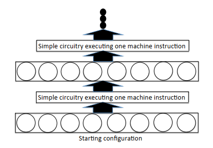
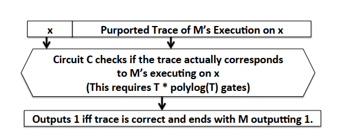

# Front Ends: Turning Computer Programs Into Circuits

## 6.1 Introduction

Most general purpose argument system implementations work in this two-step manner:

1. Computer program is complied into a model amenable to probabilistic checking, such as an arithmetic circuit (==front end==).
2. Interactive proof or argument system is applied to check that the prover correctly evaluate the circuit (==backend==).

Any computer programming that halts within $T$ time steps can be turned into a low-depth, layered, fan-in two arithmetic circuit of
size at most $O(T logT)$.

## 6.2 Machine Code

A program runs in $T(n)$ time steps is a program which can be compiled into a sequence of machine instructions of length at most
$T(n)$.

A program runs on a hardware model which is a simple RAM (Random Access Machine).
You should read the definition of [RAM](../../terms/random_access_machine).

## 6.3 A First Technique For Turning Programs Into Circuits (Sketch)

If a program runs in time $T(n)$ on a [RAM](../../terms/random_access_machine) with at most $s(n)$ cells of memory, then the program
can be turned into a layered, fan-in $2$ arithmetic circuit of depth not much more than $T(n)$ and width of about $s(n)$.

The basic idea of the transformation is to have the circuit proceed in iterations, one for each time step of the computer program. The
$i$'th iteration takes as input the configuration of the [RAM](../../terms/random_access_machine) after $i$ steps of the program have
been executed. Then, it determines what the configuration of the RAM would be after the $(i+1)$'th machine instruction is executed.

This is the caricature of the technique above:

Unfortunately, the circuits have size $\tilde \Theta(T(n) \cdot s(n))$. So this transformation is impractical.

## 6.4 Turning Small-Space Programs Into Shallow Circuits

The second technique for turning computer programs generates shallower circuits as long as the computer program doesn’t use much
space. It takes any program that runs in time $T$ and space $s$ and turns it into a circuit of depth $s \cdot logT$ and size
$2^{\Theta(s)}$.

We see that a [RAM](../../terms/random_access_machine) using $s$ bits of space have at most $2^{O(s)}$ configurations. So we can
define $A$ as the adjacency matrix of it, where $A_{i,j} = 1$ if configuration $i$ can turn directly to configuration $j$ , and
$A_{i, j}=0$ otherwise.  Then, the circuit repeatedly squares $A$ to compute $A^T$ and output the $(i, j)$ where $i$ is the starting
configuration and $j$ is the ending configuration.

The circuit that used for multiplying two $N \times N$ matrices has $O(logN)$ depth. So, the circuit repeated squares $A$ to compute
$A^T$ has $O(log(2^{\Theta(s)}) \cdot logT) = O(s \cdot logT)$ depth and $2^{\Theta(s)}$ size.

## 6.5 Turning Computer Programs Into Circuit Satisfiability Instances

### 6.5.1 The Circuit Satisfiability Problem

In the arithmetic circuit evaluation problem with circuit $C$, input $x$, and output $y$, the goal is to determine whether: $C(x) = y$.

In the arithmetic satisfiability problem (circuit-SAT), the circuit $C$ takes 2 inputs: $x$ and which is public and fixed and $w$,
often referred to as the ==witness==, or non-deterministic, or auxiliary input. Given the input $x$ and output $y$, the goal is to
determine whether *there exist* a $w$ such that $C(x,w) = y$.

For an untrusted prover to prove that he knows a witness $w$ such that $C(x, w) = y$, he needs to create a succinct arguments,
especially so-called ==SNARKs==. Ideally, the proof size and verification time of the SNARK will be far smaller than the way $P$ sends
$w$ to $V$ and $V$ evaluates $C(x,w)$ on its own, and $P$ will run in time close to the time evaluate $C(c, w)$.

**Why Circuit-SAT instances are expressive**

Intuitively, circuit satisfiability instances should be “more expressive” than circuit evaluation instances, for the same reason that
checking a proof of a claim tends to be easier then discovering the proof in the first place.

For example, a program computes a function $a/b$. Suppose that we need to turn this program into an arithmetic circuit evaluation
instance $C$. Since the gate of $C$ only compute addition and multiplication operations, $C$ would need to replace $a/b$ with
$a * b^{-1}$. Then, to compute $b^{-1}$, $C$ needs to be an expensive, huge circuit.

In contrast, to turn this program into an equivalent circuit satisfiability instance, we can demand that the witness $w$ contains a
field element $e$ that should be set to $b^{-1}$. So, the circuit can check that $e = b^{-1}$ by adding an output gate that computes
$e \cdot b -1$. This output gate will equal $0\iff e = b^{-1}$. Thus, $C$ needs fewer gates.

### 6.5.2 Preview: How Do Succinct Arguments for Circuit Satisfiability Operate?

To claim that there exists a $w$ such that $C(x, w) = y$,  the prover can directly send $w$ to the verifier, and run the
[GKR protocol](../../terms/gkr_protocol.md) to check that $C(x, w) = y$. This approach works well if the witness $w$ is small.

However, in the circuit-SAT, the size of $w$ is often large, of size roughly $T$ (the runtime of the computer program). So, asking the
verifier to read $w$ is as expensive as running the whole program herself. The, we need to use ==polynomial commitment scheme== that
avoids having the prover sends the entire $w$ to the verifier.

To obtain a succinct arguments for circuit satisfiability, the prover runs the commit phase of polynomial commitment scheme to bind
himself to the witness $w$. Then, during the protocol, verifier can force the prover to reveal any information about $w$ that the
verifier needs to know to perform its checks.\
For example, in order to run the [GKR protocol](../../terms/gkr_protocol.md) on circuit $C$ with input $u = (x, w)$, the verifier
needs to know the evaluation of $\tilde u$ at a random point. So, the polynomial commitment scheme should bind the prover to the
multilinear polynomial $\tilde w$.

### 6.5.3 The Transformation From Computer Programs To Arithmetic Circuit Satisfiability

You should read the definition of transcript [here](../../terms/transcript.md).

So, the basic idea is transform from RAM execution into a circuit $(C, x, y)$ where:

- $x$ is the input of $M$.
- $y$ is the claimed output.
- The witness $w$ is supposed to be the transcript of $M$'s execution of input $x$.

The circuit $C$ checks that $w$ is indeed the transcript of $M$'s execution on input $x$. If this check passes, $C$ outputs the same
value as $M$ does. Otherwise, $C$ outputs a special rejection symbol.

Here is the schematic of $C$:

### 6.5.4 Details of the Transformation

Here, a transcript consists of (timestamp, list) pairs. A list specifies the bits contained in the current program counter and the
values of all of $M$'s registers.

The circuit checks that the transcript is valid. It amounts to checking that the transcript satisfies:

- **Memory consistency**: whenever a value is read from a memory location, check that the claimed value in the transcript is equal to
the last value written to that location.
- **Time consistency**: *assuming that memory consistency holds*, check that for each timestep $i \in \{1,...,T-1\}$, the claimed
state of the machine at time $i+1$ correctly follows from the machine’s claimed state at time $i$.

The time consistency is checked by representing the transition function of [RAM](../../terms/random_access_machine.md) as a small
sub-circuit
([Section 6.5.4.1](chapter_6.md#6.5.4.1%20Representing%20transition%20functions%20of%20RAMs%20as%20small%20arithmetic%20circuits)).
Then, it applies the sub-circuit to each entry $i$ of the transcript and checks that the output is equal to the entry $i + 1$.  

The memory consistency is checked by reordering the transcript entries based on the memory location read from or written to, with ties
broken by time (memory ordering). Entries that do not perform either a memory read or write operation can be placed at the end of the
reordered transcript. Then, it is straightforward for the circuit to check that every memory read from a given location returns the
last value written to that location.

Note that all of the at most $T$ time-consistency checks and memory-consistency checks can be done in parallel. As we will see,
reordering can also be done in logarithmic depth. This ensures that $C$ has polylogarithmic depth.

#### 6.5.4.1 Representing Transition Functions of RAMs as Small Arithmetic Circuits

If a Random Access Machine has [word](../../terms/word.md) size $W$ then any primitive instruction other than memory accesses
(e.g., integer arithmetic, bitwise operations, integer comparisons, etc.) can be implemented in a
circuit-satisfiability instance using $poly(W)$ many gates.

For example, suppose the circuit is defined over a field $F_p$, one wishes to determine whether $a > b$ with $a, b \in F_p$. Let
$l = log_2(p).$ The circuit can ensure that the witness contains $2l$ bits $a_0,...,a_{l-1},b_0,...,b_{l-1}$ representing the binary
representations of $a$ and $b$ respectively as follows:

- To check that $a_i$ is in $\{0, 1\}$, the circuit includes an output gate computing $a_i^2 - a_i$ and checks if it equals to $0$.
- To check that $a_0,...,a_{l-1}$ is the binary representation of $a$, the circuit includes an output gate computing:
$a - \sum_{i=0}^l a_i2^i$ and checks if it equal to $0$.
- To check whether $a > b$, the circuit includes an output gate computing an arithmetization of the Boolean circuit that checks
bit-by-bit:
  - First, for $j \in {l-2, l-3,..., 1}$, define: $$A_j = \prod_{j'>j}(a_{j'}b_{j'} + (1-a_{j'})(1-b_{j'}))$$
  - Then the following expression equals $1$ if $a > b$ and $0$ otherwise:
  $$a_{l-1}(1-b_{l-1}) + A_{l-2}a_{l-2}(1-b_{l-2})+...+A_0 \cdot a_0(1-b_0)$$

#### 6.5.4.2 How to Sort with a Non-deterministic Circuit

To reordering the transcript entries, we use the method ==routing networks==. The reader may skip this section’s discussion of routing
networks with no loss of continuity.

## 6.6 Alternative Transformations and Optimizations

The previous section gave a way to turn any [RAM](../../terms/random_access_machine.md) $M$ with runtime $T$ into a circuit $C$ of
size $\tilde O(T)$ such that the output of $M$ on input $x$ equals $y$ if and only if there exists a $w$ such that $C(x,w) = y$. In
this section, we relax this requirement on $C$ in one of two following ways.

### 6.6.1 Ensuring Memory Consistency via Merkle Tree

First, you should read the definition of Merkle Tree [here](../../terms/merkle_tree.md).

The idea is that $C$ will insist that every memory read in the transcript is immediately followed by “**authentication information**”
that a polynomial-time prover is only capable of producing if the value returned by the memory read is the last value written to that
memory location. In addition, each write operation must also be accompanied by "authentication information" to enable appropriately
updating the Merkle tree.

Here, the set in the [Merkle tree](../../terms/merkle_tree.md) is the (memory location, value) pairs comprising the RAM's memory at a
given step of the RAM's execution during which a memory read occurs.

### 6.6.2 Ensuring Memory Consistency via Fingerprinting

Another technique for checking memory consistency is to use simple fingerprinting-based memory checking techniques (recall:
[Reed-Solomon Fingerprinting](chapter_2.md#Reed-Solomon%20Fingerprinting)).

Beside public input $x$ and witness $w$, $C$ takes a third input $r \in F$ such that for any pair $x, y$:

- If $M(x) = y$ then there exists a $w$ such that: $\forall r \in F: C(x, w, r) = 1$. Moreover, $w$ can be derived easily by any
prover running $M$ with input $x$.
- If $M(x) \ne y$, then $\forall w$, the probability over a randomly chosen $r \in F$ that $C(x, w, r) = 1$ is at most
$\tilde O(T) / |F|$.

Indeed, after the prover commits to $w$ (or more precisely to the [MLE](../../terms/uniqueness_of_multilinear_extension.md) $\tilde w$
of $w$, using a polynomial commitment scheme), the verifier can then select $r$ at random, and the prover can then run the
[GKR protocol](../../terms/gkr_protocol.md) to convince the verifier that $C(x,w,r) = 1$. Then, the interaction can be removed using
the [Fiat-Shamir transformation](../../terms/fiat_shamir.md).

The idea of the randomized fingerprinting-based memory-consistency-checking procedure implemented within the circuit $C$ is the
following.

By tweaking the behavior of the machine $M$, a time-consistent transcript for $M$ is also memory consistent if and only if the
multiset of (memory location, value) pairs written from memory equals (or is the permutation of) the multiset of (memory location,
value) pairs read from memory (*Reducing memory-consistency-checking to multiset equality checking*). To check this two multisets, we
can interpret each multiset as a polynomial whose roots are pairs and use
[Reed-Solomon Fingerprinting](chapter_2.md#Reed-Solomon%20Fingerprinting) (*Permutation checking via fingerprinting*).

This requires only $O(m)$ gates ($m$ is the size of the multiset) and logarithmic depth. Hence, this randomized algorithm for
permutation checking can be efficiently implemented within the arithmetic circuit $C$.

### 6.6.3 Efficiently Representing Non-Arithmetic Operations Over Large Prime-Order Fields

Non-arithmetic operations on integer values are more challenging to implement inside an arithmetic
circuit.
[Section 6.5.4.1](chapter_6.md#6.5.4.1%20Representing%20transition%20functions%20of%20RAMs%20as%20small%20arithmetic%20circuits)
describes an straightforward approach, breaking fields elements into binary representation and operating over these bits. But this
approach is expensive because it transforms an integer into at least $log_2 p$ field elements and requires at least $log_2p$ gates
(where $p$ is the prime order of the field).

To replace $O(logp)$ cost, Bootle et al. [BCG+18](https://www.iacr.org/archive/asiacrypt2018/11272305/11272305.pdf) develop a
technique that helps to implement these operations inside a circuit with a constant independent of $p$. Details follow:

Let $W$ is the [word-size](../../terms/word.md) and $T$ is a bound on the runtime of the
[Random Access Machine](../../terms/random_access_machine.md) ($W \ge log_2(T)$ to ensure that a timestamp can be store in one word).\
To represent integers $y \in [0, 2^W]$, instead of using base $b=2$, we use $b = 2^{W/c}$ for some specified integer constant $c > 1$.
So, $y$ is represented via $c$ field elements rather than $W$ field elements.

To check whether a field element $x$ is in the set $\{0, 1,...,b-1\}$, we create a *lookup table* of size $2^{W/c}$ . The circuit
initializes a table containing the values $\{0, 1,...,b-1\}$, and then have the *witness* include a proof that all values appearing in
the base-$b$ decomposition of any integer $y$ arising in the computation reside in the table. The lookup table is initialized to
contain a certain set of $2^{W/c}$ pre-determined values (i.e., the values are independent of the input to the computation).

First, we explain how to efficiently verify a long sequence of lookup operations.\
The technique builds on the permutation-invariant fingerprinting function of
[Section 6.6.2](chapter_6.md#6.6.2%20Ensuring%20Memory%20Consistency%20via%20Fingerprinting). To show that a set $\{f_1,...,f_N\}$
only contains elements from a lookup table $\{s_1,...,s_B\}$, it is enough to show that there are non-negative integers $e_1,...,e_B$
such that:  $$h(X) = \prod_{i=1}^N(X-f_i)$$ and $$q(X) = \prod_{i=1}^B (X-s_i)^{e_i}$$ are the same.\
To establish this, the witness will display the bit representation of $e_1,...,e_B$ (each $e_i \in \{0, 1\}^{log_2N}$) and the circuit
confirms that $h(r) = q(r)$ for a random $r \in \mathbb{F}$ chosen by the verifier. Then, the soundness error is $N/p$. Here, $q(r)$
can be computed by $O(Blog(N))$ gates: $$\prod_{i=1}^B \prod_{j=1}^{log_2N} (r-s_i)^{2^j \cdot e_{i,j}}$$ So long as
$N = O(T), B = 2^{W/c} \le N/logN$, this is $O(T)$ operations in total.

Then, we dive into how to reduce non-arithmetic operations to lookups. For simplicity, let $c = 2$. To confirm that a field element
$v$ is in the range $[0, 2^W]$, one can have the witness specify $v$ such that: $v = 2^{W/2} \cdot a + b$ with
$a, b \in \{0, ..., 2^{W/2-1} \}$. The circuit $C$ now checks that indeed: $v = 2^{W/2} \cdot a + b$ and $a, b$ are both reside in a
lookup table of size $2^{W/2}$.
