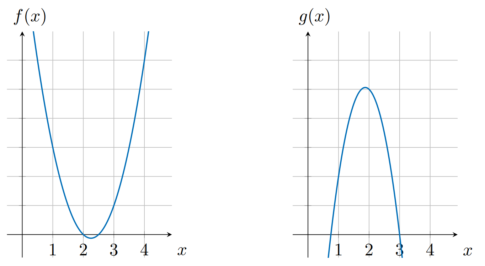

# Chapter 4
## 4.1. Computation
This step is to translate the program into the polynomial form.
Example , we have a simple program : 
```javascript
function calc(w,a,b)
	if w then 
		return a x b
	else 
		return a + b
	else if 
end function
```

assuming $\omega \in \{0,1\}$  : 
$f(\omega,a,b) = \omega (a * b ) + (1- \omega )(a*b)$  
## 4.2. Single Operation 
Any computation at it is core consists of elemental operations of the form:
                 *left operand*  **operator** *right operand* = *output*
### 4.2.1. Arithmetic Properties of Polynomials
Let us consider two following polynomials : 
$f(x) = 2x^{2}-9x+10$
$g(x)=-4x^{2}+15x-9$ 
$h(x) = f(x) * g(x) = -8x^{4}+66x^{3}-193x^{2}+231x -90$

Visualized : 



As we have :
$f(1) = 3, \space  g(1) =2, \space h(1) = 6 = 3 * 2$    
Moreover if we add $f(x) \space and \space g(x)$ , we have $s(x) = -2x^{2}+6x+1$  
$s(1)=5= 3+2$ 

## 4.3. Enforcing Operation
An operation polynomial can be represented :
$l(x) \space operator \space r(x) \space = \space o(x)$ 
* $l(x)$ : left operand
* $r(x)$ : right operand
* $o(x)$ : output of the operation
At a value $\alpha$ the operands and the output will be represented correctly if the evaluation of $l(\alpha) \space operator \space r(\alpha) \space = \space o(\alpha)$ should hold.
As the fact that the *operation polynomial* $l(\alpha) \space operator \space r(\alpha) \space -o(\alpha) = \space0$ has to evaluate to 0 at $\alpha$ $\Rightarrow \alpha$ is a root of *operation polynomial* so the *target polynomial* $t(x) = x- \alpha$ 
The operation polynomial then will be:
$$l(x)*r(x) = o(x)$$
In particular, $l(x) = 3x$ , $r(x) = 2x$ so $o(x)=6x$  :

$$
\begin{aligned}
 3x * 2x = 6x \\
 6x^{2}-6x = 0 \\
            \\
 6x(x-1)  = 0 \\
\end{aligned}
$$

Therefore if the prover provides such polynomials $l(x),r(x),o(x)$ instead of former $p(x)$. The verifier will accept it as valid since it's *divisible by $t(x)$*.
On the other side, if the prover tries to cheat and replace output with 4, $o(x)=4x$ , then the *operation polynomial* will be $6x^{2}-4x =0$, which not have a solution $x=1$  
Henceforth $l(x)*r(x) -o(x)$ is not divisible by $t(x)$ 

$\Rightarrow$ Not be accepted by the verifier.
## 4.4 Proof of Operation 

- Prover need to provide separately evaluations of polynomials $l(s),r(s),o(s)$ . 
- Verifier needs to check that $l(s) * r(s) -o(s) = t(s)h(s)$ . But the subtraction $(-o(x))$ is an expensive operation ( require to find inverse of $g^{o(s)}$ ) . So we move $o(x)$  to the right side : 
  $$l(s) * r(s)  = t(s)h(s) + o(s)$$
- In encrypted space, verifier's check translates to :
$$
\begin{aligned}
e(g^{l(s)},g^{r(s)}) = e(g^{t(s)},g^{h(s)}) \cdot e(g^{o},g) \\
e(g,g)^{l(s)r(s)} = e(g,g)^{t(s)h(s)} \cdot e(g,g)^{o(s)}    \\
e(g,g)^{l(s)r(s)} = e(g,g)^{t(s)h(s) + o(s)}                 \\
\end{aligned}
$$
#### Protocol  
**Setup** :
- Sample random values $s,\alpha$
- Calculate $g^{\alpha}$ and $g^{s^{i}}$, $g^{\alpha s^{i}}$
- Proving key ($g^{s^{i}},g^{\alpha s^{i}}$)
- Verification key: ($g^{\alpha}$ , $g^{t(s)}$ )
**Proving** :
- Assign corresponding coefficients to the $l(x), r(x), o(x)$ 
- Calculate polynomial $h(x) = \frac{l(x)*r(x)-o(x)}{t(x)}$
- Evaluate encrypted polynomials $g^{l(s)},g^{r(s)},g^{o(s)}, g^{h(s)} using \space {g^{s^{i}}}_{i \in [d]}$  
- Evaluate encrypted shifted polynomials using $\alpha$.
- Set proof $\pi = (g^{l(s)},g^{r(s)},g^{o(s)}, g^{h(s)},g^{\alpha l(s)},g^{\alpha r(s)},g^{\alpha o(s)})$ .  
**Verification** 
- Parse proof $\pi$ as $(g^{l},g^{r},g^{o}, g^{h},g^{l'},g^{r'},g^{o'})$ 
- Polynomial restrictions check :  
$$
\begin{aligned}
e(g^{l'},g) = e(g^{l},g^{\alpha}) \\
e(g^{r'},g) = e(g^{r},g^{\alpha}) \\
e(g^{o'},g) = e(g^{o},g^{\alpha}) \\
\end{aligned}
$$
- Valid operation check : 
$$e(g^{l},g^{r}) = e(g^{t(s)},g^{h}) \cdot e(g^{o},g)$$

Example , we simplify to understand  :
$l(x) = 3x, r(x) =2x, o(x) = 6x$  
$p(x) = 6x^{2} -6x =6x(x-1)$  
$\Rightarrow t(x) = (x-1), \space h(x) =6x$ 
**Setup**  :
- $s=4 \Rightarrow s^{1} =4, s^{2}=16$   
- $\alpha =5 \Rightarrow g^{\alpha} = g^{5}$
- $g^{s^{1}}=g^{4}, g^{s^{2}}=g^{16}$    
- Proving key $(g^{4},g^{20}),(g^{16},g^{80})$
- Verification key : $(g^{5},g^{3})$ 
**Proving** :
* Calculate $h(x) = 6x$
* Evaluate :   $g^{l(s^1)},g^{r(s^1)},g^{o(s^1)}, g^{h(s^1)} = (g^{12},g^{8},g^{24},g^{24})$
- $\pi_{1} =(g^{12},g^{8},g^{24},g^{24},g^{60},g^{40},g^{120})$
- $\pi_{2}=(g^{48},g^{32},g^{96},g^{96},g^{240},g^{160},g^{480})$
**Verification** : 
Check $\pi_{1} :$ 
- $e(g^{240},g)=e(g^{48},g^{5})$ 
- $(g^{160},g)= e(g^{32},g^{5})$ 
- $(g^{480},g)=e(g^{96},g^{5})$
Valid operation check : 
- $e(g^{l},g^{r})=e(g^{12},g^{8})=e(g,g)^{96}$ 
- $e(g^{t(s)},g^{h}) \cdot e(g^{o},g) =e(g^{3},g^{24}) \cdot e(g^{24},g) =e(g,g)^{72} \cdot e(g,g)^{24}=e(g,g)^{72+24}=e(g,g)^{96}$ 
Do the same with $\pi_{2} \cdots$ 

## 4.5 Multiple Operations 
We can prove a single operation. So to prove multiple operations, we need to separate it into multi single operation.


