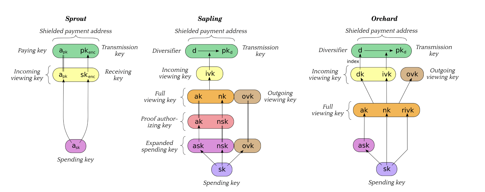
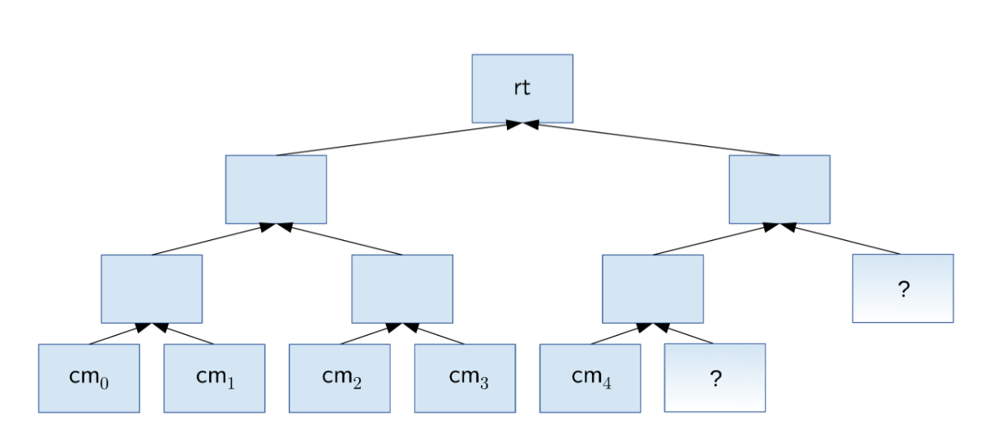

# Chapter 3: Concepts

## 3.1 Payment Addresses and Keys

---
Users who wish to receive shielded payments in the $\texttt{Zcash}$ protocol must have a shielded payment address
generated from a spending key.

- The [diagram](attachments/shielded_payment_addresses.png) compares the differences between key elements in Sprout,
  Sapling, and Orchard.
- Arrows point ($\to$) from components to any other component(s) that can be derived from it.
  Double lines ($=$) indicate that the same component is used in multiple abstractions.

**Explain:**

- **Sprout**: The receiving key $sk_{enc}$, incoming viewing key $ivk=(a_{pk},sk_{enc})$, and shielded payment address
  $addr_{pk}=(a_{pk},pk_{enc})$ are derived from the spending key $a_{sk}$.
- **Sapling**: An expanded spending key is composed of a Spend authorizing key $ask$, a nullifier private key $nsk$, and an ongoing
  viewing key $ovk$. From these components, we can derive a proof authorizing key $(ak, nsk)$, a full viewing key $(ak,nk,ovk)$, an
  incoming viewing key $ivk$, and a set of diversified payment addresses $addr_d = (d, pk_d)$.
- **Orchard**: A spending key $sk$ is used to derive a spend authorizing key $ask$, and a full viewing key $(ak, nk, rivk)$. From the
  full viewing key, we can also derive an incoming viewing key (composed of a diversifier key $dk$ and a $KA^{orchard}$ private key
  $ivk$), an outgoing viewing key $ovk$, and a set of diversified payment addresses $addr_d = (d, pk_d)$.

The composition of *shielded payment addresses*, *incoming viewing keys*, *full viewing keys*, and *spending keys* is a cryptographic
protocol detail that should not be familiar to the user. However, the user could see the operator that provides to obtain a shielded
payment address, incoming viewing keys, or full viewing key, from a spending key or extended spending key.

Users can accept payments from multiple parties using a single protected payment address, and the fact that these payments go to the
same payee is not revealed on the blockchain. However, if two parties collude to compare a protected payment address, they can
trivially determine they are the same. To prevent it, users should create a separate protected payment address for each payer.

## 3.2 Notes

---
A note (denoted $n$) can be a **Sprout** note, a **Sapling** note, or an **Orchard** note. In each case, it represents that a value $v$
is spendable by the recipient who holds the spending key corresponding to a given shielded payment address.

- A **Sprout** note is a tuple of $(a_{pk}, v, \rho, rcm)$ where:
  - $a_{pk}:\mathbb{B}^{[ℓ^{Sprout}_{PRF}]}$ is the paying key of the recipient’s shielded payment address.
  - $` v\colon\{0\dots \texttt{MAX\_MONEY} \} `$ is an integer representing the note’s value in $\texttt{zatoshi}$ (1 **ZEC** =
      **$10^8$ $\texttt{zatoshi}$**).
  - $`\rho:\mathbb{B}^{[ℓ^{Sprout}_{PRF}]}`$ is used as input to $`\texttt{PRF}^{nfSprout}_{a_{sk}}`$ to derive the nullifier of the
      note.
  - $rcm \colon \texttt{NoteCommit}^{Sprout}\cdot \texttt{Trapdoor}$ is a random commitment trapdoor.

$\Longrightarrow$ Let $\texttt{Note}^{Sprout}$ be the type of **Sprout** note.

- A **Sapling** note is a tuple of $(d, pk_d, v, rcm)$ where:
  - $d\colon\mathbb{B}^{[ℓ_d]}$ is the diversifier of the recipient’s shielded payment address.
  - $`pk_d\colon\texttt{KA}^{Sapling}\texttt{.PublicPrimeSubgroup}`$ is the diversifier transmission key of the recipient’s payment
      address.
  - $`v\colon\{0\dots \texttt{MAX\_MONEY} \}`$ is an integer representing the value of not in $\texttt{zatoshi}$.
  - $rcm\colon\texttt{NoteCommit}^{Sapling}\texttt{.Trapdoor}$ is a random commitment trapdoor.

$\Longrightarrow$ Let $\texttt{Note}^{Sapling}$ be the type of **Sapling** note.

- An **Orchard** note is a tuple of $(d, pk_d, v, \rho, \psi, rcm)$ where:
  - $d:\mathbb{B}^{[ℓ_d]}$ is the diversifier of the recipient’s shielded payment address.
  - $`pk_d: \texttt{KA}^{Orchard}\texttt{.Public}`$ is the diversifier transmission key of the recipient’s shielded payment address.
  - $`v\colon\{0\dots2^{ℓ_{value}}-1\}`$ is an integer representing the value of note in $\texttt{zatoshi}$.
  - $`\rho:\mathbb{F}_{q_\mathbb{P}}`$ is used as input to $\texttt{PRF}^{nfOrchard}_{nk}$ as part of deriving the nullifier of the
      note.
  - $`\psi:\mathbb{F}_{q_\mathbb{P}}`$ is additional randomness used in deriving the nullifier.
  - $rcm:$ $\texttt{NoteCommit}^{Orchard}\texttt{.Trapdoor}$ is a random commitment trapdoor.

$\Longrightarrow$ Let $\texttt{Note}^{Orchard}$ be the type of **Orchard** note.

### 3.2.1 Note Plaintexts and Memo Fields

---
A note plaintext includes a 512-byte memo field associated with this note. The usage of the memo field is by agreement between the
sender and the recipient of the note.

Each **Sprout** note plaintext (denote $\mathrm{np}$) consists of:

($\texttt{leadByte}$: $\mathbb{B}^\mathbb{Y}$, $`v: \{0..2^{ℓ_{value}}-1\}`$, $\rho:\mathbb{B}^{[ℓ^{Sprout}_{PRF}]}$,
$`rcm: \texttt{NoteCommit}^{Sprout}\texttt{.Trapdoor}`$, memo: $\mathbb{B}^{\mathbb{Y}^{[512]}}$).

The field of $\texttt{leadByte}$ is always $\texttt{0x00}$ for **Sprout**.

Each **Sapling** and **Orchard** note plaintext (denote $\mathrm{np}$) consists of:

($\texttt{leadByte}$: $\mathbb{B}^\mathbb{Y}$, d: $\mathbb{B}^{[ℓ_d]}$, $v: \{0..2^{ℓ_{value}}-1\}$, $`\texttt{rseed}:
\mathbb{B}^{\mathbb{Y}^{[32]}}`$, $\texttt{memo}$: $\mathbb{B}^{\mathbb{Y}^{[512]}}$).

The field $\texttt{leadByte}$ indicates the encoding's version of a **Sapling** or an **Orchard** note plaintext.
For **Sapling**,
it is $\texttt{0x01}$ before activation of the $[\mathrm{Canopy}]$ network update and $\texttt{0x02}$ afterward.
For **Orchard**, it is always $\texttt{0x02}$.

### 3.2.2 Note Commitments

---
When a note is created as an output of a transaction, only a commitment to the note content is disclosed publicly in the associated
$\texttt{JoinSplit}$ description, $\texttt{Output}$ description, or $\texttt{Action}$ description. If the transaction is entered into
the blockchain, each such note is appended to the note commitment tree of the associated tree state. This allows the value and
recipient to be kept hidden, while the commitment is used by [zk-SNARK](../../terms/zkSNARK.md) proof when the note is spent, to check
if this note exists on the blockchain.

A **Sprout** note commitment on a note $\mathrm{n} = (a_{pk}, v,\rho, rcm)$ is computed as

$`\texttt{NoteCommit}^{Sprout}(\mathrm{n}) = \texttt{NoteCommit}^{Sprout}_{rcm}(a_{pk}, v, \rho)`$.

A **Sapling** note commitment on a note $\mathrm{n} = (d, pk_d, v, rcm)$ is computed as

$g_d := \textsf{DiversifyHash}^\textsf{Sapling}(d)$

$`\textsf{NoteCommitment}^\textsf{Sapling}(\mathrm{n}) := \begin{cases} \perp, &if\ \texttt{g}_d = \perp
\\ \texttt{NoteCommit}^\texttt{Sapling}_{rcm}(\texttt{repr}_\mathbb{J}(\texttt{g}_d),\ \texttt{repr}_\mathbb{J}(\texttt{pk}_d),\ v),
&otherwise \end{cases}`$.

An **Orchard** note commitment on a note $\mathrm{n} = (d, pk_d, v, \rho, \psi, rcm)$ is computed as

$`\textsf{g}_d := \textsf{DiversifyHash}^{\textsf{Orchard}}(d)`$

$`\textsf{NoteCommitment}^{\textsf{Orchard}}(\mathrm{n})
:=
\textsf{NoteCommit}^{\textsf{Orchard}}_{\textsf{rcm}}(\textsf{repr}_{\mathbb{P}}(\textsf{g}_d),
\textsf{repr}_{\mathbb{P}}(\textsf{pk}_d)
, v, \rho, \psi)`$.

If $\textsf{NoteCommit}^{\textsf{Orchard}}_{\textsf{rcm}}$ returns $\perp$, the note is invalid and should be recreated.

### 3.2.3 Nullifiers

---
The nullifier of a note (denote $\texttt{nf}$) is a unique value of a note that is used to prevent double-spends.
When a transaction that contains one or more descriptions has entered the blockchain,
all the nullifiers for these transactions are added to the nullifier set.
A transaction is not valid if it adds a nullifier that exists.

## 3.3 The Block Chain

---

- **Candidate Blocks**: Validators keep track of multiple possible blocks that could be added to the blockchain. These blocks form a
  tree-like structure branching from the original ‘genesis’ block.
- **Blockchain**: A valid blockchain is a path in the tree from the genesis block to a leaf, where each block follows the consensus
  rules. (think of it like a correct sequence of blocks).
- **Block height**: Each block has a number indicating its position in the chain. The genesis block is at height 0, and subsequent
  blocks increase by 1.
- **Choosing the Best Chain**: Validators choose the valid chain with the most “work” invested in it. Work represents computational
  effort (more work = more secure). In a tie, the block received the first win.
- **Consensus**: The protocol is designed so that most well-connected validators eventually agree on the best chain up to a certain
  point.
- **Network Upgrades**: A network upgrade is considered “settled” when there’s widespread agreement on its activation. Validators are
  concerned about real-world money and should only accept chains containing the block where the most recent upgrade happened.
- **Rollback Limit:** For practically, validators like $\texttt{Zcash}$ and Zebra may limit how far back they’ll rewind the chain when
  switching to the new best chain (currently a limit of 100 blocks)

## 3.4 Transactions and $\texttt{Treestate}$

---
Each block contains one or more transactions.
Each transaction has a transaction ID for general reference.
Transparent transactions work with a “value pool” and miners can collect unused value as fees.

**Consensus rule**: The remaining value in the transparent transaction value pool MUST be nonnegative.

To each transaction, there are associated initial $\texttt{Treestate}$ for **Sprout**, **Sapling**, and **Orchard**. Each
$\texttt{Treestate}$ consists of a note commitment tree and a nullifier set.

In this document, we focus on shielded transactions, transparent transactions like the UTXO set works similarly with Bitcoin.

An anchor is a Merkle tree root of a note commitment tree, it’s like a unique fingerprint of the tree’s state.

In a given blockchain, for each type of shielded transaction, $\texttt{Treestate}$ is chained as follows:

- The input $\texttt{Treestate}$ of the first block is an empty $\texttt{Treestate}$.
- The input $\texttt{Treestate}$ of the first transaction of a block is the final $\texttt{Treestate}$ of the immediately preceding
  block.
- The input $\texttt{Treestate}$ of each subsequent transaction in a block is the output $\texttt{Treestate}$ of the immediately
  preceding block.
- The final $\texttt{Treestate}$ of a block is the output $\texttt{Treestate}$ of its last transaction.

## 3.5 $\texttt{JoinSplit}$ Transfers and Descriptions

---
A $\texttt{JoinSplit}$ description is data included in a transaction that describes a $\texttt{JoinSplit}$ transfer.
In **Sprout**,
this kind of value transfer was the primary $\texttt{Zcash}$-specific operation performed by transactions.

A $\texttt{JoinSplit}$ transfer spends $N^\texttt{old}$ notes $`\mathrm{n}^\texttt{old}_{1\dots N^\texttt{old}}`$ and transparent input
$`v^\texttt{old}_\texttt{pub}`$,
and creates $`N^\texttt{New}$ notes $\mathrm{n}^\texttt{new}_{1\dots N^\texttt{new}}`$ and transparent output
$v^\texttt{new}_\texttt{pub}$.
It is associated with a $\texttt{JoinSplit}$ statement instance,
for which it provides [zk-SNARK](../../terms/zkSNARK.md) proof.

**Consensus rules:**

- For the first $\texttt{JoinSplit}$ description of a transaction, the anchor MUST be the output Sprout $\texttt{Treestate}$ of a
  previous block.
- The anchor of each $\texttt{JoinSplit}$ description in a transaction MUST refer to either some earlier block’s final **Sprout**
  $\texttt{Treestate}$ or to the interstitial output $\texttt{Treestate}$ of any prior $\texttt{JoinSplit}$ description in the same
  transaction.

## 3.6 $\texttt{Spend}$ Transfers, $\texttt{Output}$ Transfers, and Their Descriptions

---

For **Sapling** notes, there is a separate $\texttt{Spent}$ transfer for each shielded input and a separate $\texttt{Output}$ transfer
for each shielded output. Each type of transfer has its description ($\texttt{Spent}$ description, $\texttt{Output}$ description).

A $\texttt{Spend}$ transfer spends a note $\mathrm{n}^\texttt{old}$. Its $\texttt{Spend}$ description includes a Pedersen value
commitment to the note’s value. It is associated with an instance of a $\texttt{Spend}$ statement, for which it provides
[zk-SNARK](../../terms/zkSNARK.md) proof. An $\texttt{Output}$ transfer works similarly.

Each transaction has a sequence of $\texttt{Spent}$ descriptions and $\texttt{Output}$ descriptions.

To ensure balance, we use a homomorphic property of Pedersen commitment that allows them to be added and subtracted, as an
[elliptic curve](../../terms/elliptic_curve.md). The result of adding two Pedersen commitments, committing $v_1+v_2$, is a new Pedersen
commitment that commits to $v_1+v_2$. Subtract works similarly.

**Consensus rules:**

- The $\texttt{Spend}$ transfers and $\texttt{Action}$ transfers of a transaction MUST be consistent with its
  $\texttt{v}^\texttt{balanceSapling}$ value.
- The anchor of each $\texttt{Spend}$ description MUST refer to some earlier block’s final Sapling $\texttt{treestate}$.

## 3.7 $\texttt{Action}$ Transfers and Their Description

---

**Orchard** introduces $\texttt{Action}$ Transfers, each of which can optionally perform a spend and an output.

$\texttt{Action}$ descriptions are data included in a transaction that describes $\texttt{Action}$ transfers.

An $\texttt{Action}$ transfer spends a note $`\mathrm{n}^\texttt{old}`$ and creates a new note. Its $\texttt{Action}$ Description
includes
a $\texttt{Pederson}$ Value Commitment to the net value. It is associated with an instance of an $\texttt{Action}$ statement, which
provides [zk-SNARK](../../terms/zkSNARK.md) proof.

As in **Sapling**, we use the homomorphic property of Pederson Value Commitments to enforce balance:
we add all the Value Commitments and prove by using an **Orchard** binding signature.

**Consensus rules**:

- The $\texttt{Spend}$ transfers and $\texttt{Action}$ transfers of a transaction MUST be consistent with its
  $\texttt{v}^\texttt{balanceSapling}$ value.
- The $\texttt{anchorOrchard}$ field of the transaction, whenever it exists (i.e. when there are any $\texttt{Action}$ descriptions),
  MUST refer to some earlier block’s final **Orchard** $\texttt{treestate}$.

## 3.8 Note Commitment Trees

---

A note commitment tree is an incremental Merkle tree of fixed depth used to store note commitment for transfers produced.

A root of a note commitment tree is associated with each
$\texttt{treestate}$.

Each node in the incremental Merkle tree is associated with a hash value of size $ℓ_\texttt{Merkle}$ bits for each type of shielded
note.
The layer numbered $h$, counting from zero of the root, has $2^h$ leaf nodes with indices $0$ to $2^h-1$ inclusive.
The hash value associated with the node at index $i$ in layer $h$ is denoted $\texttt{M}^\texttt{h}_i$.

The index of a note commitment at the leaf most layer is called its note position.

**Consensus rules**:

- A block MUST NOT add **Sprout** note commitments that would result in the **Sprout** note commitment tree exceeding its capacity of
  $2^{\texttt{MerkleDepth}^\texttt{Sprout}}$ leaf nodes.
- A block MUST NOT add **Sapling** note commitments that would result in the **Sapling** note commitment tree exceeding its capacity of
  $2^{\texttt{MerkleDepth}^\texttt{Sapling}}$ leaf nodes.
- A block MUST NOT add **Orchard** note commitments that would result in the **Orchard** note commitment tree exceeding its capacity of
  $2^{\texttt{MerkleDepth}^\texttt{Orchard}}$ leaf nodes.

## 3.9 Nullifier Sets

---
Each validator maintains a “nullifier set” of each $\texttt{treestate}$.
When processing valid transactions containing $\texttt{JoinSplit}$ transfer, $\texttt{Spend}$ transfer,
or $\texttt{Action}$ transfer, the “revealed” nullifiers are added to the corresponding nullifier set.
These nullifiers act as unique identifiers and are enforced to be unique across the entire blockchain.
This uniqueness prevents double-spending.

**Consensus rules**: A nullifier MUST NOT repeat either within a transaction or across transactions in a valid blockchain.
**Sprout**,
**Sapling**, and **Orchard** nullifiers are considered disjoint, even if they have the same bit pattern.

## 3.10 Block Subsidy, Funding Streams, and Founder’s Reward

---
$\texttt{Zcash}$ creates currency when blocks are mined. The value created on mining a block is called the block subsidy.

Before the fifth update $[\mathrm{Canopy}]$, the block subsidy is composed of a miner subsidy and a Founder’s Reward.
After $[\mathrm{Canopy}]$, it is composed of miner subsidy and Funding Stream.

The calculations of the block subsidy, miner subsidy, Funding Streams, and Founder’s Reward depend on block height.

## 3.11 Coinbase Transactions

---
A transaction that has a single transparent input with a null previous field is called a coinbase transaction.
Every block has a single coinbase transaction as the first transaction in the block.
The purpose of this coinbase transaction is to collect and spend any miner subsidy,
and transaction fees paid by other transactions included in the block.

## 3.12 Mainnet and Testnet

---
The production $\texttt{Zcash}$ network, which supports ZEC tokens, is called Mainnet.
All block hashes given in this section are in RPC byte order (that is, byte-reversed relative to the normal order for a
$\texttt{SHA-256}$ hash).

Mainnet genesis block: $\texttt{00040fe8ec8471911baa1db1266ea15dd06b4a8a5c453883c000b031973dce08}$
Mainnet NU5 (the sixth upgrade) activation block: $\texttt{0000000000d723156d9b65ffcf4984da7a19675ed7e2f06d9e5d5188af087bf8}$

There is also a public test network called Testnet.
It supports a TAZ token which is intended to have no monetary value.
The Testnet
blockchain is subject to being rolled back to a prior block at any time.

Testnet genesis block: $\texttt{05a60a92d99d85997cce3b87616c089f6124d7342af37106edc76126334a2c38}$
Testnet NU5 activation block: $\texttt{0006d75c60b3093d1b671ff7da11c99ea535df9927c02e6ed9eb898605eb7381}$

The smallest unit of currency is $\texttt{zatoshi}$.
On Mainnet, 1 ZEC = $10^8$ $\texttt{zatoshi}$.
On Testnet, 1 TAZ =
$10^8$ $\texttt{zatoshi}$.
