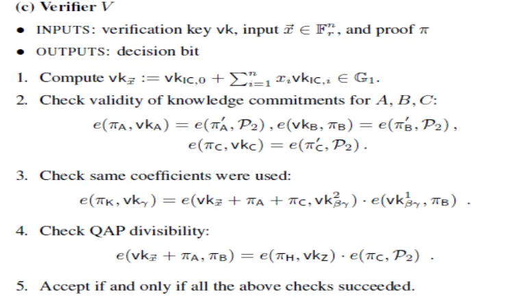

[zkSNARKs under the hood by VitalikButerin](https://medium.com/@VitalikButerin/zk-snarks-under-the-hood-b33151a013f6)

[QAP article](../quadratic-arithmetic-programs-from-zero-to-hero/quadratic_arithmetic_programs_from_zero_to_hero.md)

# Prerequisite

To start off, let us go into the key cryptographic assumption underlying the security of the mechanism that we are going to use:
the [knowledge of exponent](../../terms/knowledge_of_exponent.md) assumption.

This give zk-SNARKs somewhat shakier foundation than elliptic curve cryptography more generally — although it’s still sturdy enough
that most cryptographers are okay with it.

If we hide a secret variable $k$ away from the prover and supply $G * k, G * k * x, G * k * x^2,....$  in [trusted setup](../../terms/trusted_setup.md), 
we can ensure a variable $R$ which $R * k = S$ the prover give us come from a
linear combination a set of points on elliptic curve that prover calculated from the trusted setup and its polynomials which $Poly_1 * k = G_1$ and so on. 

# Introduction

Note that from this step, we are going to use [elliptic curve](../../terms/elliptic_curve.md), so we will have a generator point $G$ (
corresponding to 1 in the elliptic curve) appear in our equation as a way to convert a normal number into an elliptic curve.

However, in a large system with thousands of logic gates like a hash function or something similar, the list that the prover needs to
send to the verifier would be too long. So, we use [knowledge of exponent](../../terms/knowledge_of_exponent.md) assumption to make it
shorter.

On the other hand, using the prefixed function $Z = (x-1)(x-2)(x-3)(x-4)$ as a divider for the prover's QAP is not secure enough as it
would create room for the prover to make "fake" proofs.

Here, we are going to make use of random secret variables $t, k_a, k_b, k_c$ generated by the verifier to make it harder for anyone to
trick us. $t$ is a point where we evaluate our polynomial. Those variable will be send to prover via some elliptic curve encryption
using [discrete logarithm](../../terms/discrete_logarithm.md)

> [!WARNING]
> $t, k_a, k_b$, and $k_c$ are “toxic waste,” numbers that absolutely must be deleted at all costs, or else whoever has them will be
> able to make fake proofs.

Hence, what actually happens is that we add the following values to the [trusted setup](../../terms/trusted_setup.md):
$$
\begin{align}
&G * A_1(t), G * A_1(t) * k_a \\
&G * A_2(t), G * A_2(t) * k_a \\
&… \\
&G * B_1(t), G * B_1(t) * k_b \\
&G * B_2(t), G * B_2(t) * k_b \\
&… \\
&G * C_1(t), G * C_1(t) * k_c \\
&G * C_2(t), G * C_2(t) * k_c \\
&…
\end{align}
$$
Now, if someone gives you a pair of points $P, Q$ such that $P * k_a = Q$ (reminder: we don’t need $k_a$ to check this, as we can do
a [pairing](../../terms/elliptic_curve.md#elliptic-curve-pairings) check), then you know that what they are giving you is a linear
combination of $A_i$ polynomials evaluated at $t$. By evaluating polynomials at $t$, we reduce the need to send the whole matrix of the
polynomial.

For example, instead of sending $a*G + b*G*t + c*G*t^2$, the prover will send a point $a'*G$ instead.

Our coefficients in the linear combination at the end of the QAP step were $1, x, x^2, x^3, ... , x^m$ but we are going to evaluate our
polynomials at t, so they will turn into $G, G*t, G*t^2, G*t^3, ..., G*t^m$.

Hence, so far the prover must give:
$$
\begin{align}
&π_a = G * A(t), π’_a = G * A(t) * k_a \\
&π_b = G * B(t), π’_b = G * B(t) * k_b \\
&π_c = G * C(t), π’_c = G * C(t) * k_c
\end{align}
$$
Where $A(t)$ is a linear combination of $A_i$ evaluated at $t$ and so on.

> [!NOTE]
> Note that the prover doesn’t actually need to know (and shouldn’t know!) $t, k_a, k_b$, or $k_c$ to compute these values; rather, the
> prover should be able to compute these values just from the points that we’re adding to
> the [trusted setup](../../terms/trusted_setup.md).

To evaluate the proof, we have to check 3 things:

- Validity of knowledge commitments for $A, B, C$ or check if the prover used $A(t), B(t), C(t)$ in $\pi_a, \pi_b, \pi_c$
- If the same coefficients $G, G_t, G_t^2, ...$ were used in the linear combination $\pi_a, \pi_b, \pi_c$
- Finally, check if the equation is correct like in the QAP step

> [!NOTE]
> Note that equation checking is done in [pairing](../../terms/elliptic_curve.md#elliptic-curve-pairings) because we have secret
> numbers $k, t$ and [elliptic curve](../../terms/elliptic_curve.md) involved, unlike in the QAP step where $x_1, x_2, x_3, x_4$ are
> predetermined.

# QAP Divisibility

We need to prove that $A * B - C = H * Z$. We do this once again with
a [pairing](../../terms/elliptic_curve.md#elliptic-curve-pairings) check:
$$e(\pi_a,\pi_b) / e(\pi_c, G) \stackrel{?}{=} e(\pi_h, G * Z(t))$$
Where $\pi_h=G * H(t)$ and $H$ is the remainder polynomial. If the connection between this equation and $A * B - C = H * Z$ does not
make sense to you, go back and read [our file on pairing](../../terms/elliptic_curve.md#elliptic-curve-pairings). Note that $e(\pi_c,
G)$ = $\pi_c$ but we do this in order to use pairing math.

We saw above how to convert $A, B,$ and $C$ into elliptic curve points; $G$ is just the generator (i.e., the elliptic curve point
equivalent of the number one). We can add $G * Z(t)$ to the trusted setup. $H$ is harder; $H$ is just a polynomial, and we predict very
little ahead of time about what its coefficients will be for each individual QAP solution. Hence, we need to add yet more data to the
trusted setup; specifically, the sequence:

$$G, G * t, G * t², G * t³, G * t⁴ ….$$

In the Zcash trusted setup, the sequence here goes up to about 2 million; this is how many powers of t you need to make sure that you
will always be able to compute $H(t)$, at least for the specific QAP instance that they care about. And with that, the prover can
provide all of the information for the verifier to make the final check.

> [!NOTE]
> Instead of sending a list of parameters $s$ to the verifier like in the previous step, we send the remainder $H$ to the verifier.

# Coefficients Check

The next step is to make sure that all three linear combinations have the same coefficients. This we can do by adding another set of
values to the trusted setup: $$G * (A_i(t) + B_i(t) + C_i(t)) * b$$

> [!NOTE]
> b is another number that should be considered “toxic waste” and discarded as soon as the trusted setup is completed. 

We can then have the prover create a linear combination with these values with the same coefficients, and use the
same [pairing](../../terms/elliptic_curve.md#elliptic-curve-pairings) trick as above to verify that this value matches up with the
provided $A + B + C$.

$$G * (A_i(t) + B_i(t) + C_i(t)) * b$$

should be (in pairing) equal to

$$G * (1 + t^1 + t^2 + ...) * s * (A + B + C) * b$$

# Validity of Knowledge Commitments for A, B, C

Check if there is $A(t)$ inside $\pi_a$ using [knowledge of exponent](../../terms/knowledge_of_exponent.md)

The prover has $G, k, \pi_a$ but he can't come up with $\pi_a'$ if he doesn't know $A(t)$, which $G * A(t) * k = \pi_a'$.

We have two pairs $(G, k)$ and $(\pi_a, \pi_a')$, and the only way I can know the latter is by using the first pair and multiplying it
with $A(t)$.

Check using 3 [pairing](../../terms/elliptic_curve.md) equations:

$$
\begin{align}
e(\pi_a, k_a) &= e(\pi_a', G) \\
e(\pi_b, k_b) &= e(\pi_b', G) \\
e(\pi_c, k_c) &= e(\pi_c', G)
\end{align}
$$

To prove the correctness of those equations, I am going to prove the first equation:

$$
\begin{align}
e(\pi_a, k_a) &= e(\pi_a', G) \\
e(\pi_a * k_a, G) &= e(\pi_a', G) \\
e(\pi_a', G) &= e(\pi_a', G)
\end{align}
$$

So our equation is correct.
# Generalize

There is one more detail that we need to discuss. Most of the time we don’t just want to prove in the abstract that some solution
exists for some specific problem; rather, we want to prove either the correctness of some specific solution (eg. proving that if you
take the word “cow” and SHA3 hash it a million times, the final result starts with 0x73064fe5), or that a solution exists if you
restrict some of the parameters. For example, in a cryptocurrency instantiation where transaction amounts and account balances are
encrypted, you want to prove that you know some decryption key k such that:

1. decrypt(old_balance, k) ≥ decrypt(tx_value, k)
2. decrypt(old_balance, k) - decrypt(tx_value, k) = decrypt(new_balance, k)

The encrypted old_balance, tx_value and new_balance should be specified publicly, as those are the specific values that we are looking
to verify at that particular time; only the decryption key should be hidden. Some slight modifications to the protocol are needed to
create a “custom verification key” that corresponds to some specific restriction on the inputs.

# Complexity

Altogether, the verification process is a few elliptic curve multiplications (one for each “public” input variable), and five pairing
checks, one of which includes an additional pairing multiplication. The proof contains eight elliptic curve points: a pair of points
each for $A(t), B(t)$ and $C(t)$, a point $π_k$ for $b * (A(t) + B(t) + C(t))$, and a point $π_h$ for $H(t)$. Seven of these points are
on the $F_p$ curve (32 bytes each, as you can compress the $y$ coordinate to a single bit), and in the Zcash implementation one point (
$π_b$) is on the twisted curve in $F_p^2$ (64 bytes), so the total size of the proof is ~288 bytes.

The two computationally hardest parts of creating a proof are:

- Dividing $(A * B - C) / Z$ to get $H$ (algorithms based on the [Fast Fourier transform](../../terms/fast_fourier_transforms.md) can
  do this in sub-quadratic time, but it’s still quite computationally intensive)
- Making the elliptic curve multiplications and additions to create the $A(t), B(t), C(t)$ and $H(t)$ values and their corresponding
  pairs

The basic reason why creating a proof is so computational expensive was because of a single binary logic gate ($A * B = C$) in the
original function need to be transform using elliptic curve operations if we want to make it zero-knowledge. This fact, together with
nearly $O(n^2)$ time complexity of [fast Fourier transforms](../../terms/fast_fourier_transforms.md), means that proof creation takes
about 20-40 seconds for a Zcash transaction.
# Neglect the Need for Trusted Setup

The process of a "trusted setup" can be negligible using a system of key like in Diffie–Hellman algorithm where each user insert their
secret value into the secret value of the algorithm so as long as one user deleted their secret value, that secret value can't be used
again.
