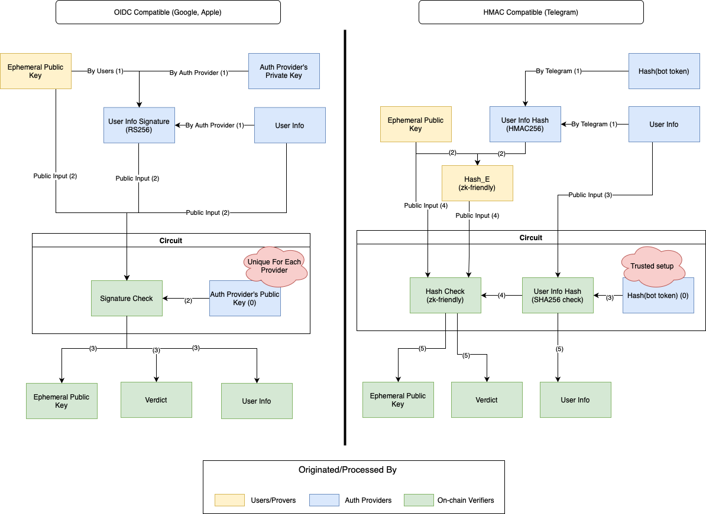

# Keyless Account for Telegram

## Introduction

Currently, there is support for users to utilize web3 applications without managing their own public and private key pairs, and without
using custodial wallets, by using their credentials directly from authentication providers like Google or Apple. This is made possible
thanks to ZK technology and account abstraction. However, the current solution
(e.g., [zkLogin](https://docs.sui.io/concepts/cryptography/zklogin)) only supports authentication providers that offer OIDC (OpenID
Connect). Providers like Telegram cannot use this, so we need to devise an alternative solution.

In this document, we will introduce the modified flow suited for Telegram.

## Telegram OAuth Properties

Telegram uses the HMAC-SHA-256 signature scheme.

To integrate Telegram authentication, you need to create a bot. Each bot has a unique `bot_token` used by Telegram to create a valid
signature for the user upon successful authorization.

Unlike OIDC, which uses RS256 where only the authentication provider's server can generate a valid signature, HMAC-SHA-256 allows both
the authentication server and the recipient (in this case, our app) to generate valid signatures.

There is no support for custom fields as opposed to OIDC, which users can use to attach additional information to the authentication
signature. This provides an easy way (as demonstrated in steps (1) and (2) in the OIDC Compatible section of the figure below) to
ensure no one else can create a valid proof and link it with an arbitrary web3 account.

## The Solution

0. **Bot Token Creation:** The first step (denoted as step 0 in the figure above) is to create a `bot_token` by following the Telegram
   instructions. Embed this token (as private) into our circuit so that the circuit can verify the hash without anyone else knowing it.
   Since anyone with the bot token can create a valid signature, we need to discard this information (and its hash value) as soon as we
   are done generating the circuit.

1. **User Information Hashing:** When the user logs into Telegram successfully, Telegram will provide us with the `user_info_hash`,
   which is derived from the `bot_token` and the `user_info`.

2. **Ephemeral Key Pair Creation:** The user needs to create an `ephemeral key pair` to interact with the blockchain. Then, hash this
   key pair with the received `user_info_hash`, creating `Hash_E`. This information will be put into the circuit to prevent attacks
   like frontrunning. Without this step, attackers could attach our proof to any ephemeral account of their choice and still pass all
   the checks. Use a zk-friendly hash for efficiency purposes.

3. **Circuit Verification:** In the circuit, use the `user_info` provided by the user and combine it with the
   embedded `Hash(bot_token)` value to calculate the `user_info_hash`. This is done in an encrypted context (a feature provided by
   using ZK and FHL techniques) so no one can read it.

4. **Hash Consistency Check:** The newly calculated `user_info_hash` is combined with the `ephemeral public key` provided by the user
   to compare with `Hash_E` to ensure consistency.

5. **Circuit Output:** After verification, the circuit outputs the `ephemeral public key`, the verdict on whether the user input passes
   all checks, and the user info. These values can then be used in the smart contract to serve our business logic.