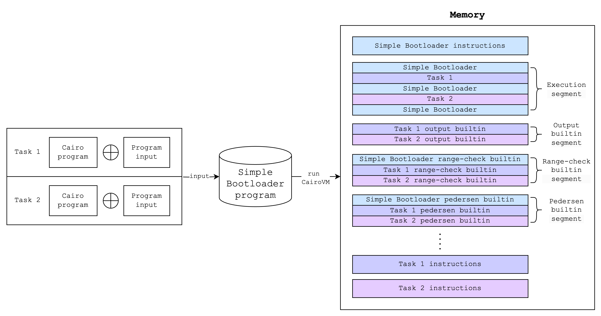
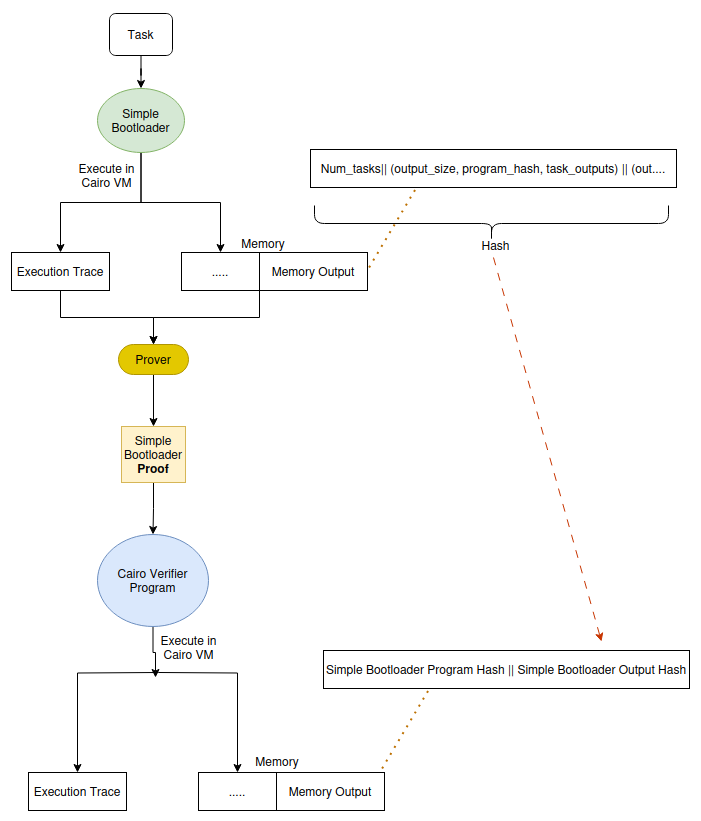
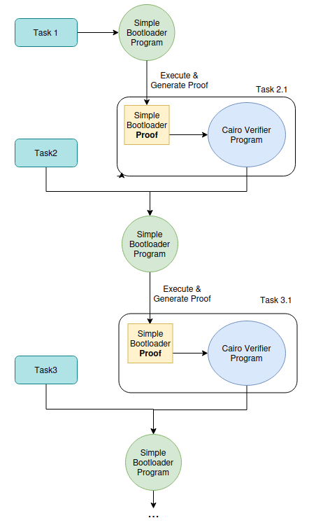
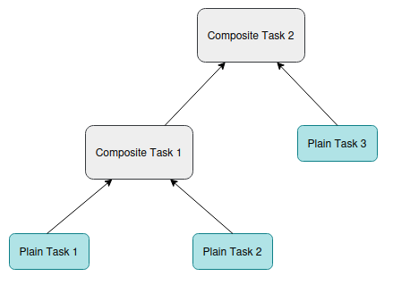
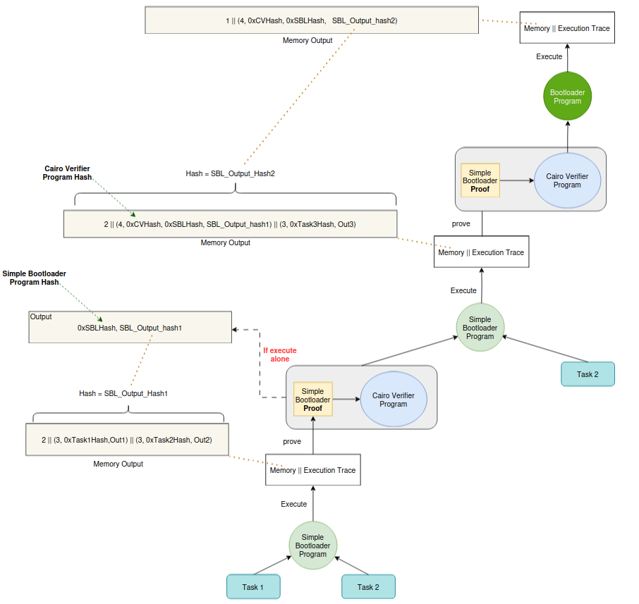
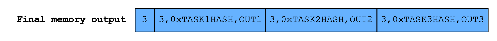
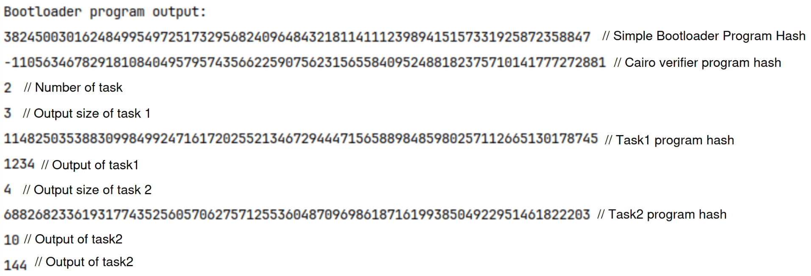

# Cairo Bootloader

## Introduction

The main purpose of the bootloader program is to reduce the size of the program's instructions being proven. The bootloader program
executes multiple large programs and recursively verifies bootloader proofs within itself.

## How it Works

A bootloader program consists of two main components: the simple bootloader and the bootloader.

### Simple Bootloader

Like other Cairo programs, running the bootloader will produce an execution trace and a memory vector. However, there are other Cairo
programs inside the bootloader , the output memory and execution trace should include those of the programs as well.

Example:



We consider each program as a task. The simple bootloader hashes the instructions of each inner Cairo program and writes the hashes to
the output. It ensures that the builtin segments of each task do not conflict with each other.

#### Builtin Segment Check

For each task, the bootloader program passes the pointers of necessary builtins to the task program's main function. The task uses the
builtin cells and eventually return the next unused cell.

After running a task, the bootloader checks and updates the pointer of each builtin  to ensure they are correctly set for the next
task. For example, the **Pedersen** builtin requires 3 cells (2 for inputs, 1 for output). The bootloader ensures that the
**Pedersen** builtin pointer increases by a value $x$, where $x$ is positive and divisible by $3$.

#### Tasks Output Written to Memory

The bootloader writes the task outputs sequentially to the output builtin segment:

| num of tasks | size of task1 | task1 program hash | task1 program output | size of task2 | ... |
|--------------| ------------- |--------------------|----------------------| ------------- | --- |

#### Flow

Below is the workflow of `run_simple_bootloader()` function in
[Cairo-lang repository](https://github.com/starkware-libs/cairo-lang/blob/v0.13.1/src/starkware/cairo/bootloaders/simple_bootloader/run_simple_bootloader.cairo):

1. Output the number of tasks
2. Create 3 structs:

- A struct that contains the pointer to each builtin.
- A struct that contains the encoding of each builtin.
- A struct that contains each builtin instance size.

3. Execute each task by invoking the `execute_task()` function. Instead of directly checking the increment of each builtin pointers,
   we use the `range_check_builtin` to verify that inside the code.
4. Verify the `range_check_builtin` pointer externally.

Workflow of the `execute_task()` function:

1. Compute the program hash and write it to `output_ptr + 1`.
2. Run the program with the builtin pointer list.
3. Validate that the builtin pointers have advanced correctly using `range_check_builtin`
4. Verify the output size.
5. Compute the `fact_topology` and append it to the `fact_topology`

Pseudocode:

``` js

function run_simple_bootloader(tasks: Vec<Task>) {
 // output the number of tasks
 [output_ptr] = number_of_tasks
 output_ptr++
 
 // create 3 structs: builtin_pointers, builtin_encodings,  and builtin_instance_size
 builtin_pointers = {
  output = ,
  pedersen = ,
  ...
 }
 
 builtin_encodings = {
  output = "output",
  pedersen = "pedersen",
  ...
 }
 
 builtin_instance_size = {
  output = 1,
  pedersen = 3,
  ...
 }
 
 for task in tasks {
  execute_task(task)
  // Verify the range_check_builtin pointer externally
  assert(self_range_check_ptr = task_range_check_ptr)
  let additional_range_checks = range_check_ptr - self_range_check_ptr;
  verify_non_negative(num=additional_range_checks, n_bits=64);
 } 
 
 }

```

### Bootloader

The bootloader allows Cairo programs and simple bootloader proofs as input. In this section, we will explore its inner workings.

#### Cairo Verifier Program

Cairo verifier program is a Cairo program which can verify the proof generated using the simple bootloader.



After verifying a proof, the memory output of Cairo verifier program includes the hash of the SBL(Simple Bootloader) program, and the
hash of SBL's output. So it is possible to commit to the output of the simple bootloader using the Cairo verifier and open it later.

#### Iteratively Creating Proofs

Since the Simple Bootloader can run arbitrary programs, it is possible to create a proof that includes both the verification process
and the proof of a new program. The flow is as follows:



#### Bootloader

In the previous step, the output of the simple bootloader program is the hash of the output from the previous iteration. But how can
we verify the the hash is correct? Instead of using the Simple Bootloader, we utilize the Bootloader for this purpose.

For example, we can visualize the structure of the iterative proof as a tree:



The **Plain Task** represents a Cairo program run by the SBL (such as Task1, Task2,... in the previous diagram), while the
**Composite Tasks** represents the Cairo verifier program (such as Task2.1, Task3.1 in the previous diagram). The output
of the final iteration is the root.

The bootloader verifies the output by using DFS (Depth-first search), checking that the parent nodes hash the outputs of their child
nodes correctly. The following diagram shows the memory output of each node in the tree structure above:



After performing DFS, the bootloader knows all the leaf data of the tree, allowing it to write the output of all proven tasks. For
example, the output is:



#### Implementation

Here is the flow of the Bootloader program, version
[0.13.1](https://github.com/starkware-libs/cairo-lang/blob/v0.13.1/src/starkware/cairo/bootloaders/bootloader/bootloader.cairo).

1. Set the simple bootloader program hash and the Cairo verifier program hash
2. Run the Simple Bootloader to execute tasks.
3. Output the bootloader configuration at the beginning.
4. Output the total number of tasks.
5. Parse outputs recursively and write them to the output builtin by invoking the function `parse_tasks()`.
6. Output fact topologies.

The functionality of `parse_tasks()`is to recursively handle tasks, which come in 2 types: plain packed task and composite packed task.
To handle each type, the Bootloader invokes two difference functions `unpack_composite_packed_task` and `unpack_plain_packed_task`.

The `unpack_composite_packed_task` works as below:

1. Retrieve the pre-image of the child nodes' output hash.
2. Compute the hash.
3. Verify the task output.
4. Perform DFS and move to children tasks.

The function`unpack_plain_packed_task` writes the program hash and output of the task to the output pointer.

Here is an example of the final output after running the Bootloader program with 2 tasks:



## Reference

- [Bootloader - ZkSecurity](https://zksecurity.github.io/stark-book/cairo/bootloader.html)

- [Bootloader Code - Starkware](https://github.com/starkware-libs/cairo-lang/tree/v0.13.1/src/starkware/cairo/bootloaders)
