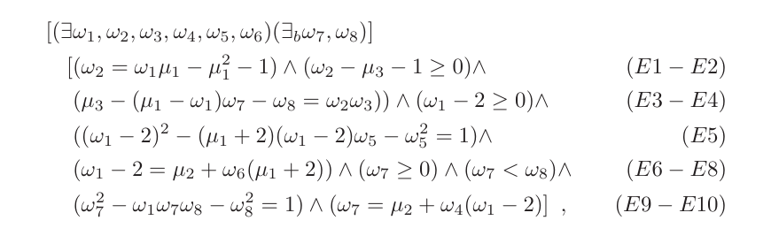

# DARK: Diophantine Argument of Knowledge

**Reference**: [DARK paper](https://eprint.iacr.org/2003/105)  
**Terms**:  [diophantine equation](../terms/diophantine_equation.md), [diophantine set](../terms/diophantine_set.md), [commitment
scheme](../terms/commitment_scheme.md)

## 1. Integer Commitment Scheme

Firstly, you should read the definition of [commitment scheme](../terms/commitment_scheme.md). DARK uses Damgard-Fujisaki integer
commitment scheme, you can read the full paper of it
[here](https://citeseerx.ist.psu.edu/document?repid=rep1&type=pdf&doi=fdfdb6df844a02ec1d783e43899a179920f13dac). To make explaining
things much easier, this article will not explain the results of the paper in detail. There are two important properties of this
commitment scheme you need to focus on:

- **Summation Protocol** : If prover has three integer $a,b,c$ such that $a+b=c$ and their respective commitment $A,B,C$, they can
  prove that $a+b=c$ in a zero-knowledge way using only the commitment values $A,B,C$.
- **Multiplication Protocol** : If prover has three integer $a,b,c$ such that $a \cdot b=c$ and their respective commitment $A,B,C$,
  they can prove that $a*b=c$ in a zero-knowledge way using only the commitment values $A,B,C$.

In other words, the prover can claim that "these committed values actually have this sum/product relation" in a zero-knowledge way.
Here is an easy example of how to prove that we have computed an integer coefficient multivariable polynomial on some input:

- Prover has some values $x_1, x_2, x_3, x_4$ that satisfies $x_4 = x_1x_2+x_3$. How to prove it?
- Prover calculate $x_5=x_1x_2$ and commit $x_1,x_2,x_3,x_4,x_5$.
- Prover now can prove $x_5=x_1x_2$ and $x_4=x_3+x_5$ in a zero-knowledge proof, using only commitment.

## 2. Diophantine Argument of Knowledge

While integer commitment scheme is cool and already has quite a lot of applications, it's quite limited. There are plenty of
prepositions that one would like to prove that does not have the form of "I evaluated a integer coefficient polynomial". Let's dig
deeper.

### 2.1 Diophantine Set

You should read the definition of Diophantine set [here](../terms/diophantine_set.md).

### 2.2 Arguments of Knowledge

For bit-strings $a$ and $\mu$, and predicate $Q(·),$ we denote by $AK(Q(a,\mu))$ a three-round honest-verifier statistical
zero-knowledge (==HVSZK==) two-party argument of knowledge (==AoK==) that given a value $a$ (known to both parties), the arguer knows
an integer parameter $\mu$, such that the predicate $Q(a,\mu)$ is true. As an example, $AK(y = E_K(\mu;\rho) \land \mu = \omega^2)$
denotes a HVSZK AoK that given a ciphertext $y$ and a public key $K$, the arguer knows a plaintext $\mu$ and a randomness $\rho$ such
that $y =EK(\mu;\rho)$ and $\mu$ is a perfect square.

A natural requirement here is that if the arguer convinces the verifier that she knows such an $\omega$, the verifier will also be
convinced that $\mu \in S$ where $R_S(\mu, \omega)$ = 0. However, these arguments can only be executed if the arguer knows the
corresponding witness, so we need an efficient algorithm to compute $\omega$ from $\mu$.

### 2.3 DARK

The definition of Diophantine set leads us to a much more versatile approaches for a proof. If $S$ is Diophantine set and I want to
prove $\mu \in S$, I can:

- Find a representing polynomial $P_S$ of $S$ and publicize it along with the full formula and proof for $P_S$.
- To prove $\mu \in S$, find a witness $\omega$. Prove $P_S(\mu,\omega)=0$ using integer commitment scheme.

This is the fundamental idea of Diophantine Argument of Knowledge, abbreviated as ==DARK==.

However, to put into practical use, we only deal with special Diophantine sets that:

- Have representing polynomial $P_S$ that we can actually construct
- Has a polynomial time algorithm to compute the witness $\omega$
- The length of our witness has to be sub-quadratic to the length of the input $\mu$

The proofs of the above properties is mentioned in the original paper so we will not describe them here. Let's see how to do that.

> [!NOTE]
> We can use the [fact](../terms/diophantine_set.md#fact) from Diophantine set to deal with and/or operations on prepositions.

#### 2.3.1 Nonnegative Proof

It suffices to have a nice representing polynomial $P_S$ for nonnegative integers, with witness easy to find. To do this, we will
leverage [Lagrange's four-square theorem](https://en.wikipedia.org/wiki/Lagrange%27s_four-square_theorem). Below is the algorithm:

---
**Algorithm 1** Algorithm for computing an Lagrange representation $\mu = \omega_1^2 + \omega_2^2 + \omega_3^2 + \omega_4^2, \omega
\leftarrow Lagrange(\mu)$

---

1. Write $\mu$ in the form $\mu =2^t(2k +1),$ where $t,k \geq 0$.
2. If $t = 1$, then \
   $(a)$ Choose random $\omega_1 \leq \sqrt{\mu},\ \omega_2 \leq \sqrt{\mu−\omega_1^2}$, such that exactly one of $\omega_1,\ \omega_2$
   is even. Let $p \leftarrow \mu−\omega_1^2 −\omega_2^2$. Now $p \equiv 1$ (mod $4$).   
   $(b)$ Hoping that $p$ is prime, try to express
   $p = \omega^2_3 + \omega^2_4$ as follows: First, find a solution $u$ to the equation $u^2 \equiv−1$ (mod $p$). Apply the Euclidean
   algorithm to $(u,p),$ take the first two remainders that are less than $\sqrt{p}$ to be $\omega_3$ and $\omega_4$. If $p \neq
   \omega^2_3 +\omega^2_4,$ $p$ was not prime, so go back to step 2a.  
   $(c)$ Return $(\omega_1,...,\omega_4)$ as the representation.
3. If $t$ is odd but not $1$, find a representation $(\omega_1,...,\omega_4).$ Return $(s\omega_1,...,s\omega_4)$, where $s
   =2^{(t−1)/2}$.
4. If $t$ is even, find a representation $\omega^2_1 +\omega^2_2 +\omega^2_3 +\omega^2_4$ for $2(2k +1)$ by step 2. Then convert this
   to a representation for $(2k+1)$ as follows: Group $\omega_1, \omega_2, \omega_3, \omega_4$ so that $\omega_1 \equiv \omega_2$ (mod
   $2$) and $\omega_3 \equiv \omega_4$ (mod $2$). Return $(s(\omega_1 + \omega_2),s(\omega_1 − \omega_2),s(\omega_3 +
   \omega_4),s(\omega_3 − \omega_4)),$ where $s =2^{t/2−1}$.

---

Finally, the representing polynomial is simply $P_S(\mu; \omega_1, \omega_2, \omega_3, \omega_4) = \mu - \omega_1^2- \omega_2^2-
\omega_3^2- \omega_4^2$

#### 2.3.2 Range Proof

To prove $a \leq \mu \leq b$, it suffices to prove $\mu - a \geq 0$ and $b - \mu \geq 0$ using nonnegative proof, i.e $[a \leq \mu \leq
b] \equiv [\mu - a \geq 0 \land b - \mu \geq 0]$

#### 2.3.3 Exponential Relation

Here, our goal is to prove $\mu_3 = \mu_1^{\mu_2}$ . Below is the theorem extracted from the paper.

Theorem 3. Assume $\mu_1 > 1, \mu_3 > 0$ and $\mu_2 > 2$. The exponential relation $[\mu_3 = \mu_1^{\mu_2}]$ belongs to PD. More
precisely, let $E(\mu_1,\mu_2,\mu_3)$ be the next equation:
<!-- $$
\begin{aligned}
{[(\exists \omega_1,\omega_2,\omega_3,\omega_4,\omega_5,\omega_6)(\exists_b \omega_7,\omega_8)]} \\
(E1-E2) \hspace{3.2cm} [(\omega_2 = \omega_1\mu_1 −\mu^2_1 −1)\land(\omega_2 −\mu_3 −1 \geq 0)\land \\
(E3-E4) \hspace{2cm} (\mu_3 −(\mu_1 −\omega_1)\omega_7 −\omega_8 = \omega_2\omega_3))\land(\omega_1 −2 \geq 0)\land \\
(E5) \hspace{4.4cm} ((\omega_1 −2)^2 −(\mu_1 +2)(\omega_1 −2)\omega_5 −\omega^2_5 =1)\land \\
(E6-E8) \hspace{1.5cm} (\omega_1 −2=\mu_2+\omega_6(\mu_1 +2))\land(\omega_7 \geq 0)\land(\omega_7 <\omega_8)\land \\
(E9-E10) \hspace{1.7cm} (\omega^2_7 − \omega_1\omega_7\omega_8 −\omega^2_8 =1)\land(\omega_7 = \mu_2 +\omega_4(\omega_1 −2)],
\end{aligned}
$$ -->

where $\exists_b$ signifies a bounded quantifier in the following sense: if $\mu_3 =
\mu_1^{\mu_2}$ then $E(\mu_1,\mu_2,\mu_3)$ is true with $W = Θ(\mu_2^2log\mu_1)=o(M^2).$ On the other hand, if $\mu_3 \neq
\mu_1^{\mu_2}$ then either $E(\mu_1,\mu_2,\mu_3)$ is false, or it is true but the intermediate witnesses $\omega_7$ and $\omega_8$ have
length $\Omega(\mu_3log\mu_3)$, which is equal to $\Omega(2^M · M)$ in the worst case.

Let's decipher this. Since the expressions $(E1-E10)$ are all prepositions that can be written as a polynomial equation, we can combine
them as a one big integer coefficient multivariate polynomial with above fact. Basically, if $\mu_3 = \mu_1^{\mu_2}$, we can
efficiently find our witness for $P_S$ that has sub-quadratic length. If $\mu_3 \neq \mu_1^{\mu_2}$, either the witness for $P_S$ does
not exist, or the witness has a large length, $\Omega(\mu_3log\mu_3)$ - which makes it impractical to use as a fake "proof" that $\mu_3
= \mu_1^{\mu_2}$. We can also take care of edge cases like $\mu_1=0,1, \mu_2=0,1,2,\mu_3=0$ easily with our "fact" as well. This shows
that we can completely prove $\mu_3 = \mu_1^{\mu_2}$ with DARK, zero-knowledge. The auxiliary witnesses can be calculated by below
formulas:

- $\omega_{1} \leftarrow (\mu_1 +2)^{[\mu_2+1]} +2$
- $\omega_2 \leftarrow \omega_1\mu1 − \mu_{1}^{2}-1$
- $\omega_{3}\leftarrow(\mu_{3}-(\mu_{1}-\omega_{1})\omega_{1}^{[\mu_{2}]}-\omega_{1}^{[\mu_{2}+1]})/\omega_{2}$
- $\omega_{4}\leftarrow(\omega_{8}-\mu_{2})/(\omega_{1}-2)$
- $\omega_{5}\leftarrow(\mu_{1}+2)^{[\mu_{2}+2]}$
- $\omega_{6}\leftarrow(\omega_{1}-2-\mu_{2})/\dot{(\mu_{1}+2)}$
- $\omega_{7}\leftarrow\omega_{1}^{[\mu_{2}]}$
- $\omega_{8}\leftarrow\omega_{1}^{[\mu_{2}+1]}$

#### 2.3.4 Bounded Arithmetic

Bounded arithmetic is a first-order theory of the natural numbers with non-logical symbols $0, \sigma,+, ·, \leq, \overset{.}{-},
\lfloor x/2 \rfloor, |x|, MSP(x,i)$ and $\sharp$ . The symbols $0, \sigma(x) :=x +1,+, ·,$ and $\leq$ have their usual meaning. Other
operations are defined as $x \overset{.}{-} y := max(x − y,0), |x| := \lfloor {log_2(x) +1} \rfloor , MSP(x,i) := \lfloor x/2^i
\rfloor$ and $x \sharp y := 2^{|x|·|y|}.$ For our purposes we adapt a slightly modified definition of bounded arithmetic where the
underlying domain is $\mathbb{Z}$ instead of $\mathbb{N}$. We denote by $L_2$ the set of terms of the quantifier-free bounded
arithmetic (over $\mathbb{Z}$). One
can express a large number of relations in $L_2$. Many familiar predicates (like $[\mu_1 > \mu_2],$ $[\mu$ is a perfect square\],
$[\mu_2 = bit(\mu_1,i)]$) are known to belong to $L_2$. They can be readily found from the literature.

Since we now have and/or of prepositions, addition, multiplication, exponentiation ready to be proved in a zero-knowledge way, we can
combine these with relative ease to show that all of those operations can be used, and proved in a zero-knowledge way. It seems that
bounded arithmetic is quite researched, and a lot of useful prepositions can be written using the bounded arithmetic language. We will
show how to implement the Boolean operators that connect $L_2$-terms by using induction on the structure of formulas:

- $0,+,⋅$ : We already know how to prove these by our integer commitment scheme.
- $\sigma: [\mu_2 = \sigma(\mu_1)] \equiv [\mu_2 − \mu_1 − 1]$
- $\leq$: We studied how to do range proofs - simply proof $b−a \geq 0$ to show $a \leq b$.
- $\overset{.}{-}$: $[\mu_3 = \mu_1 \overset{.}{-} \mu_2] \equiv [((\mu_1 − \mu_2 = \mu_3) \land (\mu_1 \geq \mu_2)) \vee (\mu_3
  =0\land\mu_1 <\mu_2)]$
- $\lfloor x/2 \rfloor: [\mu_2 = \mu_1/2 ] \equiv [(\mu_1 = 2\omega_1) \vee (\mu_1 =2\omega_1 + 1)]$
- $|x|: [\mu_2 = |\mu_1|] \equiv [\omega_1 =2\mu_2 \land\omega_1 \leq  2(\mu_1 +1)\land(\mu_1 +1)<\omega_1]$
- $MSP(x,i): [\mu_2 = MSP(\mu_1,i)] \equiv [(\mu_1 =2i · \mu_2 + \omega \land \omega \in [0, 2i − 1])]$
- $\sharp:[\mu_3 = \mu_1 \mu_2] \equiv [(\omega_1 = |\mu_1|) \land (\omega_2 = |\mu_2|) \land (\mu_3 =2^{\omega_1·\omega_2})]$

#### 2.3.5 Supersonic

Supersonic is a transparent [SNARK](../terms/zkSNARK.md) with DARK as a compiler. You can read the paper
[here](https://eprint.iacr.org/2019/1229.pdf).
