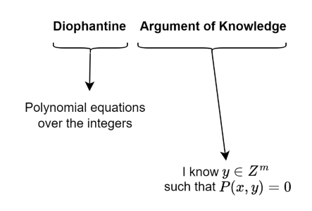

# DARK: Diophantine Argument of Knowledge

**Reference**:

- [DARK paper](https://eprint.iacr.org/2003/105)
- [rkm0959's blog](https://rkm0959.tistory.com/193)

## Integer Commitment Scheme

DARK uses Damgard-Fujisaki integer [commitment scheme](../terms/commitment_scheme.md), you can read the full paper of it
[here](https://citeseerx.ist.psu.edu/document?repid=rep1&type=pdf&doi=fdfdb6df844a02ec1d783e43899a179920f13dac). This scheme is 
**additive homomorphic** and **multiplicative homomorphic**. That is, we can prove that $a + b = c$ and $a \cdot b = c$ using $com(a),
com(b), com(c)$.

For example, prover has some values $x_1, x_2, x_3, x_{4}$ and wants to prove that $x_4 = x_1x_2+x_3$.
- Prover calculates $x_5=x_1x_2$ and sends commitments of $x_1,x_2,x_3,x_4,x_5$ to verifier. 
- Verifier checks that $x_5=x_1x_2$ and $x_4=x_3+x_5$ using their commitments.

## DARK

### Main Idea

First, you should read the definitions
of [diophantine equation](../terms/diophantine_equation.md), [diophantine set](../terms/diophantine_set.md).

The main idea of DARK is to prove a constraint with $\mu$ as the witness, prover needs to find an auxiliary witness $\omega$, where
$R_S(\mu, \omega) = 0$ and then uses the integer commitment scheme above to commit to elements of $R_S$. For example, to prove $\mu \geq 0$, prover
finds $\omega_{1}, \omega_{2}, \omega_{3}, \omega_{4} \ s.t. \ R_S(\mu,\omega)=\mu - (\omega_1^2 + \omega_2^2 + \omega_3^2 + \omega_4^2)$ (see the
non-negative proof below for more details). Then prover sends $com(\mu), com(\omega_1),com(\omega_2),com(\omega_3),com(\omega_4)$ to verifier. Verifier checks $com(\mu)-(com(\omega_1)^2+com(\omega_2)^2+com(\omega_3)^2+com(\omega_4)^2)=com(0)$ 

To put into practical use, there are a few things to consider:

- Compute the witness $\omega$ in polynomial time.
- The length of our witness has to be sub-quadratic to the length of the input $\mu$

Therefore, we only deal with operations that listed in section [Bounded Arithmetic](#bounded-arithmetic)

### Basic Proofs

> [!NOTE]
> We can use the [fact](../terms/diophantine_set.md#fact) from Diophantine set to deal with AND/OR operations on prepositions.

Below are the basic proofs for constructing our bounded arithmetic.

#### Non-negative Proof

We will leverage [Lagrange's four-square theorem](https://en.wikipedia.org/wiki/Lagrange%27s_four-square_theorem) to prove that $\mu \geq
0$. Below is the algorithm extracted from the paper:

> **Algorithm 1** Algorithm for computing a Lagrange representation $\mu = \omega_1^2 + \omega_2^2 + \omega_3^2 + \omega_4^2,\ \omega
> \leftarrow Lagrange(\mu)$
> 
> 1. Write $\mu$ in the form $\mu =2^t(2k +1),$ where $t,k \geq 0$.
> 2. If $t = 1$, then \
> $(a)$ Choose random $\omega_1 \leq \sqrt{\mu},\ \omega_2 \leq \sqrt{\mu−\omega_1^2}$, such that exactly one of $\omega_1,\ \omega_2$
> is even. Let $p \leftarrow \mu−\omega_1^2 −\omega_2^2$. Now $p \equiv 1$ (mod $4$).   
> $(b)$ Hoping that $p$ is prime, try to express
> $p = \omega^2_3 + \omega^2_4$ as follows: First, find a solution $u$ to the equation $u^2 \equiv−1$ (mod $p$). Apply the Euclidean
> algorithm to $(u,p),$ take the first two remainders that are less than $\sqrt{p}$ to be $\omega_3$ and $\omega_4$. If $p \neq
> \omega^2_3 +\omega^2_4,$ $p$ was not prime, so go back to step 2a.  
> $(c)$ Return $(\omega_1,...,\omega_4)$ as the representation.
> 3. If $t$ is odd but not $1$, find a representation $(\omega_1,...,\omega_4).$ Return $(s\omega_1,...,s\omega_4)$, where $s
> =2^{(t−1)/2}$.
> 4. If $t$ is even, find a representation $\omega^2_1 +\omega^2_2 +\omega^2_3 +\omega^2_4$ for $2(2k +1)$ by step 2. Then convert this
> to a representation for $(2k+1)$ as follows: Group $\omega_1, \omega_2, \omega_3, \omega_4$ so that $\omega_1 \equiv \omega_2$ (mod
> $2$) and $\omega_3 \equiv \omega_4$ (mod $2$). Return $(s(\omega_1 + \omega_2),s(\omega_1 − \omega_2),s(\omega_3 +
> \omega_4),s(\omega_3 − \omega_4)),$ where $s =2^{t/2−1}$.

Finally, the representing polynomial is simply $R_S(\mu; \omega_1, \omega_2, \omega_3, \omega_4) = \mu - \omega_1^2- \omega_2^2-
\omega_3^2- \omega_4^2$

#### Range Proof

To prove $a \leq \mu \leq b$, it suffices to prove $\mu - a \geq 0$ and $b - \mu \geq 0$ using non-negative proof,
i.e. $[a \leq \mu \leq
b] \equiv [\mu - a \geq 0 \land b - \mu \geq 0]$

#### Exponential Relation

Here, our goal is to prove $\mu_3 = \mu_1^{\mu_2}$ . Below is the theorem extracted from the paper.

> **Theorem 3**. Assume $\mu_1 > 1, \mu_3 > 0$ and $\mu_2 > 2$. More precisely, let $E(\mu_1,\mu_2,\mu_3)$ be the next equation:
> 
> 
> $$
> \begin{aligned}
> &{[(\exists \omega_1,\omega_2,\omega_3,\omega_4,\omega_5,\omega_6)(\exists_b \omega_7,\omega_8)]} &&&\\
> &[(\omega_2 = \omega_1\mu_1 −\mu^2_1 −1)\land(\omega_2 −\mu_3 −1 \geq 0)\land &&&(E1-E2) \\
> &(\mu_3 −(\mu_1 −\omega_1)\omega_7 −\omega_8 = \omega_2\omega_3))\land(\omega_1 −2 \geq 0)\land &&&(E3-E4)\\
> &((\omega_1 −2)^2 −(\mu_1 +2)(\omega_1 −2)\omega_5 −\omega^2_5 =1)\land &&&(E5) \\
> &(\omega_1 −2=\mu_2+\omega_6(\mu_1 +2))\land(\omega_7 \geq 0)\land(\omega_7 <\omega_8)\land &&&(E6-E8)\\
> &(\omega^2_7 − \omega_1\omega_7\omega_8 −\omega^2_8 =1)\land(\omega_7 = \mu_2 +\omega_4(\omega_{1} −2)],&&&(E9-E10)
> \end{aligned}
> $$
> 
> where $\exists_b$ signifies a bounded quantifier in the following sense: if $\mu_3 =\mu_1^{\mu_2}$ then $E(\mu_1,\mu_2,\mu_3)$ is
> true with $W = Θ(\mu_2^2log\mu_1)=o(M^2).$ On the other hand, if $\mu_{3 \neq}\mu_1^{\mu_2}$ then either $E(\mu_1,\mu_2,\mu_3)$ is
> false, or it is true but the intermediate witnesses $\omega_7$ and $\omega_8$ have length $\Omega(\mu_3log\mu_3)$, which is equal to
> $\Omega(2^M · M)$ in the worst case.

Basically, if $\mu_3 = \mu_1^{\mu_2}$, we can
efficiently find our witness for $R_S$ that has sub-quadratic length. If $\mu_3 \neq \mu_1^{\mu_2}$, either the witness for $R_S$ does
not exist, or the witness has a large length, $\Omega(\mu_3log\mu_3)$ - which makes it impractical to use as a fake "proof" that $\mu_3
= \mu_1^{\mu_2}$. We can also take care of edge cases like $\mu_1=0,1, \mu_2=0,1,2,\mu_3=0$ easily with our "fact" as well. This shows
that we can completely prove $\mu_3 = \mu_1^{\mu_2}$ with DARK, zero-knowledge. The auxiliary witnesses can be calculated by below
formulas:

- $\omega_{1} \leftarrow (\mu_1 +2)^{[\mu_2+1]} +2$
- $\omega_2 \leftarrow \omega_1\mu1 − \mu_{1}^{2}-1$
- $\omega_{3}\leftarrow(\mu_{3}-(\mu_{1}-\omega_{1})\omega_{1}^{[\mu_{2}]}-\omega_{1}^{[\mu_{2}+1]})/\omega_{2}$
- $\omega_{4}\leftarrow(\omega_{8}-\mu_{2})/(\omega_{1}-2)$
- $\omega_{5}\leftarrow(\mu_{1}+2)^{[\mu_{2}+2]}$
- $\omega_{6}\leftarrow(\omega_{1}-2-\mu_{2})/\dot{(\mu_{1}+2)}$
- $\omega_{7}\leftarrow\omega_{1}^{[\mu_{2}]}$
- $\omega_{8}\leftarrow\omega_{1}^{[\mu_{2}+1]}$

### Bounded Arithmetic

Let's denote some new operations:

- $\sigma(x)=x+1$
- $x \overset{.}{-} y := max(x − y,0)$
- $|x| := \lfloor {log_2(x) +1} \rfloor$
- $MSP(x,i) := \lfloor x/2^i\rfloor$
- $x \sharp y := 2^{|x|·|y|}$

We have following representations:

- $\sigma: [\mu_2 = \sigma(\mu_1)] \equiv [\mu_2 − \mu_1 − 1]$
- $\leq$: proves $b−a \geq 0$ to show $a \leq b$.
- $\overset{.}{-}$: $[\mu_3 = \mu_1 \overset{.}{-} \mu_2] \equiv [((\mu_1 − \mu_2 = \mu_3) \land (\mu_1 \geq \mu_2)) \vee (\mu_3
  =0\land\mu_1 <\mu_2)]$
- $\lfloor x/2 \rfloor: [\mu_2 = \lfloor \mu_1/2 \rfloor ] \equiv [(\mu_1 = 2\mu_2) \vee (\mu_1 =2\mu_2 + 1)]$
- $|x|: [\mu_2 = |\mu_1|] \equiv [2^{\mu_{2}-1} \leq \mu_{1} \leq 2^{\mu_2}-1]$ 
- $MSP(x,i): [\mu_2 = MSP(\mu_1,i)] \equiv [(\mu_1 =2^i · \mu_2 + \omega \land \omega \in [0, 2i − 1])]$
- $\sharp:[\mu_3 = \mu_1 \sharp\mu_2] \equiv [(\omega_1 = |\mu_1|) \land (\omega_2 = |\mu_2|) \land (\mu_3 =2^{\omega_1·\omega_2})]$

## Supersonic

Supersonic is a transparent [SNARK](../terms/zkSNARK.md) with DARK as a compiler. You can read the paper
[here](https://eprint.iacr.org/2019/1229.pdf).
