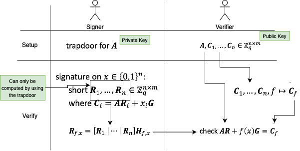

# Lattice-based Homomorphic Signatures

Leveraging the construction of a [trapdoor](../terms/trapdoor.md), we have:

- **Public Key**: An uniform random matrix $A$ and matrices $C_1, \ldots, C_n$ generated randomly.
- **Private Key**: The trapdoor corresponding to the matrix $A$.

As shown in the figure above, the main part of generating a valid signature involves calculating $R_1, \ldots, R_n$. Given $C_i$
and $x_i$, the only way to compute these values is by using the trapdoor for $A$.
