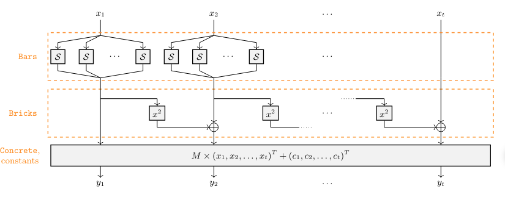
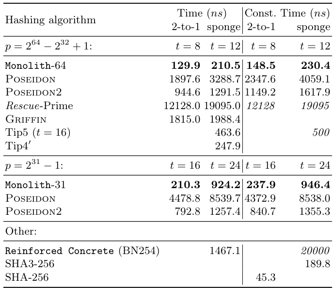
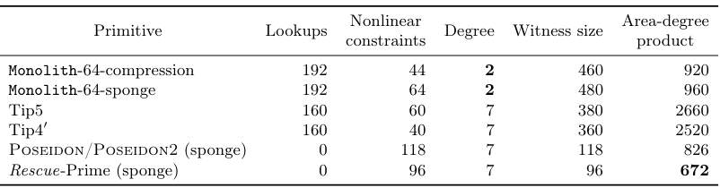

# Monolith Hash

> [!WARNING]
>
> This doc is not verified

References:

+ [Monolith Paper](https://eprint.iacr.org/2023/1025.pdf)
+ [Monolith Hash Presentation in ZK summit](https://www.youtube.com/watch?v=_bLphYtQYQE&ab_channel=ZeroKnowledge)
+ [How to choose ZK-friendly hash](https://blog.taceo.io/how-to-choose-your-zk-friendly-hash-function/)
+ [Introduce Monolith](https://readmedium.com/introducing-monolith-for-faster-hashing-in-zk-settings-6980f406af0e)

## Overview

Monolith is a family of hash functions optimized for zero-knowledge protocols.

Monolith permutation comprises multiple round functions. A single round function is defined as illustrated below

One round is divided into:

+ $\text{Bricks}$: a non-linear layer constructed from a quadratic [Feistel Type-3](
  https://link.springer.com/chapter/10.1007/0-387-34805-0_42)
+ $\text{Concrete}$: an affine layer achieved through multiplication with a circulant MDS matrix
+ $\text{Bars}$: a binary non-linear layer based on Kintsugi strategy, implementing the lookup-based behavior.

The components $\text{Bricks}$ and $\text{Concrete}$ are responsible for the security against statistical attacks, while $\text{Bars}$
provides high security against algebraic attacks. Anticipating improvements, we set the number of rounds uniformly to 6.

## Specification

Monolith uses prime fields $\mathbb{F}_p$ with two options for $p$, namely:

$p_{\text{Goldilocks}} = 2^{64} - 2^{32} + 1$ and $p_{\text{Mersenne}} = 2^{31} - 1$

The parameters used for Monolith are shown in the table below:

| Name                 | $p$                   | Security | Round $N$ | $t$ (2-to-1) | Width $t$ (Sponge) | # Bar $u$ |
|----------------------|-----------------------|----------|-----------|--------------|--------------------|-----------|
| $\text{Monolith-64}$ | $2^{64} - 2^{32} + 1$ | 128      | 6         | 8            | 12                 | 4         |
| $\text{Monolith-31}$ | $2^{31} - 1$          | 128      | 6         | 16           | 24                 | 8         |

### Modes of Operation

Monolith supports [sponge modes](
https://en.wikipedia.org/wiki/Sponge_function) for slightly larger state size and a [2-to-1 compression function](
https://en.wikipedia.org/wiki/One-way_compression_function) for smaller state size (e.g., for Merkle tree with fixed depth).

### Permuatation Structure

The Monolith permutation is defined as:

$$\text{Monolith}(.) = R_N \circ \cdots \circ R_2 \circ R_1 \circ \text{Concrete}(.)$$

where $N$ is the number of rounds and $R_i$ over $\mathbb{F}_p^t$ are defined as

$$R_i(.) = c^{(i)} + \text{Concrete} \circ \text{Bricks} \ \circ \text{Bars}(.), \ \forall i \in \lbrace 1, 2, \ldots, N \rbrace$$

where $c^{(i)}$ are pseudo-random round constants, excluding $c^{(N)} = 0$.

> [!NOTE]
> A single $\text{Concrete}$ operation is applied before the first round.

### Bars Layer

The $\text{Bars}$ layers is defined as:

$$\text{Bars}(x_1,\ldots,x_t):=\text{Bar}(x_1)\| \cdots \| \text{Bar} \| \text{Bar}(x_u) \| x_{u+1} \| \cdots \| x_t$$

for a $t$ - element state, where:

+ $u \in \lbrace 1, \ldots, t \rbrace$: number of $\text{Bar}$ operations are applied in each round
+ $u$ such that: $u \cdot \log_2 p \approx 256$, i.e., the nonlinear part occupies around 256 bits of the state.

Each $\text{Bar}$ is defined as:

$$\text{Bar}(x) = C \circ S \ \circ D(x)$$

where $C$, $S$, and $D$ are the operations defined in [kintsugi strategy](../terms/kintsugi-strategy.md).

> [!NOTE]
> You should read the [kintsugi strategy](../terms/kintsugi-strategy.md) before proceeding to the section below to fully understand
> the underlying mathematics.

In the following, we describe them individually for $\text{Monolith-64}$ and $\text{Monolith-31}$ with parameters taken
from the table above corresponding to each type.

#### $\text{Bars}$ For $\text{Monolith-64}$

For $D$ operation, we use a decomposition into 8-bit values such that:

$$x = 2^{56}x'_8 + 2^{48}x'_7 + 2^{40}x'_6 + 2^{32}x'_5 + 2^{24}x'_4 + 2^{16}x'_3 + 2^{8}x'_2 + x'_1$$

The composition $C$ is the inverse operation of the decomposition $D$.

For $S$ operation, we set $s=8$, then all $S_i$ over $\mathbb{F}^8_2$ are defined as:

$$S_i(y) = (y \ \oplus ((\bar{y} \lll 1) \ \odot (y \lll 2) \ \odot (y \lll 3))) \lll 1$$

where $\lll$ is a circular shift (we interpret an integer as a big-endian 8-bit string) and $\bar{y}$ is the bitwise negation.

#### $\text{Bars}$ For $\text{Monolith-31}$

The decomposition $D$ is given by:

$$x=2^{24}x'_4 + 2^{16}x'_3 + 2^{8}x'_2 + x'_1$$

where $x'_4 \in \mathbb{Z}^7_2$ and $x'_3, x'_2, x'_1 \in \mathbb{Z}^8_2$.

The composition $C$ is the inverse of $D$.

For $S$ operation, we set $s=4$ using $\lbrace 8, 7 \rbrace$ - bit lookup tables.

Then for $y \in \mathbb{F}_2^8$ and $y' \in \mathbb{F}_2^7$, the S- boxes are defined as:

$$\forall i \in \lbrace 1,2,\ldots,s - 1 \rbrace :S_i(y)=(y \oplus ((\bar{y} \lll 1) \odot (y \lll 2) \odot (y \lll 3))) \lll 1$$

and

$$S_s(y')=(y' \ \oplus ((\bar{y'} \lll 1) \ \odot (y' \lll 2) )) \lll 1$$

### Bricks

The component $\text{Bricks}$ is defined as:

$$\text{Bricks}(x_1, \ldots, x_t) := (x_1, x_2 + x_1^2, x_3 + x_2^2, \ldots, x_t + x_{t-1}^2)$$

$\text{Bricks}$ is selected to minimize multiplications by using the square map $x \mapsto x^2$, reducing computational overhead and
requiring only degree-2 constraints, a significant advantage over competitors like [Poseidon](
https://eprint.iacr.org/2019/458), [Rescue](
https://eprint.iacr.org/2019/426), and [Tip5](
https://eprint.iacr.org/2023/107).

### Concrete Layer

The $\text{Concrete}$ layer is defined as:

$$\text{Concrete}(x_1, \ldots, x_t) := M \times (x_1, \ldots, x_t)^T$$

where $M \in \mathbb{F}^{t \times t}_p$ is an MDS matrix.

For $\text{Monolith-64}$:

+ For $t=8$ then $M = circ(23, 8, 13, 10, 7, 6, 21, 8)$
+ For $t=12$ then $M = circ(7, 23, 8, 26, 13, 10, 9, 7, 6, 22, 21, 8)$.

These matrices have the unique advantage of having small elements in the time and frequecy domain, allowing for
especially fast native performance.

For $\text{Monolith-31}$:

+ For $t=16$, $M$ is the $16 \times 16$ matrix from [Tip5](
  https://eprint.iacr.org/2023/107), i.e.,

$$\begin{align} M = circ(&61402, 1108, 28750, 33823, 7454, 43244, 53865, 12034,
\newline &56951, 27521, 41351, 40901, 12021, 59689, 26798, 17845) \end{align}$$

+ For $t=24$, $M$ is a $24 \times 24$ submatrix of the defined $32 \times 32$ circulant MDS matrix:

$$\begin{align} M =
circ(&\text{0x536C316},\text{0x1DD20A84}, \text{0x43E26541}, \text{0x52B22B8D}, \text{0x37DABDF0}, \text{0x540EC006}, \\
&\text{0x3015718D}, \text{0x5A99E14C}, \text{0x23637285}, \text{0x4C8A2F76}, \text{0x5DEC4E6E}, \text{0x374EE8D6},\\
&\text{0x27EDA4D8}, \text{0x665D30D3}, \text{0x32E44597}, \text{0x43C7E2B3}, \text{0x67C4C603}, \text{0x78A8631F},\\
&\text{0x452F77E3}, \text{0x39F03DF}, \text{0x743DBFE0}, \text{0x4DA05A48}, \text{0x5F027940}, \text{0x8293632}, \\
&\text{0x50F2C76A}, \text{0x7B773729}, \text{0x577DE8B0}, \text{0x73B1EAC6}, \text{0x58DA7D29},\text{0x67AA4375}, \\
&\text{0xDBA9E33}, \text{0x2655E5A1}) \end{align}$$

## Application

You should use Monolith if ZK proof system:

+ Supports lookup argument
+ Operates natively with a small prime field.

## Performance

In the following figure, we have the analysis of Monolith's plain performance

Monolith is significantly faster than other ZK-friendly hash functions, especially $\text{Monolith-64}$ in compression mode.

In the figure below, Monolith's circuit efficiency is evident due to its native degree of only 2, allowing various trade-offs
in circuit design.

## Implementation

Here are some implementations of this hash:

+ [Winterfell](https://github.com/facebook/winterfell/blob/main/crypto/src/hash/mds/mds_f64_12x12.rs)
+ [HorizenLabs](https://github.dev/HorizenLabs/monolith/tree/main/ci)
+ [Plonky3](https://github.dev/Plonky3/Plonky3/tree/main/monolith)
+ [Circom](https://github.com/shuklaayush/circom-monolith/blob/main/circuits/goldilocks.circom)

## Conclusion

Therefore, here are some properties that make Monolith hash as fast as SHA-3 and the fastest ZK-friendly hash

+ Improve the S-box function that is defined by:
    + Splitting a field element into smaller bit arrays.
    + Then applied Daemen’s χ function and [similar ones](
      https://cs.ru.nl/~joan/papers/JDA_Thesis_1995.pdf) into these arrays, which can be parallelized with fast
      vector instructions and implemented as lookup table in circuits.
    + Finally, the outputs are reassembled into a field element without overflow or collision, asserting minimal circuit overhead.
+ Using a Feistel Type-3 function together with an MDS layer:
    + Use faster squaring operations (i.e., $x^2$) instead of more expensive (as $d$ must be coprime with $p - 1$) power
      function over $\mathbb{F}_p$
