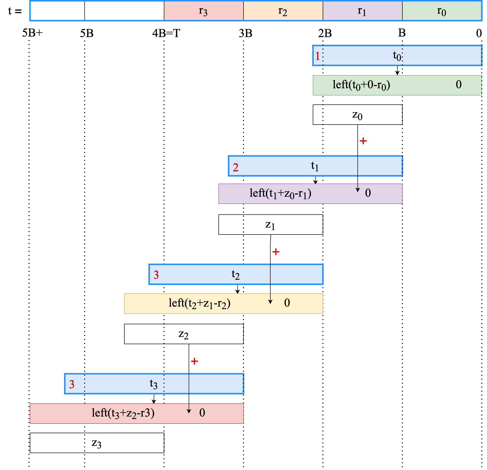

# Non-Native Field Arithmetic

**References:**

- [Aztec Emulated Field and Group Operations for Efficient Large Number Arithmetic](https://hackmd.io/@kullervo/cryptographyExplorations/%2F%40kullervo%2FbignumberCircuits)
- [Non-Native Field Arithmetic](https://hackmd.io/@JkY-zACaSqerTtn_UwFjKg/SJZw6x75o)
- [Field selection for recursive SNARKs](https://medium.com/delendum/field-selection-for-recursive-snarks-726ad56c3a3c)
- [Foreign field arithmetic](https://www.youtube.com/watch?v=IBeo5epQoYo)

## Motivation

Sometimes, we want to represent modulo arithmetic with prime modulus $p$ over our prime finite field $\mathbb{F}_n$ . It's called
non-native field arithmetic (or some other names like *foreign field, mismatched field, non-aligned field, wrong field*). Below are a
few use cases:

- **For ZK-Rollups after EIP-4844:** After [EIP-4844](zk_rollups_after_eip4844.md), this operation is required for proof systems that
  do not
  use [BLS12-381](../terms/bls12-381.md) modulus to deal with blob transaction.
- **Verify cryptographic constructs:** at the protocol level, it is common to verify cryptographic constructs (hashes, signatures,
  proofs) that may be defined over an arbitrary field ($\mathbb{F}_2, \mathbb{F}_q, ...$) inside our field $\mathbb{F}_n$.
- **Proof aggregation:** merge multiple proofs and create a single proof from them to save resource.

In this article, we will take advantage of [Chinese Remainder Theorem](../terms/chinese_remainder_theorem.md) (CRT) to solve the problem.

## Problem

We are interested in building a circuit for $a \cdot b \pmod p$ over our field $\mathbb{F}_n$ (the same for $a+b$ with our trick).
Typically, a witness $(a,b,r,q,p)$ is produced and the integer constraint $a \cdot b - p \cdot q - r = 0$ is included as part of
the [polynomial commitment](../terms/polynomial-commitment/000_polynomial_commitment.md).

We need to avoid the computation of $a \cdot b$ or $p \cdot q$, because it is inefficient to compute them if $p$ is a large prime
number.

For simplicity, we can assume that $n < p$.

## Non-native Field Arithmetic with CRT

### Constraint Decomposition with Limbs

In the following, we will work in modulus $2^T$, where $p < 2^T$. We denote $p' = -p \mod 2^T$, or more concrete $p' = 2^T - p$. It is
easy to see that $a \cdot b - p \cdot q \equiv a \cdot b + p' \cdot q \pmod{2^T}$.

Assume that $T \mid 4$ , we will write our integers in binary notation as a concatenation of multiple bit subsections, sometimes called
limbs.

Consider limbs of size $B = T / 4$, then an integer $a \in \lbrack 0, 2^T)$ could be written as $4$ limbs: $a = \lbrack a_3, a_2, a_1,
a_0\rbrack$ with
$a_i \in \lbrack 0, 2^B)$ and $a = \sum\limits_{0 \leq i < 4}{a_i \cdot 2^{iB}}$ . Given $a,b,q,p' \in \lbrack 0, 2^T)$, we can rewrite
the equation
$a \cdot b + p' \cdot q$ as follow:

$$
\begin{aligned}
a \cdot b + p' \cdot q & = \lbrack a_3, a_2, a_1, a_0\rbrack \cdot \lbrack b_3, b_2, b_1, b_0\rbrack + \lbrack p'_ 3, p'_ 2, p'_ 1, p'_
0\rbrack \cdot \lbrack q_3, q_2, q_1, q_0\rbrack \\
& =(a_{0}\cdot b_{0}+q_{0}\cdot p_{0}^{\prime})\cdot2^{0B}+ \\
& \quad \ (a_{1}\cdot b_{0}+a_{0}\cdot b_{1}+q_{1}\cdot p_{0}^{\prime}+q_{0}\cdot p_{1}^{\prime})\cdot2^{1B}+ \\
& \quad \ (a_{2}\cdot b_{0}+a_{0}\cdot b_{2}+a_{1}\cdot b_{1}+q_{2}\cdot p_{0}^{\prime}+q_{0}\cdot p_{2}^{\prime}+q_{1}\cdot p_
{1}^{\prime})\cdot2^{2B}+ \\
& \quad \ (a_{3}\cdot b_{0}+a_{0}\cdot b_{3}+a_{1}\cdot b_{2}+a_{2}\cdot b_{1}+q_{3}\cdot p_{0}^{\prime}+q_{0}\cdot p_{3}^{\prime}+q_
{1}\cdot p_{2}^{\prime}+q_{2}\cdot p_{1}^{\prime})\cdot2^{3B} \\
& =t_{0}\cdot2^{0B}+t_{1}\cdot2^{1B}+t_{2}\cdot2^{2B}+t_{3}\cdot2^{3B}
\end{aligned}
$$

We can ignore $a_i \cdot b_j$ with $i+j \geq 4$ because it is divisible by $2^T = 2^{4B}$. Now we have:

$$
\begin{array}{l}
{{t_{0}\in\lbrack 0,2^{2B+1})\mathrm{}}}\\
{{t_{1}\in\lbrack 0,2^{2B+2})\mathrm{}}}\\
{{t_{2}\in\lbrack 0,2^{2B+3})\mathrm{}}}\\
{{t_{3}\in\lbrack 0,2^{2B+3})\mathrm{}}}\end{array}
$$

Let $t = t_{0}\cdot2^{0B}+t_{1}\cdot2^{1B}+t_{2}\cdot2^{2B}+t_{3}\cdot2^{3B}$. Note that $t$ itself does not need to be less than
$2^T$. Thus, if $a \cdot b + p' \cdot q = r \mod 2^T$, it is not guaranteed that $t = r$. However, the last $T$ bits of $t$ are
certainly going to equal $r$ (the reason why we choose $2^T$ as our modulus).

With $r = \lbrack r_3, r_2, r_1, r_0\rbrack$, we have $r_0$ is the last $B$ bits of $y_0 = t_0 + 0$, i.e $y_0-r_0 = z_0 \cdot 2^B$ for
some
non-negative $z_0$. Similarly, $r_1$ is the last $B$ bits of $y_1 = t_1 + z_0$ with $y_1 - r_1 = z_1 \cdot 2^B$. We can write the all
the
limbs of $r$ in a similar fashion:

$$
\begin{array}{l l}
{{y_{0}=t_{0}+0,}}&{{y_{0}-r_{0}=z_{0}\cdot2^{B}}}\\
{{y_{1}=t_{1}+z_{0},}}&{{y_{1}-r_{1}=z_{1}\cdot2^{B}}}\\
{{y_{2}=t_{2}+z_{1},}}&{{y_{2}-r_{2}=z_{2}\cdot2^{B}}}\\
{{y_{2}=t_{3}+z_{2},}}&{{y_{3}-r_{3}=z_{3}\cdot2^{B}}}
\end{array}
$$

Removing the intermediate variables $y_i$, we get:

$$
\begin{array}{l}
{{t_{0}+0-r_{0}=z_{0}\cdot2^{B}}}\\
{{t_{1}+z_{0}-r_{1}=z_{1}\cdot2^{B}}}\\
{{t_{2}+z_{1}-r_{2}=z_{2}\cdot2^{B}}}\\
{{t_{3}+z_{2}-r_{3}=z_{3}\cdot2^{B}}}
\end{array}
$$

To summarize, for a given $(\lbrack a_3,a_2,a_1,a_0\rbrack, \lbrack b_3, b_2, b_1, b_0\rbrack, \lbrack p'_3, p'_2, p'_1, p'_0\rbrack,
\lbrack q_3, q_2, q_1, q_0\rbrack, \lbrack r_3,r_2,r_1,r_0\rbrack,t_3,t_2,t_1,t_0, z_3,z_2,z_1,z_0)$
that satisfies the 4 constraints above, along with constraints that ensure $p'=2^T-p$ (notice that $p$ is an odd prime)

$$
\begin{array}{l}
{{p_{0}^{\prime}+p_{0}+0=2^{B}}}\\
{{p_{1}^{\prime}+p_{1}+1=2^{B}}}\\
{{p_{2}^{\prime}+p_{2}+1=2^{B}}}\\
{{p_{3}^{\prime}+p_{3}+1=2^{B}}}
\end{array}
$$

it is guaranteed that $a \cdot b - q \cdot p - r = 0 \mod 2^T$ (but not $a \cdot b - q \cdot p - r = 0$ on their own).

### Constraints in Our Native Field

Next, we will consider a method to ensure $a \cdot b - q \cdot p - r = 0 \mod n$. We denote some new variables $\lbrace a_n, b_n, q_n,
p_n,
r_n\rbrace \ s.t.\ a_n = a \mod n$ etc., respectively. Now, we have more constraints with advice variables $\lbrace v_a, v_b, v_q, v_p,
v_r, v_
{overall}\rbrace$

$$
\begin{array}
{c}{{v_{a}\cdot n+a_{n}=a}}\\
{{v_{b}\cdot n+b_{n}=b}}\\
{{v_{q}\cdot n+q_{n}=q}}\\
{{v_{p}\cdot n+p_{n}=p}}\\
{{v_{r}\cdot n+r_{n}=r}} \\
v_{overall} \cdot n = a_n \cdot b_n - q_n \cdot p_n - r_n
\end{array}
$$

Because $a,b,q,p,r$ are not fit in our native field, we need to decompose them into their limbs.
For a given $(a,b,q,p,r,v_a, v_b, v_q, v_p, v_r, v_{overall})$ that follow the 6 constraints above, it is guaranteed that $a \cdot b -
q \cdot p - r = 0 \mod n$, but not $a \cdot b - q \cdot p - r = 0$.

### Applying the Chinese Remainder Theorem

Now we have $a \cdot b - q \cdot p - r = 0 \mod n$ and $a \cdot b - q \cdot p - r = 0 \mod 2^T$, which implies that $a \cdot b - q
\cdot p - r = 0 \mod (n \cdot 2^T)$ by our CRT. If we choose $T$ such that $a \cdot b - q \cdot p - r < p^2 < n \cdot 2^T$, then it
means that $a \cdot b - q \cdot p - r = 0$. Note that we should choose $T$ such that $t_3 < n$ to be able to represent all our numbers
in our native field $\mathbb{F}_n$.

### Range check using lookup argument

When decomposing an element into its limbs, we need to perform a ==range check== $a_i \in [0, 2^B) \forall i$, which can be done quickly using lookup argument (e.g., [Plookup](./plookup.md)). For example, with $B = 64$, we can create a lookup table $t = \lbrace 0, 1, ..., 2^8-1\rbrace$, and add the following constraints to ensure an element $x$ is in $[0, 2^B)$:

$$
\begin{aligned}
\lbrace x_0, x_1, \ldots, x_7\rbrace \in t \\
\sum_{i=0}^7 x_i * 2^{7i} = x
\end{aligned}
$$
