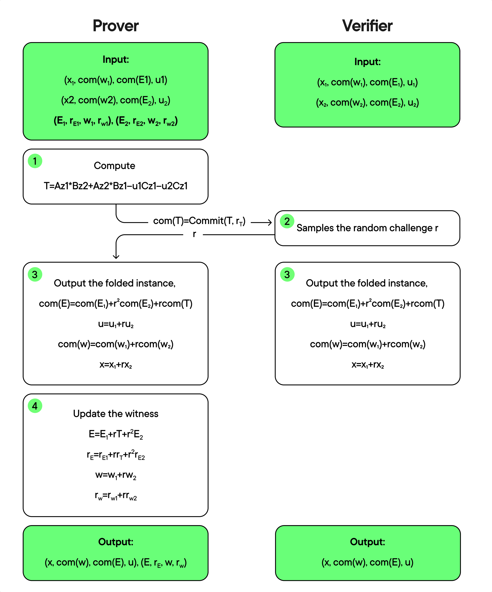
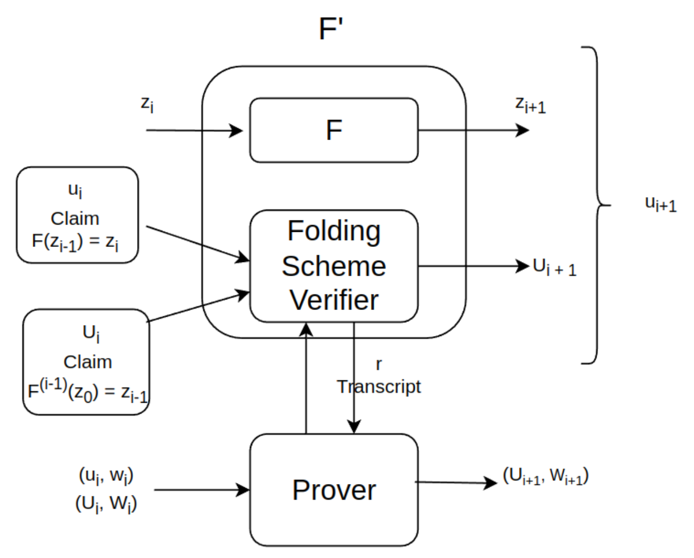
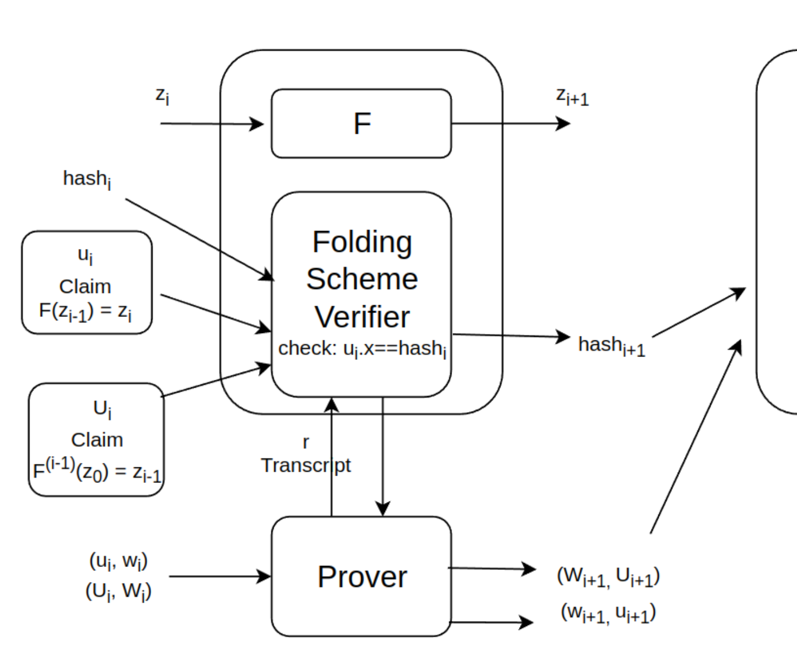
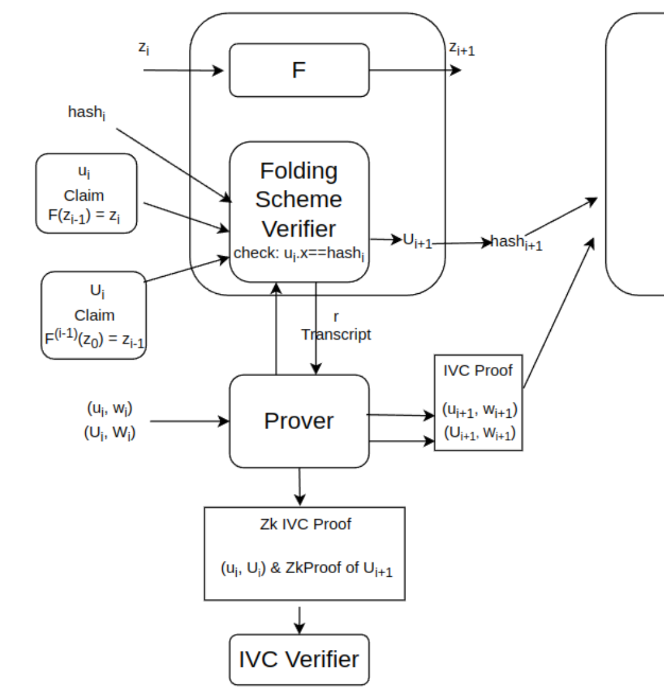

# Nova

## Recursive SNARKs

Read the definition of recursive SNARK [here](../terms/recursive_snark.md).

## IVC

Read the definition of IVC [here](../terms/ivc.md).

## Folding Scheme

Read the definition of the folding scheme [here](../terms/folding_scheme.md).

## R1CS

Read the definitions of R1CS, Relaxed R1CS and Committed Relaxed R1CS [here](../terms/r1cs.md).

## Folding Scheme for Committed Relaxed R1CS

For Committed Relaxed R1CS, we use succinct and hiding additively
[homomorphic commitments](../terms/homomorphic_encryption.md) for
$W$ and $E$ in the instance, and treat both $W$ and $E$ as the witness.

Specifically, we can compress $Z_1$ and $Z_2$ into a single $Z$ using
Random Linear Combination. This technique uses a random $r$ and
computes:

- $Z_1 = (W_1, x_1, u_1)$, $Z_2 = (W_2, x_2, u_2)$, $Z = (W, x, u)$.
- $x = x_1 + r \cdot x_2$
- $W = W_1 + r \cdot W_2$
- $u = u_1 + r \cdot u_2$
- $E = E_1 + r\cdot (AZ_1 \circ BZ_2 + AZ_2 \circ BZ_1 − u_1CZ_2 − u_2CZ_1) + r^2 \cdot E_2$

Thus, the R1CS satisfied condition still holds:

$$
\begin{array}{rcl}
AZ \circ BZ & = & A(Z_1 + r \cdot Z_2) \circ B(Z_1 + r \cdot Z_2) \\
& = & (u_1CZ_1 + E_1) + r \cdot (AZ_1 \circ BZ_2 + AZ_2 \circ BZ_1) + r^2 \cdot (u_2CZ_2 + E_2) \\
& = & (u_1 + r \cdot u_2) C(Z_1 + rZ_2) + E \\
& = & uCZ + E.
\end{array}
$$

So, the folding scheme prover and the folding scheme verifier
proceed as follows:

- **Prover (P)**: sends $\bar{T} = \text{Com}(T, r_T)$ where:
  $T = AZ_1 \circ BZ_2 + AZ_2 \circ BZ_1 − u_1CZ_2 − u_2CZ_1$
  as the cross-term.
- **Verifier (V)**: sends a random challenge: $r$.
- **Verifier (V) and Prover (P)**: output the folded instance: $(\bar E, u, \bar{W}, x)$:
  - $\bar{E} \leftarrow \bar{E_1} + r \cdot T + r^2 \cdot \bar{E_2}$
  - $u \leftarrow u_1 + r \cdot u_2$
  - $\bar{W} \leftarrow \bar{W_1} + r \cdot \bar{W_2}$
  - $x \leftarrow x_1 + r \cdot x_2$
- **Prover (P)**: outputs the folded witness $E, r_E, W, r_W$, where:
  - $E \leftarrow E_1 + r \cdot T + r^2 \cdot E_2$
  - $r_E \leftarrow r_{E_1} + r \cdot r_T + r^2 \cdot r_{E_2}$
  - $W \leftarrow W_1 + r \cdot W_2$
  - $r_W \leftarrow r_{W_1} + r \cdot r_{W_2}$

Then, the Prover (P) can claim his correct folding by proving that $\bar{W}$ and $\bar{E}$
are the commitments of $W$ and $E$.

You should see the depiction below:

We can make this protocol non-interactive via [Fiat-Shamir](../terms/fiat_shamir.md). Let $\rho$
denote a [random oracle](../terms/random_oracle_model.md), then
the Prover (P) can get random challenge $r$ via:

$r \leftarrow \rho(vk, u_1, u_2, \bar T)$.

## Constructing IVC from a Folding Scheme

### Simple IVC Folding Scheme

The simple idea is: at step $i$ of the [IVC](../terms/recursive_snark.md) process:

- Nova’s prover proves that the step $i$ was computed correctly.
- Nova treats the computation at step $i-1$ as an R1CS instance and folds it into a running relaxed R1CS instance.

So, each step computes a step of the incremental computation and includes a circuit for the computation of the verifier
in the non-interactive folding scheme for relaxed R1CS.

In this construction, the prover uses an augmented function $F'$. This function not only invokes $F$ but also performs
additional bookkeeping to fold proofs of prior invocations of itself.

$F'$ takes as non-deterministic advice two committed relaxed R1CS instances $u_i$ and $U_i$, where:

- $u_i$ represents the correct execution of invocation $i$ of $F'$:  $F'(z_{i-1}) = z_i$. This is the **fresh instance**.
- $U_i$ represents the correct execution of invocations $1,...,i-1$ of $F'$: $F'^{(i -1)}(z_0) = z_{i-1}$.
  This is the **running instance**.

$F'$ executes 2 tasks:

- Executes a step of the incremental computation: $F'(z_i) = z_{i + 1}$.
- Invokes the verifier of non-interactive folding scheme to fold the task of checking $u_i$ and $U_i$ into the task of checking
- a single instance $U_{i+1}$.

The IVC prover then computes a new instance $u_{i+1}$,which is used to attest that $z_{i + 1} = F'(z_i)$, and gets $U_{i+1}$ as
the result of folding $u_i$ and $U_i$.

Here is the depiction:

However, the instance $u_{i + 1}$ contains $U_{i + 1}.x$, and $F'$ must hold $u_{i+1}.x$ into $U_{i+1}.x$ in the next iteration,
so the size of $u_{i+1}$ grows linearly. To avoid that, we replace it with a hash function of its public IO. The next invocation
of $F'$ will takes the preimage of this hash via the proof.

In particular, the public IO of $u_i$ and $u_{i+1}$ are:

- $u_i.x = hash(i, z_0, z_i, U_i)$
- $u_{i+1}.x = hash(i, z_0, z_{i+1}, U_{i+1})$

The verifier checks that $u_i.x \stackrel{?}{=} hash(i, z_0, z_i, U_i)$, and the prover now needs to send proof:  
$((U_{i+1}, W_{i+1}), (u_{i+1}, w_{i+1}))$.

### IVC Folding Scheme with zkSNARKs

First, the witness $W$ and $w$ are sent by the prover, so it is not zero-knowledge. Second, the proof size is linear in the size
of $F$. Therefore, we should use zkSNARKs to make the proof zero-knowledge and succinct.

To do that, the prover creates a proof $\Pi$ claims that he knows a witness $W'$ such that:
$(U', W') = folding((U, W), (u, w))$, and the verifier will verify that proof for each iteration.

Unfortunately, employing an off-the-shelf zkSNARK makes the overall solution impractical. The reason is that the zkSNARK prover
must prove the knowledge of vectors whose commitments equal a particular value (e.g., $\bar W$ is the commitment of $W$). This
requires encoding a linear number of group scalar multiplications in the programming model of zkSNARKs. One way to make this
practical is by interpreting commitments to vectors as polynomial commitments.

## References

[Nova paper - Abhiram Kothapalli & Srinath Setty & Ioanna Tzialla](https://eprint.iacr.org/2021/370.pdf)

[Nova: IVC from folding scheme - ZKstudy Session 07 [EN]](https://www.youtube.com/watch?v=xpgDdTqPnSg&t=1389s)

[(Workshop) [Super] Nova [Scotia]: Unpacking Nova](https://www.youtube.com/watch?v=N6RW_YhLMNw)
