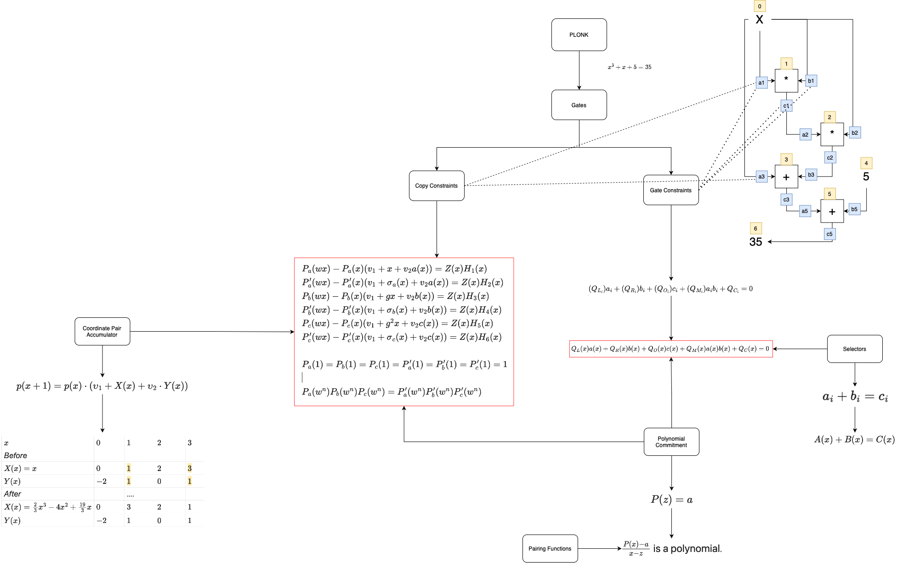
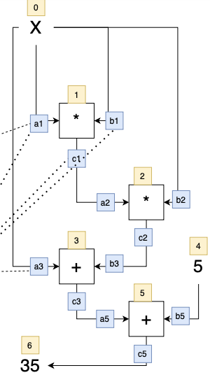

# PLONK: Permutations over Lagrange-Bases for Oecumenical Noninteractive Knowledge

**Reference:** [PLONK Blog Post](https://vitalik.eth.limo/general/2019/09/22/plonk.html)

## Overview

### Problem Statement

Consider the polynomial $P(x) = x^3 + x + 5$, which evaluates to $35$.

### Gates and Constraints 

In the context of gates and wires, PLONK introduces two main types of constraints:

- **Gate Constraints:** Equations between wires connected to the same gate, such as $a_1 \cdot b_1 = c_1$.
- **Copy Constraints:** Assertions about the equality of different wires anywhere in the circuit, like $a_0 = a_1 =
  b_1 = b_2 = a_3$ or $c_0 = a_1$.

### Linear Systems 

The linear systems are represented as equations of the form:

$$
\begin{aligned}
(Q_{L_i})a_i + (Q_{R_i})b_i + (Q_{O_i})c_i + (Q_{M_i})a_{i}b_{i} + Q_{C_i} = 0
\end{aligned}
$$

Here, $L$ denotes left, $R$ denotes right, $O$ denotes output, $M$ denotes multiplication, and $C$ denotes a constant.
The variables $a_i$, $b_i$, and $c_i$ are provided by the user.

The gate constraints are categorized into three sets:

1. **Addition Gate:** $Q_{L_i} = 1, Q_{R_i} = 1, Q_{M_i} = 0, Q_{O_i} = -1, Q_{C_i} = 0$
2. **Multiplication Gate:** $Q_{L_i} = 0, Q_{R_i} = 0, Q_{M_i} = 1, Q_{O_i} = -1, Q_{C_i} = 0$
3. **Constant Gate:** $Q_{L_i} = 1, Q_{R_i} = 0, Q_{M_i} = 0, Q_{O_i} = 0, Q_{C_i} = -x$

### Polynomials 

Using [Lagrange Interpolation](../terms/lagrange_interpolation.md), constants in the linear systems are converted into
corresponding polynomials:

$$
\begin{aligned}
Q_L (x)a (x) + Q_R (x)b (x) + Q_O (x)c (x) + Q_M (x)a (x)b (x) + Q_C (x) = 0
\end{aligned}
$$

### Roots of Unity 

The n-th roots of unity are employed, where $x^n = 1$.

You can read about two context that used roots of unity it [here](https://hackmd.io/@benjaminion/bls12-381#Roots-of-unity).

### Copy Constraints 

To verify copy constraints, equations such as $a(5) = c(7)$ and $c(10) = c(12)$, PLONK
uses [coordinate accumulators](../terms/coordinate_pair_accumulator.md). Two accumulators are created, one with 
$X(x) =x$ and $Y(x) = a(x)$, and the other with $Y(x) = a(x)$, but $X'(x)$ is a polynomial that evaluates permutations,
flipping, or rearranging values in each copy constraint.

To prove constraints between $a$, $b$, and $c$, we use the same procedure, but instead "accumulate" together points from
all three polynomials. We assign each of $a$, $b$, $c$ a range of $X$ coordinates (e.g. $a$ gets $X_a(x) = x$ i.e.
$0...n - 1$, $b$ gets $X_b(x) = n + x, i.e., n...2n - 1$, $c$ gets $X_c(x) = 2n + x$, i.e., $2n…3n – 1$). To prove copy
constraints that hop between different sets of wires, the "alternate" X coordinates would be slices of a permutation
across all three sets. For example, if we want to prove $a(2) = b(4)$ with $n = 5$, then $X'_a(x)$ would have
evaluations $\{0,1,9,3,4\}$ and $X'_b(x)$ would have evaluations $\{5,6,7,8,2\}$ (notice the $2$ and $9$ flipped where
$9$ corresponds to the $b_4$ wire). Often $X'_a(x), X'_b(x)$, and $X'_c(x)$ are also called $\sigma_a(x), \sigma_b(x)$,
and $\sigma_c(x)$.

We would then instead of checking equality within one run of the procedure (i.e., checking $p(4) = p'(4)$) as before, we
would check the product of the three different runs on each side: $p_a(n) \cdot p_b(n) \cdot p_c(n) = p'_a(n) \cdot p'_
b(n) \cdot p'_c(n)$.

The product of the three $p_n$ evaluations on each side accumulates all coordinate pairs in the $a,b$ and $c$ runs on
each side together so this allows us to do the same check as before except that we can now check copy constraints not
just between positions within one of three sets or wires a, b, or c but also between one set or wires and another (e.g.,
as in $a(2) = b(4)$).

### Putting it All Together 

The final equations include the following:

$P_a(wx) - P_a(x)(v_1 + x + v_2a(x)) = Z(x)H_1(x)$

$P_a'(wx) - P_a'(x)(v_1 + \sigma_a(x) + v_2a(x)) = Z(x)H_2(x)$

$P_b(wx) - P_b(x)(v_1 + gx + v_2b(x)) = Z(x)H_3(x)$

$P_b'(wx) - P_b'(x)(v_1 + \sigma_b(x) + v_2b(x)) = Z(x)H_4(x)$

$P_c(wx) - P_c(x)(v_1 + g^2 x + v_2 c(x)) = Z(x)H_5(x)$

$P_c'(wx) - P_c'(x)(v_1 + \sigma_c(x) + v_2c(x)) = Z(x)H_6(x)$

And the protocol ensures that:

$P_a(1) = P_b(1) = P_c(1) = P_a'(1) = P_b'(1) = P_c'(1) = 1$
$P_a(w^n)P_b(w^n)P_c(w^n) = P_a'(w^n)P_b'(w^n)P_c'(w^n)$.

### Polynomial Commitments

The polynomials above are big. So the next question is, how do we get around this so we can make the proof short?

The answer is to use [polynomial commitments](../terms/polynomial-commitment/000_polynomial_commitment.md)
