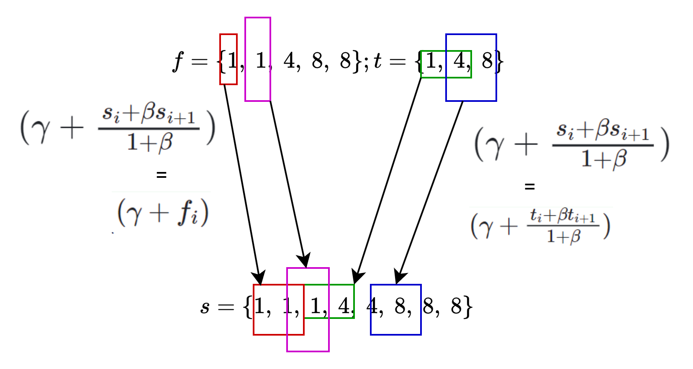

# Plookup: A Simplified Polynomial Protocol for Lookup Tables

**References**:

- [Plookup paper](https://eprint.iacr.org/2020/315.pdf)
- [On Plonk and Plookup](https://research.metastate.dev/on-plonk-and-plookup)
- [XOR Circuit Example](https://anoma.net/blog/hash-functions-in-plonkup#an-example-circuit)

## Symbol Description

- $H = \lbrace g, ... g^{n+1}=1 \rbrace$ is a multiplicative [group](../terms/group.md) of order $n+1$ in $\mathbb{F}$
- $\lbrack n \rbrack$ represents $\lbrace 1,2,3...,n \rbrace$
- For $f \in \mathbb{F}\lbrack X \rbrack$, if $f_i=f(g^i), i \in \lbrack n+1 \rbrack$ then $f_i$ can be expressed as $f(g^i)$
- The vector $f \in \mathbb{F}^n$ can also be expressed by the polynomial $f \in \mathbb{F}_{\lt n}\lbrack X \rbrack$ , where $f(g^i) =
  f_i$
- Given two vectors $f \in \mathbb{F}^n, t \in \mathbb{F}^d, f \subset t$ represents $\lbrace f_i\rbrace_{i \in \lbrack n \rbrack}
  \subset \lbrace t_i\rbrace_{i \in \lbrack d \rbrack}$
- $L_i \in \mathbb{F}_{\lt n}\lbrack X \rbrack$ is the $i$'th [Lagrange](../terms/lagrange_interpolation.md) polynomial for $H$, that
  satisfies
  $L_i(g^i) = 1$ and $L_i(g^j) = 0$ for $j \neq i$

## Introduction

*Plookup* is a protocol for checking the values of a committed polynomial $f \in \mathbb{F}_{\lt n}\lbrack X \rbrack$ over a
multiplicative subgroup $H \in \mathbb{F}$ of size $n$, are contained in the values of a table $t \in \mathbb{F}^d$ (i.e $f \subset
t$).

A typical scenario is to do a ==range check== in a zk-SNARK, verifying that all evaluations are on $\lbrack 0, m
\rbrack.$ Suppose we want to check that a variable $a$ has to be in a prescribed range, such as a `u8`. One simple yet ineffective way
to do so is to express $a$ in its binary form $a_0a_1a_2...a_7$ and check that:

1. Every variable is boolean $a_i(1−a_i)=0$
2. $a=\sum a_k2^k$

This approach makes us add several additional constraints, which scale proportionally with the number of bits. Original paper
investigate an alternative approach, where for commonly used operations we precompute a lookup table of the legitimate (input, output)
combinations; and the prover argues the witness values exist in this table. By performing a random folding $(f = a + \zeta b +
\zeta^2c$ encodes for tuple $(a,b,c))$, we can reduce to the case of looking up single field elements instead of tuples.

> [!Note]
> For simplicity, we can assume that $\lbrace f_i\rbrace$ is sorted, $\lbrace t_i\rbrace$ has no repeated values
>

## Randomized Differences

Note that if $f \subset t$, then these ==sets of non-zero differences== are the same (the difference set of a set $\lbrace f_1,
f_2, ..., f_n\rbrace$ is the set $\lbrace f_2-f_1, f_3-f_2, ..., f_n-f_{n-1}\rbrace$). For example, we have:

$$
\begin{array}{rcl}
t & = & \{ 1,4,8 \} \\
f & = & \{ 1,1,4,8,8,8 \}
\end{array}
$$

having the same difference set $\lbrace 3,4\rbrace$. However, the converse is not true (e.g. $f=\lbrace 1,5,5,8,8\rbrace$ with the
difference set $\lbrace 4,3\rbrace$). For this reason, Plookup instead uses a ==randomized difference set== consisting of elements of
the form $f_i + \beta \cdot f_{i+1}$ for a random $\beta \in \mathbb{F}$ (e.g. $f_{diff}= \lbrace 1+4\beta, 4+8\beta \rbrace$).

## The Main Scheme

### Notation

When $f \in t$ , we say that $f$ is ==sorted by== $t$ when values appear in the same order in $f$ as they do in $t$. Formally, for any
$i \lt i' \in \lbrack n \rbrack$ such that $f_i \neq f_{i'}$ , if $j, j' \in \lbrack d \rbrack$ are such that $t_j = f_i , t_{j'} = f_
{i'}$ then $j \lt j'$ . For example, $f = \lbrace 2, 4, 4, 3, 3, 5 \rbrace$ is sorted by $t = \lbrace 2,4,3,5 \rbrace$.

We denote by $s \in F^{ n+d }$ the sorted version of the *concatenation* of $f$ and $t$

### Theorem

Now, given $t \in \mathbb{F}^d , f \in \mathbb{F}^n , s \in \mathbb{F}^{n+d}$ , define bi-variate polynomials $F, G$ as

$$
\begin{array}{rcl}
F(\beta, \gamma) & := &
(1 + \beta)^n
\cdot \prod\limits_{i \in \lbrack n \rbrack} (\gamma + f_i)
\cdot \prod\limits_{i \in \lbrack d-1 \rbrack} (\gamma(1 + \beta) + t_i + \beta t_{i+1}) \\ \\
G(\beta, \gamma) & := &
\prod\limits_{i \in \lbrack n + d - 1 \rbrack} (\gamma(1 + \beta) + s_i + \beta s_{i+1})
\end{array}
$$

where $F \equiv G$ if and only if:

- $f \subset t$
- $s$ *is* $(f,t)$ *sorted by* $t$

**Proof:** We write $F, G$ as elements of $\mathbb{F}(\beta)\lbrack \gamma \rbrack$ while taking out a $(1 + \beta )$ factor as
follows.

$$
\begin{array}{rcl}
F(\beta,\gamma) & := &
(1+\beta)^{n+d-1}\cdot
\prod\limits_{i\in [n]} \left(\gamma + f_{i}\right)
\prod\limits_{i\in [d-1]} \left(\gamma + \frac{t_{i} + \beta t_{i+1}}{1+\beta}\right) \\ \\
G(\beta,\gamma) & := &
(1+\beta)^{n+d-1}
\cdot\prod\limits_{i\in [n+d-1]} \left(\gamma + \frac{s_{i} + \beta s_{i+1}}{1+\beta}\right)
\end{array}
$$

Each element of $f$ will correspond to a pair of adjacent elements in $s$,. Similarly, each pair of adjacent elements in $t$ will also
correspond to a pair of adjacent elements in $s$. See the image below for better visualization.

Below is the biconditional proof for our theorem.

1. Suppose first that $f \subset t$ and $s \in \mathbb{F}^{n+d}$ is $(f, t)$ sorted by $t$.

$s$ is sorted by $t$, so for each $j \in \lbrack d−1 \rbrack$, there is a distinct index $i \in \lbrack n+d−1 \rbrack$ such that $(
t_j , t_{j+1}) = (s_i , s_{i+1}).$ The corresponding factors in $F, G$ are equal. That is,

$$
\begin{array}{rcl}
\left(\gamma + \frac{t_j + \beta t_{j+1}}{1 + \beta}\right) & = & \left(\gamma + \frac{s_i + \beta s_{i+1}}{1 + \beta}\right)
\end{array}
$$

Let $P' \subset \lbrack n + d − 1 \rbrack$ the set of these $d − 1$ indices $i$ , and let $P := \lbrack n + d − 1 \rbrack \ \backslash
\ P'$ . The $n$ indices $i \in P$ are such that $s_i = s_{i+1}$, and $\lbrace s_i\rbrace_{i\in P}$ equals $\lbrace f_i
\rbrace_ {i\in \lbrack n \rbrack}$ as multisets. That is, we have a one-to-one map $j : P \rightarrow \lbrack n \rbrack$ such that for
each $i
\in P, s_i = f_{j(i)}$ . For each $i \in P$, the corresponding factor of $G$, will be

$$
\begin{array}{rcl}
\gamma + \frac{s_i + \beta s_{i+1}}{1 + \beta } & = & \gamma + s_i = \gamma + f_{j(i)}
\end{array}
$$

- Assume $F \equiv G$ as polynomials in $\mathbb{F}\lbrack \beta , \gamma \rbrack$

Then $F \equiv G$ also as elements of $\mathbb{F}(\beta )\lbrack \gamma \rbrack$. Since $\mathbb{F}(\beta )\lbrack \gamma \rbrack$ is a
unique factorization domain (more details in [Appendix B](#appendix-B)), we know that the linear factors of $F, G$, as written above
must be equal. Thus, for each $i \in \lbrack d−1 \rbrack, G$ must have a factor equal to $(\gamma + (t_i +\beta t_{i+1})/(1 +\beta )).$
In other words, for some $j \in \lbrack n+d−1 \rbrack,$

$$
\begin{array}{rcl}
(\gamma + \frac{t_i + \beta t_{i+1}}{1 + \beta }) & = & (\gamma + \frac{s_j + \beta s_{j+1}}{1 + \beta })
\end{array}
$$

which implies
$t_i + \beta t_{i+1} = s_j + \beta s_{j+1}$, and therefore $t_i = s_j , t_{i+1} = s_{j+1}$. Call $P' \subset \lbrack n + d − 1 \rbrack$
the set of these $d − 1$ indices $j$. For any index $j \in \lbrack n + d − 1 \rbrack \ \backslash \ P'$ , there must be a factor
“coming from $f$” in $F$ that equals the corresponding factor in $G$. More precisely, for such $j$ there exists $i \in \lbrack n
\rbrack$ such that

$$
\begin{array}{rcl}
\gamma + f_i & = & \gamma + \frac{s_j + \beta s_{j+1}}{1 + \beta }
\end{array}
$$

or equivalently

$$
\begin{array}{rcl}
f_i + \beta f_i & = & s_j + \beta s_{j+1}
\end{array}
$$

which implies $f_i = s_j = s_{j+1}$

Thus, we know that whenever consecutive values in $s$ are different, they are exactly equal to two consecutive values in $t$, and all
values of $f$ are values of $t$.

### Protocol

We have the above theorem, the rest is to prove $F \equiv G$, using a “grand product argument” similar
to [PLONK's Permutation Argument](#appendix-A). It will be convenient to assume $d = n+1$ (if $d \leq n$ then pad $t$ with $n − d + 1$
repetitions of the last element).

- Let $s \in \mathbb{F}^{2n+1}$ be the vector that is $(f, t)$ sorted by $t$. We represent $s$ by $h_1, h_2 \in \mathbb{F}_ {\lt
  n+1}\lbrack X
  \rbrack$ as follows. $h_1(g^i ) = s_i$ for $i \in \lbrack n + 1 \rbrack$; and $h_2(g^i ) = s_{n+i}$ for each $i \in \lbrack n + 1
  \rbrack$. So $h_1$ represents $\lbrace s_1, s_2, ..., s_{n+1}\rbrace$, $h_2$ represents $\lbrace s_{n+1}, s_{n+2}, ..., s_
  {2n+1}\rbrace$ which mean:

$$
\begin{array}{rcl}
h_1(g^{n+1}) & = & h_2(g) = s_{n+1}
\end{array}
$$

- ${\bf P}$ computes the polynomials $h_1, h_2$ and sends them to the ideal party ${\bf I}$
- ${\bf V}$ chooses random $\beta , \gamma \in \mathbb{F}$ and sends them to ${\bf P}$
- ${\bf P}$ computes a polynomial $Z \in \mathbb{F}_{\lt n+1}\lbrack X \rbrack$ that aggregates the value $F(\beta , \gamma  )/G(
  \beta ,
  \gamma  )$ where $F, G$ are as described above. Specifically, we let

$\quad \quad$**a**. $Z(g) = 1$

$\quad \quad$**b**. For $2 \leq i \leq n$

$$
\begin{array}{rcl}
Z({\bf g}^{i}) & = & \frac{(1+\beta)^{i-1} \cdot \prod\limits_{j < i} (\gamma + f_j) \cdot
\prod\limits_{1 \leq j < i} (\gamma(1+\beta) + t_j + \beta t_{j+1})}
{\prod\limits_{1 \leq j < i} (\gamma(1+\beta) + s_j + \beta s_{j+1}) (\gamma(1+\beta) + s_{n+j} + \beta s_{n+j+1})}
\end{array}
$$

$\quad \quad$ or equivalently

$$
\begin{array}{rcl}
Z(g^{i+1}) & = & Z(g^{i}) \times \frac{(1+\beta)(\gamma + f_i)(\gamma(1+\beta) + t_i + \beta t_{i+1})}
{(\gamma(1+\beta) + s_i + \beta s_{i+1})(\gamma(1+\beta) + s_{n+i} + \beta s_{n+i+1})},
\end{array}
$$

$\quad \quad$ and

$\quad \quad$**c**. $Z(g^{n+1})=1$

- ${\bf P}$ sends $Z$ to ${\bf I}$.
- ${\bf V}$ checks that $Z$ is indeed of the form described above, and that $Z(g^{n+1}) = 1$. More precisely, ${\bf V}$ checks the
  following identities for all $x \in H$.

$\quad \quad$**a**. $L_1({\bf x})(Z({\bf x}) − 1) = 0.$

$\quad \quad$**b**.

$$
\begin{array}{rl}
& ({\bf x}-{\bf g}^{n+1})Z({\bf x})(1 + \beta)(\gamma + f({\bf x}))(\gamma(1 + \beta) + t({\bf x}) + \beta t({\bf g} \cdot {\bf x})) \\
= & ({\bf x} - {\bf g}^{n+1})Z({\bf g} \cdot {\bf x})
(\gamma(1 + \beta) + h_{1}({\bf x}) + \beta h_{1}({\bf g} \cdot {\bf x}))
(\gamma(1 + \beta) + h_{2}({\bf x}) + \beta h_{2}({\bf g} \cdot {\bf x}))
\end{array}
$$

$\quad \quad$**c.** $L_{n+1}({\bf x})(h_1({\bf x}) − h_2({\bf g \cdot x})) = 0.$

$\quad \quad$**d.** $L_{n+1}({\bf x})(Z({\bf x}) − 1) = 0.$

$\quad \quad$ and outputs $acc$ if all checks hold.

## Applications

### Vector lookups

Suppose $\bf P$ has $\omega$ polynomials $f_1, f_2, ..., f_{\omega} \in {\mathbb{F}}_ {\lt n}\lbrack X \rbrack$ and a data table
$t^{ * } \in (\mathbb{F}^\omega)^d$ of $d$ rows and $\omega$ columns, and to prove that $\forall j \in \lbrack n \rbrack, (f_1(g^j),
f_2(g^j), ..., f_{\omega}(g^j)) \in t^{ * }$, we can use random folding.

- For each $i \in \lbrack \omega \rbrack$ we will include in the set of preprocessed polynomials $t_i \in \mathbb{F}_ {\lt d}\lbrack X
  \rbrack$
  with $t_i(g^j ) = t^{ * }_ {i,j}$ for each $j \in \lbrack d \rbrack.$
- $\bf V$ selects a random number $\alpha$ to send to $\bf P$
- $\bf P$ recalculates the polynomial and data that require lookup
  - $f = \sum_{i \in \lbrack \omega \rbrack}{\alpha^i f_i}$
  - $t = \sum_{i \in \lbrack \omega \rbrack}{\alpha^i t_i}$
- Using $f$ and $t$ for the previous lookup process

A natural use case for this vector lookup primitive is a key-value setting, where we have a function $f$ with $\omega − 1$ inputs, and
wish to verify a vector is of the form $(x_1, . . . , x_{\omega−1}, f(x_1, . . . , x_{\omega−1}))$ for some input $(x_1, . . . , x_
{\omega−1}).$

### Multiple tables

Suppose further that we have in fact have multiple tables $t_1^{ * }, ...,t_l^{ * }$ and for each $i \in \lbrack n \rbrack$ wish to
check that for some predefined $j = j(i) \in \lbrack l \rbrack (f_1(g^i), ..., f_{\omega}(g^i )) \in t_j^{ * }$ . We can reduce to the
previous setting as follows. We create a preprocessed table containing $t_1^{ * }, ...,t_l^{ * }$ as sub-tables, by adding a column
specifying the table index.

That is, suppose for simplicity that for each $j \in \lbrack l \rbrack, t_j^{ * } \in  (\mathbb{F}^w)^{d/l}$. We construct $t^{ * }
\in  (\mathbb{F}^{\omega+1})^d$ , containing for each $j \in \lbrack l \rbrack, i \in \lbrack d/l \rbrack$ of the element $(j,(
t_j^{ * })\ i).$ We preprocess a polynomial $q \in \mathbb{F}_ {\lt n}\lbrack X \rbrack$ such that $q_i = j(i)$, where again $j(i)$ is
the
subtable we wish the $i$’th value to be in. Now use Vector lookup to check that for each $i \in \lbrack n \rbrack, (q(g^i), f_1(
g^i), ..., f_{\omega}(g^i)) \in t^{ * }$

## Conclusion

Plookup allows us prove that specific calculations are correct by checking their results in a table that contains all valid
input/output relations. It uses randomized difference set to define bi-variate polynomials $F, G$ in the theorem above and, then
applies PLONK's Permutation Argument to prove that $F$'s factors and $G$'s factors are permutations of each other.

It results in an extra cost since we have the calculation time increases with table size. Recent constructions reduce the cost
associated with the size of the table, paying just a price proportional to the number of lookups,
says [Flookup](https://eprint.iacr.org/2022/1447.pdf).

## Appendix

### A. PLONK's Permutation Argument

For two sequences of length $n$, $(f_1,f_2,…,f_n)$ and $(g_1,g_2,…,g_n)$, the prover wants to convince the verifier that $g_i=f_
{\sigma (i)}$ for $1\leq i\leq n$ for a permutation $\sigma$ that is known to both parties. It proceeds as follows:

- The verifier sends random $\beta , \gamma \in \mathbb{F}$ to the prover.
- The prover constructs two new sequences $(f_1,f_2,…,f_n)$ and $(g_1,g_2,…,g_n)$ where

$$
\begin{aligned}
f'_i=f_i+\beta ⋅i+\gamma \\
g'_i=g_i+\beta ⋅\sigma (i)+\gamma  
\end{aligned}
$$

- The prover then sends a sequence defined recursively as

$$
\begin{aligned}
s_0 = 1, \ s_i = s_{i-1} \cdot \frac{f'_i}{g'_i}
\end{aligned}
$$

This is the "grand product" in our grand product argument, where the name comes from the fact that this recursion is equivalently
defined as

$$
\begin{aligned}
s_i = \frac{\prod_{1 \leq j \leq i}{{f'}_ {j}}}{\prod_{1 \leq j \leq i}{g'_j}}
\end{aligned}
$$

- The verifier checks that the following equations hold on the set $\omega ,\omega ^2,…,\omega ^n$ (the set we used to define the
  interpolation of the sequences)

$$
\begin{aligned}
\hat{s}(\omega ^ n) = s_0 = 1 \\ \\
\hat{s}(\omega ^ i) \cdot g'_i = \hat{s}(\omega ^ {i-1}) \cdot f'_i
\end{aligned}
$$

where $\hat{s}$ is the polynomial that interpolates the sequence $s$ defined above. If these equations hold, then the verifier is
convinced that $g_i=f_{\sigma (i)}$ for $1\leq i\leq n$.

A dishonest prover could say $s_n=1$ regardless of whether $(f_1,f_2,…,f_n)$ and $(
g_1,g_2,…,g_n)$ are related by the permutation, so the verifier must check that $\hat{s}(\omega ^ i) \cdot g'_i = \hat{s}(
\omega ^ {i-1}) \cdot f'_i$ for $i = n$ and for $i=n-1,n-2,...1$

### B. Unique factorization

These sets of polynomials have a very important property: ==unique factorization==. Similar to how each integer can be factored
uniquely (up to factors of $\pm 1$)  into a product of primes, each polynomial can be factored uniquely (up to an element of
$\mathbb{F}$) into irreducible polynomials. This gives us a sufficient condition for two polynomials to be different: if they have a
different factorization, they're different polynomials.
