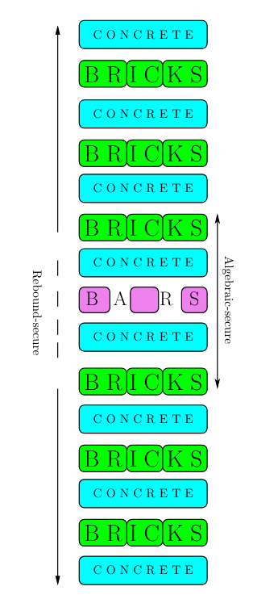
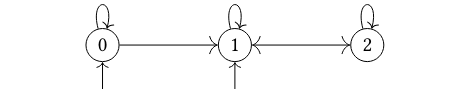

# Reinforced Concrete

> [!WARNING]
>
> This doc is not verified

A fast and efficient [zk-friendly hash](../terms/zk-friendly-hash.md) function that leverages lookup gates to ensure security.

References:

+ [Reinforced Concrete Paper](https://eprint.iacr.org/2021/1038.pdf)

Other helpful resources:

+ [Reinforced Concrete Hash Slide](
  https://www.slideshare.net/AlexPruden/zkstudyclub-plonkup-reinforced-concrete-luke-pearson-joshua-fitzgerald-dmitry-khovratovich) .
+ [Reinforced Concrete and Plonkup Video](https://www.youtube.com/watch?v=Pnc9J7uQgqs&ab_channel=ZeroKnowledge).
+ [Reinforced Concrete by Dmitry Khovratovich](https://www.youtube.com/watch?v=SXnb7T9YATs&ab_channel=ZeroKnowledge).

## Overview

The Reinforced Concrete (RC) hash function works in the sponge framework, transforming a fixed-length bijective function into a
variable-length hash.

**The RC permutation**, shown in figure below, is a modified
7-round [SP network](https://en.wikipedia.org/wiki/Substitution%E2%80%93permutation_network), with elements from $\mathbb{F}_ p^3$ for
a prime number $p$.

We refer to $\text{Concrete} \cdot \text{Bricks}$ as a "round".

The RC construction includes:

+ $\text{Bars}$ layer for high algebraic degree.
+ Linear layer ($\text{Concrete}$) for diffusion.
+ Low-degree nonlinear layer ($\text{Bricks}$) to prevent certain attacks.

From the figure above, the middle Br-C-B-C-Br part is secure against [algebraic attacks](
https://www.theochem.ru.nl/~pwormer/Knowino/knowino.org/wiki/Algebraic_attack.html) whereas C-Br-C-
Br-C-Br-C-Br-C-Br-C is secure against [rebounds (statistical) attacks.](
https://en.wikipedia.org/wiki/Rebound_attack).

## Construction

### The Bricks Function

The function: $\text{Bricks}: \mathbb{F}_ p^3 \to \mathbb{F}_ p^3$ is a non-linear
permutation of degree $d = 5$ (with the requirement $gcd(p - 1, d) = 1$).

We define $Bricks$ as: $\text{Bricks}(x_1, x_2, x_3)$

$=(x_ 1^d, x_ 2(x_ 1^2 + \alpha_1x_1 +\beta_1), x_ 3(x^2_ 2 + \alpha_2x_ 2 + \beta_ 2))$

where $\alpha_ 1, \alpha_ 2, \beta_ 1, \beta_ 2 \in \mathbb{F}_ p$ such that $\alpha_ i^2 - 4\beta_ i$ is not a
quadratic residue modulo $p$.

### The Concrete Function

The function $\text{Concrete}^{(j)}: \mathbb{F}_ p^3 \to \mathbb{F}_ p^3$ multiplies the state by a 3 x 3 [MDS matrix](
https://en.wikipedia.org/wiki/MDS_matrix)
$M = circ(2, 1, 1)$ and adds the $j$ - th round constant vector $c^{(j)} \in \mathbb{F}_ p^3$, that is:

$$Concrete^{(i)}(x) := \begin{pmatrix} 2 \ 1 \ 1 \\
1 \ 2 \ 1 \\
1 \ 1 \ 2 \end{pmatrix} \times \begin{pmatrix} x_1 \\
x_2 \\
x_3 \end{pmatrix} + c^{(j)}$$

> [!NOTE]
> $M$ is invertible and MDS for each $p \geq 3$.
>
> The elements $c_ 1^{(j)}$, $c_ 2^{(j)}$, $c_ 3^{(j)}$ are certain pseudo-random
> constants, generated using e.g. SHAKE-128 with rejection sampling.

### The Bars Function

A $\text{Bars}$ layer is a non-linear layer made up of independent high-degree, dense S-boxes and can
be implemented as a zero-knowledge circuit.

The function: $\text{Bars}: \mathbb{F}_ p^3 \to \mathbb{F}_ p^3$ is defined as:

$$\text{Bars}(x_1, x_2, x_3) = (\text{Bar}(x_1), \text{Bar}(x_2), \text{Bar}(x_3))$$

The function $\text{Bar}: \mathbb{F}_ {p} \to \mathbb{F}_ {p}$ is a permutation on $\mathbb{F}_ {p}$
derived from $n$ independent transformations on
smaller domains $\mathbb{Z}_ {s_1}, ..., \mathbb{Z}_ {s_ n}$, where $s_ 1, ..., s_ n$ are
defined for each prime $p$ separately.

We decompose a field element $x \in \mathbb{F}_ p$ into $n$
smaller digits $x_ 1, ..., x_ n$ with $x_ i \in \mathbb{Z}_ {s_ i}$ using $\text{Comp}$, and reassemble it with $\text{Decomp}$.

Overall, $\text{Bar}: \mathbb{F}_ p \to \mathbb{F}_ p$ is defined as:

$$\text{Bar} = \text{Comp} \ \cdot \ \text{SBox} \ \cdot \text{Decomp}$$

#### SBox: The Centerpiece

Let $(v_ 1, v_ 2, \cdots, v_ n) \coloneqq \text{Decomp}(p-1) \in \mathbb{Z}_ {s_1} \times \cdots \times \mathbb{Z}_ {s_n}$.

Let $p' \leq min_ {1 \leq i \leq n} v_ i$.

Then $x_i$ is converted as follows:

$$y_ i \coloneqq S_{(x_i)} \coloneqq \begin{cases} f(x_ i) &\text{if } x_ i \lt p' \newline x_ i &\text{if } x_ i \geq p' \end{cases}$$

where $f$ denotes a permutation of $\mathbb{F}_ {p'} = \mathbb{Z}_ {p'}$.

#### The Composition and Decomposition Function

##### Decomposition

The decomposition $\text{Decomp}: \mathbb{F}_ p \to \mathbb{Z}_ {s_1} \times \cdots \times \mathbb{Z}_ {s_n}$

expands $x \in \mathbb{F}_ p$ as:

$$x = x_ 1 \cdot s_ 2 s_ 3 \cdots s_ n + x_ 2 \cdot s_ 3 s_ 4 \cdots s_ n + \cdots + x_ {n-1} \cdot s_ n + x_ n$$

$$= \sum_ {i = 1}^{n} x_ i \prod_ {j > i} s_ j$$

with $0 \leq x_ i \lt s_ i$ and $s_i$ such that:

$$\prod_ {i = 1}^n s_ i \gt p$$

The digits $x_ i \in \mathbb{Z}_ {s_i}$ are determined similarly to ordinary base - $b$ expansion:

$$x_ n \coloneqq x \mod s_ n$$

$$x_ i \coloneqq \frac{x - \sum_ {j>i} x_ j \prod_ {k>j} s_ k}{\prod_ {j > i} s_ j} \mod s_ i$$

##### Composition

We define for $1 \leq i \leq n$ the elements

$$b_ i \coloneqq \prod_ {j > i} s_ j = s_ {i+1} s_ {i+2} \cdots s_ n$$

The composition $\text{Comp}: \mathbb{Z}_ {s_1} \times \cdots \times \mathbb{Z}_ {s_n} \to \mathbb{F}_ p$ is computed as:

$$\text{Comp}(y_1, \cdots, y_n) \coloneqq \sum_{i=1}^n y_ib_i \mod p$$

> [!NOTE]
> To prevent overflows during composition in $\text{Bars}$ its nonlinear transformation should have a balanced
> number of fixed points for security. This led to a heuristic for finding a suitable decomposition

## Constraints For Bar

For $x, y \in \mathbb{F}_ p$ it holds $y = \text{Bar}(x)$ if and only if this set of constraints is satisfied. We face two challenges:

+ The S-box $S_ i$ operates on a domain of size $s_i$, making each one unique.
  Specifying each S-box separately would result in a table with $\sum_ {i} s_ i$ entries, which is inefficient.
+ Since $\prod_ {i} s_ i > p$, there exist distinct element
  $(x_ 1, \cdots, x_ n) \neq (x'_ 1, \cdots, x'_ n)$ in $\mathbb{Z}_ {s_1} \times \cdots \times \mathbb{Z}_ {s_n}$ that
  produce the same $x \in \mathbb{F}_ p$.

This means:
$x = \text{Comp}(x_ 1, \cdots, x_ n) = \sum_{i=1}^n x_ i b_ i \mod p =$
$= \sum_{i=1}^n x'_ i b_ i \mod p = \text{Comp} (x'_ 1, \cdots, x'_ n)$

We must ensure our table and constraints avoid collisions. To address this, we use additional
variable sets $(z_1, \cdots, z_n)$ and $(c_1, \cdots, c_n)$.

The variable $z_i$ is defined as:

+ 0, if $x_i < p'$ ($S_i$ is non-linear function)
+ Else 1, if $x_i \geq p'$ ($S_i$ is identity function)

$$z_i \coloneqq \begin{cases} 0 &\text{if } x_ i \lt p' \newline 1 &\text{if } x_ i \geq p' \end{cases}$$

The variable $c_i$ is used to indicate if a tuple
$(x_1, \cdots, x_n) \in \mathbb{Z}_ {s_1} \times \cdots \times \mathbb{Z}_ {s_n}$ has the property
$\sum_{i=1}^n x_ i b_ i \geq p$, making it a potential collision
candidate if true.

For $(v_1, \cdots, v_n) = \text{Decomp}(p-1)$, we therefore define:

$$c_i \coloneqq \begin{cases} 0 &\text{if } x_ j = v_j \ \text{for all} \ 1 \leq j \leq i;
\newline 1 &\text{if } x_ i \lt v_i;
\newline 2 &\text{if } x_i \geq v_i \ \text{and} \ x_j \neq v_j \ \text{for some} \ 1 \leq j \leq i;
\end{cases}$$

By definition of $c_i$, only sequences $c_1, c_2, \cdots, c_n$ of
length $n$ output by the finite-state automaton $A$ in
figure below are allowed.

We create the following 4-ary tables for our set of constraints:

+ Table $T_2$ contains all 4-bit binary sequences,
  encoding sequences $z_1, \cdots, z_n$ by concatenating as these sequences.
+ Table $T_3$ includes all 4-bit outputs from the finite-state automaton $A$ in figure above, linking them
  end-to-start to represent all $A$ outputs of length $n$ (see constraints (2), (3)).
+ Table $T_1$ encodes the S-Boxes $S_1, \cdots, S_n$
  outputs, indicating whether the input to $S_i$ uses the
  non-linear function $f$ or the identity function.

Lookup table $T_1$:

$$T_1 = \begin{bmatrix} 0 & 0 & f(0) & 0 \newline
1 & 0 & f(1) & 1 \newline
\cdots \newline
p' - 1 & 0 & f(p' - 1) & 1 \newline
p' & 1 & p' & 1 \newline
p' + 1 & 1 & p' + 1 & 1 \newline
\cdots \newline
v_1 - 1 & 1 & v_1 - 1 & 1 \newline
v_1 & 1 & v_1 & 0 \newline
p' & 2 & p' & 1 \newline
\cdots \newline
v_2 - 1 & 2 & v_2 - 1 & 1 \newline
v_2 & 2 & v_2 & 0 \newline
v_2 & 2 & v_2 & 2 \newline
v_2 + 1 & 2 & v_2 + 1 & 2 \newline
\cdots \newline
s_2 - 1 & 2 & s_2 - 1 & 2 \newline
\cdots \newline
p' & n & p' & 1 \newline
\cdots \newline
v_n - 1 & n & v_n - 1 & 1 \newline
v_n & n & v_n & 0 \newline
v_n & n & v_n & 2 \newline
v_n + 1 & n & v_n + 1 & 2 \newline
\cdots \newline
s_n - 1 & n & s_n - 1 & 2 \newline
\end{bmatrix}$$

Lookup table $T_2$:

$$T_2 = \begin{bmatrix}
0 & 0 & 0 & 0 \newline  
0 & 0 & 0 & 1 \newline
0 & 0 & 1 & 0 \newline
\cdots \newline
1 & 1 & 1 & 0 \newline
1 & 1 & 1 & 1 \newline
\end{bmatrix}$$

Lookup table $T_3$:

$$T_3 = \begin{bmatrix}
0 & 0 & 0 & 0 \newline
0 & 0 & 0 & 1 \newline
0 & 0 & 1 & 1 \newline
0 & 0 & 1 & 2 \newline
0 & 1 & 1 & 1 \newline
0 & 1 & 1 & 2 \newline
0 & 1 & 2 & 1 \newline
0 & 1 & 2 & 2 \newline
1 & 1 & 1 & 1 \newline
1 & 1 & 1 & 2 \newline
1 & 1 & 2 & 1 \newline
1 & 1 & 2 & 2 \newline
1 & 2 & 1 & 1 \newline
1 & 2 & 1 & 2 \newline
1 & 2 & 2 & 1 \newline
1 & 2 & 2 & 2 \newline
2 & 1 & 1 & 1 \newline
2 & 1 & 1 & 2 \newline
2 & 1 & 2 & 1 \newline
2 & 1 & 2 & 2 \newline
2 & 2 & 1 & 1 \newline
2 & 2 & 1 & 2 \newline
2 & 2 & 2 & 1 \newline
2 & 2 & 2 & 2 \newline
\end{bmatrix}$$

We claim that $y = \text{Bar}(x)$ holds if and only if for
$x, y \in \mathbb{F}_ p$ and $(x_1, \cdots, x_n), (y_1, \cdots, y_n) \in \mathbb{N}^n$ the
following constraints are satisfied:

+ $\forall n \geq i \geq 1: (x_i, i \cdot z_i, y_i, c_i) \in T_1$ (1)
+ $\forall \lceil (n - 1)/3 \rceil - 1 \geq i \geq 1$ :

+ $(c_{3i - 2}, c_{3i-1}, c_{3i}, c_{3i+1} \in T_3)$ (2)

+ $(c_{n - 3}, c_{n-2}, c_{n-1}, c_{n} \in T_3)$ (3)

+ $\forall \lceil n/3 \rceil - 1 \geq i \geq 1$:
    + $(z_{4i - 3}, z_{4i-2}, z_{4i - 1}, z_{4i} \in T_2)$ (4)

+ $(z_{n - 3}, z_{n-2}, z_{n-1}, z_{n} \in T_3)$ (5)

+ $x = \sum_{i=1}^n x_i b_i \mod p$ (6)

+ $y = \sum_{i=1}^n y_i b_i \mod p$ (7)

We assert that for $x \in \mathbb{F}_ p$, there are no collisions in
$\mathbb{Z}_ {s_1} \times \cdots \times \mathbb{Z}_ {s_n}$. Specifically, there exists a unique
$(x_1, \cdots, x_n)$ in $\mathbb{Z}_ {s_1} \times \cdots \times \mathbb{Z}_ {s_n}$ such that
$\text{Comp}(x_ 1, \cdots, x_ n) = x$.

The total number of lookup constraints is

$$n + \lceil (n - 1) / 3 \rceil + \lceil n / 3 \rceil \approx n + n/3 + n/4 \approx 1.59n$$

table lookups with tables of total size $p' + \sum_i (s_i - p' + 1) + 16 + 23$.

You can read more about the soundness and completeness of these constraints in the [original paper](
https://eprint.iacr.org/2021/1038.pdf).

## Security

Short summary of RC security:

+ Differential and linear attacks do not work as long as the $\text{Bricks}$ layer is involved.
+ We cannot mount rebound attacks for 5 or more rounds thus having at least 2 rounds of a security margin.
+ No invariant subspace attacks have been found
+ Groebner basis cryptanalysis fails at greatly weakened versions (10-bits fields) already.

## Performance

The method requires a small number of field multiplications but involves several integer divisions.

When applied to BN/BLS fields, it is 6 times more efficient than Poseidon and 10 times faster than
SHA-2. For hashing 512 bits, it utilizes 400 Plookup gates.

Overall, it achieves a speed up to 15 times faster than Poseidon.

## Applications

Use Reinforced Concrete for large prime field with lookup arguments. (e.g. [Arya](
https://www.iacr.org/cryptodb/data/paper.php?pubkey=29155), [Plookup](
https://eprint.iacr.org/2020/315), [Halo2](
https://github.com/zcash/zips/blob/main/protocol/protocol.pdf), [Cairo](
https://eprint.iacr.org/2021/1063)).

Recursive SNARKs.

Privacy-preserving cryptocurrencies, verifiable encryption.

Use case of this hash:

+ Fast and efficient set membership proofs based on Merkle tree
+ Verifiable computation based on recursive proofs

## Restrictions

A proof system should support lookup gates, as
otherwise the RC circuit would be quite big

The $\text{Bars}$ component is specific for each field, which implies a bit of work when carrying it to a proof
system with a new curve.

## Future Work

Develop a more versatile version of $\text{Bars}$.

Design non-sponge instances of RC.
