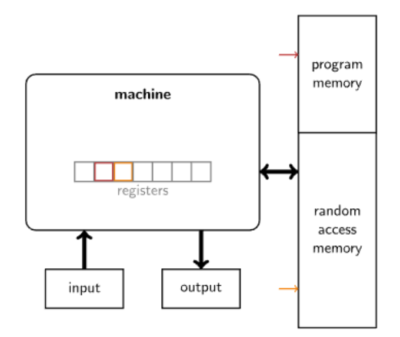
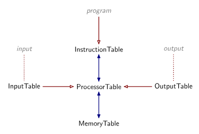

# STARK Engine

## STARK Recap

You should read about the STARK's mechanics [here](../stark_mechanics.md).

## From STARK to STARK Engine

Our machine now follows the von Neumann architecture, which can:

- read the next instruction from memory and decode it;
- (possibly) read a word from memory or standard input;
- update the register set in accordance with the instruction;
- (possibly) write a word to memory or standard output.

The simple state evolution describes the machine’s register set changes inside the processor but does not explain how the processor
interacts with external data sources. So, how can we prove and verify the integrity of interactive instructions?

> [!NOTE]
> The difference between a STARK and a STARK Engine is that the latter comes with a virtual machine and is capable of proving and
> verifying arbitrary computations.
>

### Table

Let’s use an illustrative example where the processor writes something to RAM and then later reads it. We need $3$ registers:

- `clk`: the cycle counter
- `mp`: the memory pointer, representing an address in RAM.
- `mv`: the memory value, corresponding to the value of the RAM at the address `mp`.
It is notable that whenever `mp` changes, `mv` automatically changes also.

This is the execution trace of our problem:

| clk | mp  | mv  |
| --- | --- | --- |
| 0   | 0   | 0   |
| 1   | 0   | 5   |
| 2   | 1   | 0   |
| 3   | 0   | 5   |

We need to check the consistency of memory:

- The initial value of all memory cells is zero.
- When the memory pointer register `mp` is reset to a previous value, the memory value register `mv` changes. Its new value must
  be consistent with the value it had the last time the memory pointer pointed to it.

To achieve this, we first sort the table by the memory pointer `mp` and then by the clock cycle `clk`.

| clk | mp  | mv  |
| --- | --- | --- |
| 0   | 0   | 0   |
| 1   | 0   | 5   |
| 3   | 0   | 5   |
| 2   | 1   | 0   |

The transition constraints that enforce the issues raised above can now be articulated:

- Whenever the memory pointer `mp` changes, the new memory value `mv` is zero.
- Whenever memory pointer `mp` remains unchanged and the clock cycle `clk` jumps by more than one, the memory value `mv` cannot change.

The prover needs to commit to both tables. The verifier verifies two sets of AIR constraints, one for the processor table and one for
the memory table. A *permutation argument* is used to establish that the sets of rows in the two tables are identical, meaning these
tables pertain to the same execution trace.

### Permutation Argument

We can assume that the prover has access to random scalars $a,b,c,\alpha, \dots$ supplied by the verifier. The prover uses these
scalars to compress multiple columns into one. Let the elements in these columns be: $(c_i)$ and $(k_i)$.

Both tables now are extended with **a new column** $e$ that computes the products $\prod_i(\alpha - c_i)$ and $\prod_i(\alpha - k_i)$,
integrating a new factor $(\alpha - c_i)$ or $(\alpha - k_i)$ into a running product in each row. The transition constraint for this
column is:  $e_{i−1} \cdot (\alpha−c_i)=e_i$. (Note that $e$ is called *extension column*, while the others are *base columns*)

If the two tables pertain to the same execution trace, then the products should be the same
$\prod_i(\alpha - c_i) =  \prod_i(\alpha - k_i)$.

### Evaluation Argument

An evaluation argument establishes a relation such as when one table’s list of rows *appears in order* as a sublist of another
table’s list of rows. This relation occurs, for instance, when the processor reads input from a designated input tape.

Without loss of generality, both tables' columns are compressed into one column. The larger table must have a virtual or explicit
indicator column, denoted by $J_i$,  that takes the value $1$ if row $i$ is part of the sublist relation and $0$ if it is not.
The claimed relation is: $(c_i)_{J_i=1} = k_j$.

The transition constraints are given by:

- $\forall i > 0: e_i = J_i \cdot (\alpha e_{i-1} + c_i) + (1 - J_i) \cdot e_{i-1}$  for the larger table.
- $\forall j > 0: e_j= \alpha e_{j-1} + k_j$ for the smaller one.

### Constraints

A table AIR constraints contains:

- Boundary constraints: apply only to the first row
- Transition constraints: apply to every consecutive pair of rows.
- Terminal constraints: apply to the *last* row. (terminal is the last value of the running product or running sum).
- Difference constraints: apply to specific, often special, rows.

## STARK Engine Workflow

> [!NOTE]
> The tuple (input, program, output) is the computational integrity claim, and both the prover and verifier receive it as input. The
> execution trace is the secret additional input only for the prover.
>

A STARK engine consists of three parts: a virtual machine, a prover, and a verifier.

In the STARK virtual machine, several tables must be created, including:

- Processor table: contains all states of registers in chronological order
- Instruction table: contains all instructions in the program
- Memory table: records all changes to memory.
- Input / Output table: captures input and output data.

These tables have relationships with each other, as depicted in the diagram below, where the red arrow represents an evaluation
argument and the blue arrow represents a permutation argument.

The prover follows the workflow outlined below. Initially presented in an interactive language, it can be transformed into a
non-interactive process using the [Fiat-Shamir](../terms/fiat_shamir.md) heuristic.

- Populate the tables with data from the execution trace and pad them to match the next power of two in height.
- Compute the max degree of constraint polynomials and [FRI](./fri.md) domain size.
- Sample a randomizer polynomial of maximal degree and evaluate it on the FRI domain to obtain the *randomizer codeword*.
- Interpolate all tables' base columns to derive base polynomials, then evaluate them on the FRI domain, thereby obtaining the
  *base codewords*.
- Zip the randomizer and base codewords and compute their Merkle tree. (the *base tree*).
- Send the Merkle root to the verifier and receive random scalars $a,b,c,\alpha, \dots$ called *challenges*.
- Compute the table *extension columns* with these challenges.
- Interpolate all tables' extension columns to derive extension polynomials, then evaluate them on the FRI domain, thereby
  obtaining the *extension codewords*.
- Commit *extension codewords* via Merkle Tree (the *extension tree*).
- Evaluate all AIR constraints point by point in matching locations of the referenced codewords, and divide out the corresponding
  zerofier. This generates *quotient codewords*.
- Send the root of *extension tree* to the verifier and receive random scalars for nonlinear combination.
- Compute nonlinear combination codewords.
- Compute the Merkle tree of the nonlinear combination codeword.
- Send the root of this Merkle tree and receive $t$ indices where the correct combination is to be checked.
- Open the indicated positions in the nonlinear combination Merkle tree and in both earlier Merkle trees.
- Generate *FRI* proof for the nonlinear combination using $s$ colinearity checks. This subprotocol establishes that the Merkle root
  of the nonlinear combination codeword decommits to a codeword that corresponds to a low degree.

Verifier:

- Verify the opening of indicated positions in the Merkle trees.
- Verify the nonlinear combination:
  - Compute the indicated quotient codewords by evaluating constraints at the opening points.
  - Compute indicated nonlinear combination codewords.
  - Compare these with the opening codewords from the prover.
- Verify the low degree of the combination polynomial using the FRI proof.

You all should see the Brainfuck VM depiction version of this workflow from [Ferdinand](https://github.com/jan-ferdinand)
[here](https://aszepieniec.github.io/stark-brainfuck/graphics/bf-stark_pipeline.svg).

## References

All this knowledge is from the [BrainSTARK](https://aszepieniec.github.io/stark-brainfuck/index) series by
[Aszepieniec](https://github.com/aszepieniec) .
