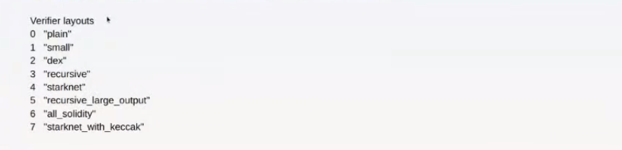

# STARK EVM Adapter

## Introduction

[Stark-evm-adapter](https://github.com/zksecurity/stark-evm-adapter) is a library that provides a set of utilities for parsing STARK
proofs using [stone-prover](https://github.com/starkware-libs/stone-prover). This library can be used to generate a "split-proof",
which can be submitted to the SHARP verifier on-chain.

The main reason for splitting a STARK proof into multiple smaller proofs is to reduce gas fees and avoid exceeding the computational
limitations of smart contracts on Ethereum.

### Input

The input for this library is `Annotated_Proof`, which includes:

- **Proof hex**: the hexadecimal representation of the proof, generated by Stone-prover
- **Annotations**: read more [here](./annotation.md)
- **Extra_output**: read more [here](./annotation.md)
- **Proof_parameters**: The configuration of STARK (FRI, field,...), generated by Stone-prover
- **Public_input**: includes layout, memory segments, public memory,.. generated by Stone-prover

### Output

The output of the Stark-evm-adapter includes

- **Three merkle proofs**
- **Several FRI proofs**: One proof for each layer.
- **Main proof**:
	- Several memory_pages proofs
	- One proof_and_register proof.

All these proofs are submitted on-chain to verify the STARK proof.

## How it works

I suggest reading the [annotation](./annotation.md) before proceeding with this session, as it provides detailed information about the
interactions between the Prover and Verifier.

### Merkle proofs

The proof of a Merkle tree includes:

- `expectedRoot`: The root of Merkle tree
- `height`: The height of the Merkle tree
- `initialMerkleQueue`: A list of tuples containing:
	- `index`: The index of the Merkle query (i.e., the index of the leaf nodes, also known as codewords).
	- `value`: The claimed value corresponding to that index.
- `merkleView`: Includes the neighboring leaves and inner nodes in the authentication path of the Merkle tree.

**Details**:

- `expectedRoot`: Committed by the Prover to the Verifier and can be found in the annotation file.`
- `height`: Retrieved from the leaf nodes computed by the Verifier (available in the extra output file).
- `initialMerkleQueue`: Also derived from the leaf nodes computed by the Verifier (in the extra output file).
- `merkleView`: Sent by the Prover and available in the annotation file.

**Note**: The Merkle tree commits to a matrix trace, where the leaf nodes represent hashes of the corresponding columns in a row. If
the matrix contains only one column, the leaf node hash must be replaced by the Montgomery form of the trace itself.

### FRI proof

We recommend reviewing the [FRI documentation](https://aszepieniec.github.io/stark-anatomy/fri.html) for a deeper understanding.

The proof of an FRI layer includes:

- `evaluationPoint`: the value of weight $\alpha$  used in FRI's
  [split-and-fold](https://aszepieniec.github.io/stark-anatomy/fri.html#split-and-fold) process.
- `expectedRoot`: The Merkle root of this FRI layer.
- `friQueue` A list of tuples containing:
	- `index`: The index of the Merkle query (i.e., the leaf node or codeword index).
	- `value`: The claimed value corresponding to the given index.
	- `xInv`: The inverse of the root of unity for the given index, used to compute the next layer value.
- `friStepSize`: The logarithm of the step size in this FRI layer.
- `proof`: Includes the Merkle views for each claimed value.

**Details**:

- `evaluationPoint`: Sent by the Verifier and available in the annotation file.
- `expectedRoot`: The root of the FRI layer, sent by the Prover and found in the annotation file.
- `friQueue`:
	- `index`: Sent by the Verifier and recorded in the annotation file.
	- `value`: Computed by the Verifier from column values sent by the Prover, found in the extra output file.
	- `xInv`: Available in the extra output file.
	- **Note**: Both `value` and `xInv` must be converted to Montgomery form in the proof.
- `friStepSize`:  Equal to the logarithm of the number of columns sent by the Prover, as recorded in the annotation file.
- `proof`: Sent by the Prover and included in the annotation file. It must be converted to Montgomery form.

### Main proof

The main proof includes:

- **Proof hex**:  The trimmed proof, with Merkle decommitments removed and the hashes of each FRI layer's output added.
- **Proof Parameters**: Extracted from the proof file.
- **Public Input**: Taken directly from the proof file.
- `z, alpha`: Values used to compute the accumulated product for memory pages, sent by the Verifier and recorded in the annotated proof

Next, we’ll examine how to generate **memory page proofs** and **proof_and_register proof**.

#### Memory page proof

In the Cairo VM, there are two types of memory pages:

- **Regular page:** The initial page of memory. There is only one regular page (page number $0$).
- **Continuous page**: Contains values stored consecutively, requiring addresses to form a continuous sequence.

**Memory page proofs** are only applicable for continuous pages. Each proof contains:

- `alpha`: the `alpha` value mentioned above.
- `z`: the `z` value mentioned above
- `startAddr`: The starting address of the continuous page.
- `values`:  A list of values located in the continuous memory cells of this page.
- `prime`:The prime modulus used for computing the accumulated product.

Where:

- `alpha, z`: Sent by the Verifier, found in the annotation file.
- `startAddr, values`: Extracted from `public_input.public_memory` in the `bootloader_proof` file.
- `prime`: A constant, equal to `3618502788666131213697322783095070105623107215331596699973092056135872020481`

#### Proof and Register proof

The **proof and register proof** consists of the following fields:

- `proofParams`:Configuration parameters for STARK.
- `cairoVerifierId`: The ID of the layout used in the SHARP verifier.
- `taskMetaData`: Metadata for each task executed by the bootloader program.
- `cairoAuxInput`: Auxiliary input information for Cairo, including built-in details and memory page accumulative products.
- `proof`: the final proof.

Below is a breakdown of each field and its components.

**proofParams**:
The values inside this field are extracted from the `proof_parameters` in the proof file:

- **Number of queries**: The number of FRI queries, found in `proof_parameters.stark.fri.n_queries`
- **Blowup factor**: The blow up factor in FRI, found in `proof_parameters.stark.log_n_cosets`
- **Proof of work bits**: The PoW security level, taken from `roof_parameters.stark.fri.proof_of_work_bits`
- **Logarithm of Last Layer Degree Bound**: The logarithm of the degree for the last FRI layer, found in
  `proof_parameters.stark.fri.last_layer_degree_bound`.
- **FRI step list length**: the length of the FRI step list, given by `proof_parameters.stark.fri.fri_step_list.len()`
- **FRI steps**: A vector of step sizes for each FRI layer.

**cairoVerifierId**: The ID of the layout in the SHARP verifier.

**taskMetaData**:

We use `fact_topologies` as an input parameter. For details on how `fact_topologies` works and how to construct the tree, refer to
[GpsOutputParser.sol](https://github.com/starkware-libs/starkex-contracts/blob/master/evm-verifier/solidity/contracts/gps/GpsOutputParser.sol).

taskMetaData includes:

- **Number of tasks**: Extracted from the program output in public memory and output
  segment(see more in [bootloader](./bootloader.md))
- **For each tasks**:
	- `output_size`: Size of the task's output.
	- `program_hash`: Hash of the task's program instructions.
	- `pair_number`: Number of pairs in the `structure` of the fact topology.
	- `tree_structure`: The tree structure in fact topology file.

Additionally, stark-evm-adapter computes the `task_fact` for the `fact_registry` in the smart contract, and validates the task output
size against the fact topology's page size.

**cairoAuxInput**:

The cairoAuxInput includes:

- `log_n steps , rc_min, rc_max, layout_info`: Extracted from the `public input`
- `segment_info`: Includes the `startAddr` and `stopPtr` for each buiiltin, found in `public_input.memory_segments`
- `memory_pages_public_input`: Contains memory page details used in memory page proofs:
	- Initial memory **address** and **value** of the padding cell (`public_memory[0]`)
	- `pages_len`: Total number of pages in public memory
	- **For each page:**
		- If a continuous page: include the `page_start_address`
		- `page_size`: The size of this page
		- `page_hash`: Hash of the values in this page
	- **For each page:**
		- `page_prod`: Accumulated product of this page
- `z, alpha`: Values used for accumulated product computation, provided by the verifier in the annotation file.

**proof**:

The main proof includes:

- **Base Trace Commitment**: Sent by the prover in the annotation file.
- **Extension Trace Commitment**: Sent by the prover in the annotation file.
- **Composition Trace Commitment**: Sent by the prover in the annotation file.
- **OODS** (out-of-domain sampling) values:
	- $y_i$ : Execution trace oods a.k.a masks
	- $H_1, H_2,..$: composition trace oods.
	- These values are sent by the prover in the annotation file and must be converted to Montgomery form in the proof.
- **FRI commitments**: Commitments of each FRI layer, sent by the prover in annotation file.
- **FRI last layer coefficients**: Coefficients of the last FRI layer, sent by the prover in the annotation file.
- **Nonce**: PoW nonce, sent by the prover in the annotation file.
- **Data for DEEP Composition Evaluation**:
	- Includes column values from the three trace matrices.
	- Used by the verifier to construct FRI layer 1 leaf nodes.
- **FRI output hash**:
	- Hash of the next layer values for each FRI layer.
	- Used to validate the registry fact.

## Reference

- [Stark EVM Adapter - zkSecurity](https://github.com/zksecurity/stark-evm-adapter).
- [Starkex Constracts - Starkware](https://github.com/starkware-libs/starkex-contracts/tree/master).
