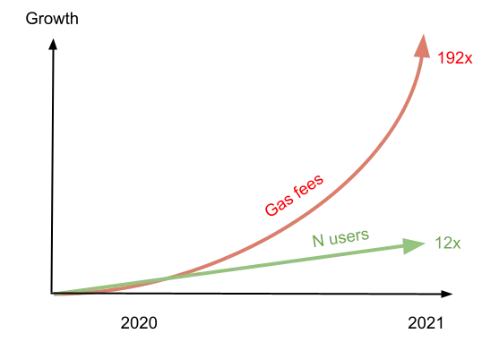
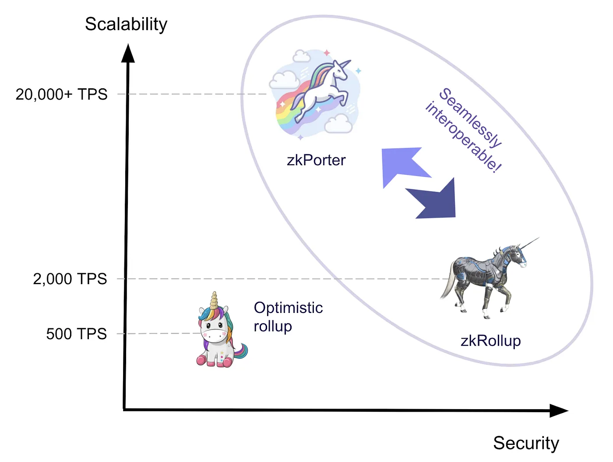
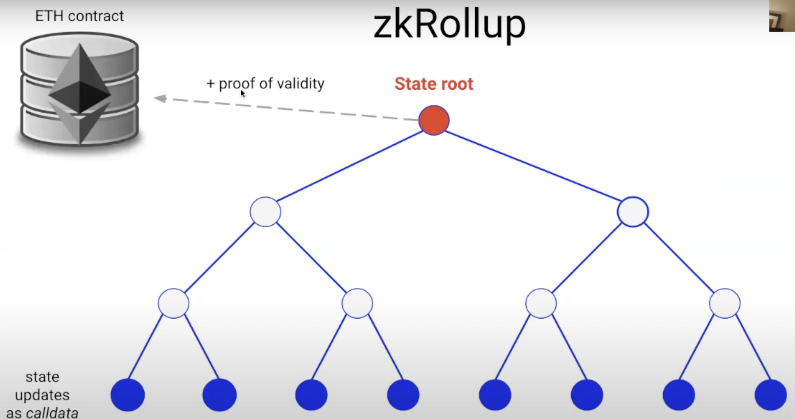
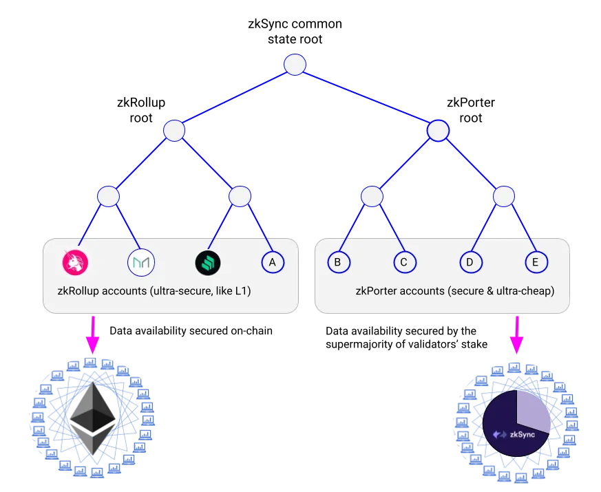
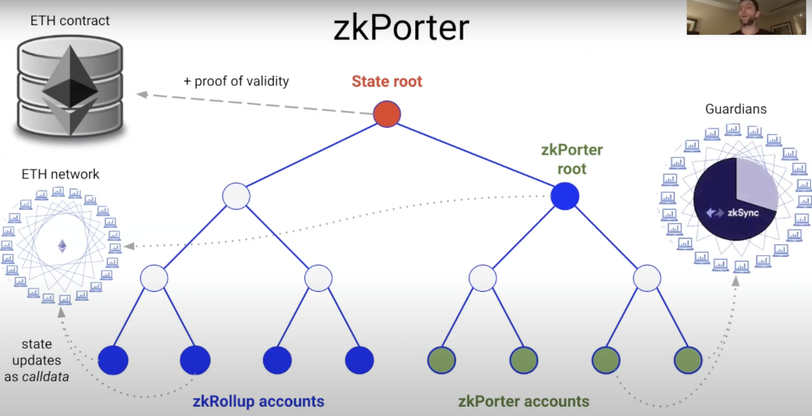
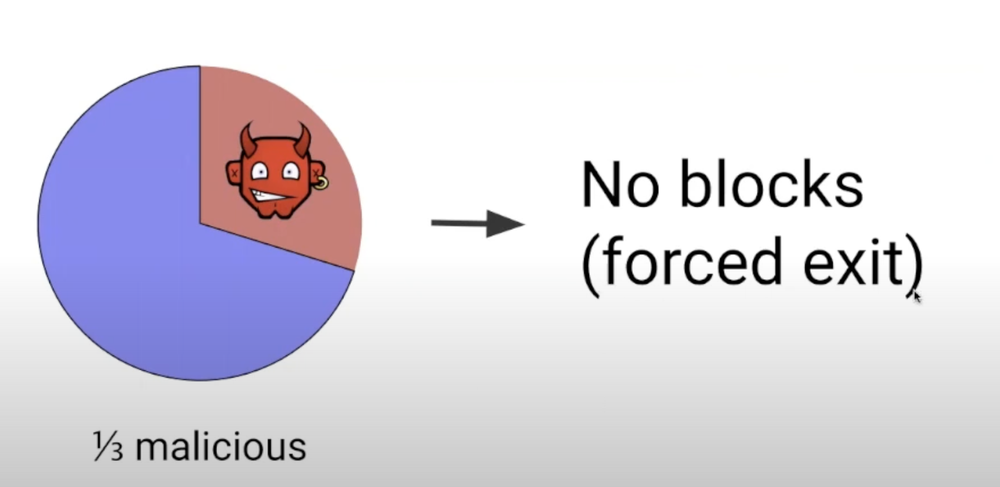
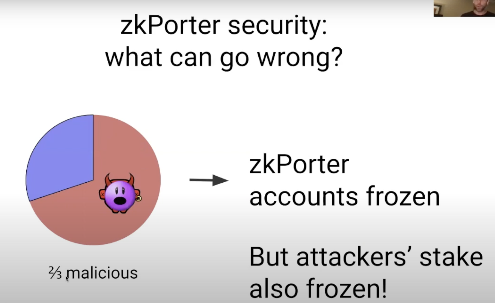

# ZkPorter: Revolutionizing Layer 2 Scaling 

For a more in-depth exploration, refer to the detailed blog post on
ZkPorter [here](https://blog.matter-labs.io/zkporter-a-breakthrough-in-l2-scaling-ed5e48842fbf) and a video
overview [here](https://www.youtube.com/watch?v=dukgSVE6fxc&t=683s).

> [!NOTE]
> Leveraging the properties of [zero-knowledge proofs (zkp)](../terms/zkp.md), ZkPorter ensures that the output is
> tamper-proof. The challenge lies in where to store the proofs. Sending them to the mainnet is limited by block size,
> prompting the creation of a new network to save proof data.

## Why ZkPorter?

The need for enhanced scalability arises from the anticipation of increased financial activity, trading volumes, and the
emergence of new use cases. The exponential growth in gas fees underscores the urgency for scalable solutions.

## The Promise of ZkPorter

ZkPorter presents a scalable solution to tackle challenges stemming from existing limitations in gas fees.

## The Solution: zkRollup and ZkPorter

### Understanding zkRollup

To grasp ZkPorter's solution, it's crucial to comprehend how zkRollup operates. Data is structured as leaves of a Merkle Tree, with the
root hash stored on the Ethereum smart contract. When data changes, a new root, accompanied by a proof, must be submitted to the
Ethereum contract. However, the contract retains only the root, while the complete data is stored in
calldata [calldata](https://solidity-by-example.org/data-locations/). This method faces constraints due to the block size limit,
thereby restricting the size of the calldata and making scaling to thousands of transactions challenging.

### ZkPorter's Innovative Approach

ZkPorter addresses scalability challenges by eliminating the need to push data as calldata to the blockchain, thereby
bypassing block size limitations.

- ZkPorter stores data on a distinct network known as Guardians (managed by zkSync Token holders), with only the
  zkPorter's root saved as calldata on Ethereum.
- In case of issues with ZkPorter, the zkRollup remains unaffected.
- Contracts and accounts on both zkRollup and zkPorter sides seamlessly interact.

### Comparison between zkRollup and zkPorter

|                   | zkRollup      | zkPorter  |
|-------------------|---------------|-----------|
| Data availability | on-chain      | off-chain |
| Security          | 5*            | 4*        |
| Transparent       | x             | x         |
| Transaction Fee   | 1/100th of L1 | ~0.01$    |

### Possible Attacks

ZkPorter safeguards against potential attacks, ensuring network integrity:

- If $\frac{1}{3}$ of the network is malicious, it becomes unable to produce any more blocks.

- With $\frac{2}{3}$ malicious actors, ZkPorter accounts, including attackers', are frozen, preventing further damage.

