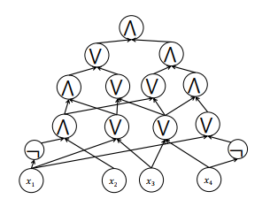

# Boolean Circuit

Boolean circuits are directed acyclic graphs whose internal nodes (or “gates”) are Boolean functions, most often the “standard”
Boolean functions,_and_,_or_and_not_. In a circuit, the nodes of in-degree 0 are called ==input nodes== and labeled with input
variables. The nodes with out-degree 0 are called ==output nodes==.

**Example:**

