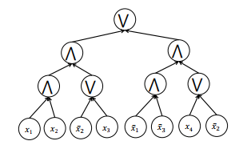

# Boolean Formula

A Boolean formula is identical to a [Boolean circuit](./boolean_circuit.md), except that in a formula, non-output gates are required
to have fan-out 1, while in a circuit the fan-out of each gate can be unbounded. Here, the fan-out of a gate $g$ in a circuit or
formula refers to the number of other gates that $g$ feeds into, i.e., the number of gates for which $g$ is itself an input.

**Example**

