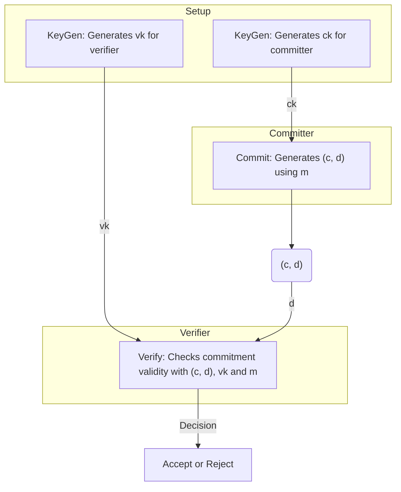

# Commitment Scheme

**Parties**: Committer and Verifier

**Goal**: Committer binds to a message $m$ without revealing it. The commitment:

1. **Binding**: Committer can't change the message after committing.
2. **Hiding**: Verifier can't learn anything about the message from the commitment.

**Recommended Resource**: [Video on Binding and Hiding](https://www.youtube.com/watch?v=4w_b8Msxy14).

## Formal Definition

### Algorithms

1. **$KeyGen$**: Generates keys
    - $ck$ for the committer
    - $vk$ for the verifier
    - If public, $ck = vk$
2. **$Commit$**:
    - Input: $ck$, message $m$
    - Output: Commitment $c$, possibly extra info $d$
3. **$Verify$**:
    - Input: $c$, $vk$, claimed message $m'$, and opening info $d$
    - Output: Accept or Reject

### Diagram

## Properties

- **Correctness**: $Verify(vk, Commit(m, ck), m)$ accepts with probability 1 for any $m$.
- **Perfectly Hiding**: Distribution of $Commit(m, ck)$ is independent of $m$.
- **Computationally Binding**: It's computationally hard to find $d', m' \neq m$ such that
  $Verify(vk, (c, d), m) = Verify(vk, (c, d'), m') = 1$.

## Example

[Polynomial Commitment Scheme](polynomial-commitment/000_polynomial_commitment.md)
