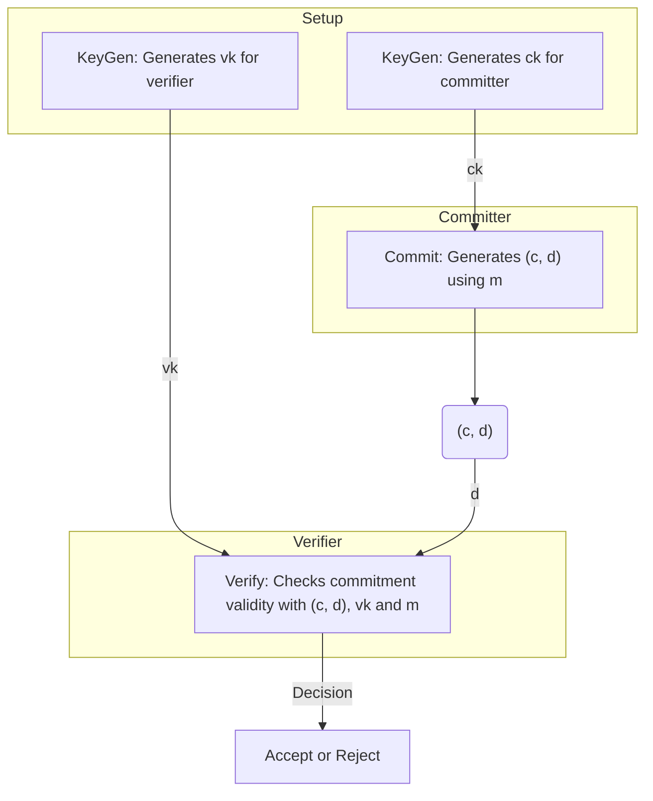

# Commitment scheme

In a commitment scheme, there are two parties, a committer and a verifier. The committer wishes to bind itself to a message without
revealing the message to the verifier. That is, once the committer sends a commitment to some message $m$, it should be unable to
“open” to the commitment to any value other than $m$ (this property is called binding). But at the same time the commitment itself
should not reveal information about $m$ to the verifier (this is called hiding). I highly recommend you watch
[this video](https://www.youtube.com/watch?v=4w_b8Msxy14) to clearly understand these two properties.

Formally, a commitment scheme is specified by three algorithms, $KeyGen$, $Commit$, and $Verify$. $KeyGen$ is a randomized algorithm
that generates a commitment key $ck$ and a verification key $vk$ that are available to the committer and the verifier respectively (if
all keys are public then $ck$ = $vk$), while $Commit$ is a randomized algorithm that takes as input the committing key $ck$ and the
message $m$ to be committed and outputs the commitment $c$, as well as possibly extra “opening information” $d$ that the committer may
hold onto and only reveal during the verification procedure. $Verify$ takes as input the commitment, the verification key, and a
claimed message $m'$ provided by the committer, and any opening information $d$ and decides whether to accept $m$ as a valid opening of
the commitment. See the diagram below for a better visualization.

A commitment scheme is correct if $Verify(vk,Commit(m, ck),m)$ accepts with probability $1$, for any $m$ (i.e., an honest committer can
always successfully open the commitment to the value that was committed). A commitment scheme is ==perfectly hiding== if the distribution
of the commitment $Commit(m, ck)$ is independent of $m$. Finally, a commitment scheme is ==computationally binding== if it require
exorbitant computational power to find some $d', m' \neq m$ such that $Verify(vk,(c,d),m) = Verify(vk,(c,d'),m') = 1$.

One crucial type of commitment scheme that you will often see is [polynomial commitment scheme](polynomial-commitment/000_polynomial_commitment.md). 
