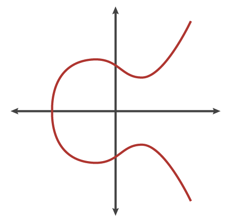
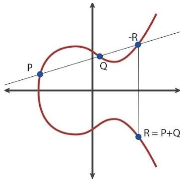
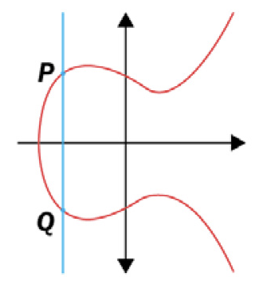

# Elliptic Curve (EC)

Explore the fascinating world of Elliptic Curve cryptography through the following resources:

1. [Exploring Elliptic Curve Pairings](https://medium.com/@VitalikButerin/exploring-elliptic-curve-pairings-c73c1864e627)
   by Vitalik Buterin
2. [Cloudflare's blog](https://blog.cloudflare.com/a-relatively-easy-to-understand-primer-on-elliptic-curve-cryptography/)
   An easy to understand primer on elliptic curve cryptography
3. [Cryptography Algorithms](https://www.amazon.com/Next-generation-Cryptography-Algorithms-Explained-implementation/dp/1789617138)
   A comprehensive book on cryptography algorithms

<!-- TOC -->

- [Elliptic Curve (EC)](#elliptic-curve-ec)
  - [What Is An Elliptic Curve?](#what-is-an-elliptic-curve)
  - [Terminology](#terminology)
    - [Point of Infinity](#point-of-infinity)
    - [Order Of A Curve](#order-of-a-curve)
    - [Generator Point](#generator-point)
  - [Calculations On An Elliptic Curve](#calculations-on-an-elliptic-curve)
  - [Elliptic Curve Pairings](#elliptic-curve-pairings)
  - [Applications](#applications)

<!-- TOC -->

## What Is An Elliptic Curve? 

The equation defining an elliptic curve is $y^{2} = x^{3} + ax + b$.

> [!WARNING]  
> An elliptic curve is not an ellipse.

You should also read about [elliptic curve group](elliptic_curve_group.md).

## Terminology

### Point of Infinity 

$O$: a point that goes to infinity if we intersect two points in the curve symmetrically with respect to the y-axis.
You can imagine the third point as an infinite point lying at the infinite end of the y-axis.

> $P + O = P$

### Order Of A Curve 

A curve has an "**order**"; there exists a number $n$ such that $P * n = O$ for any $P$.

> ==$=> P∗(n+1)=P$==
>
> $=> P∗(7∗n+5)=P∗5$

### Generator Point 

There is also a commonly agreed-upon "generator point" $g$ (or $G$ interchangeably), which is understood to, in some
sense, represent the number "1".

> **Denote:** $\langle g \rangle = \mathbb{G}$

Theoretically, any point on a curve (except $O$) can be $g$; all that matters is that $g$ is standardized.

## Calculations On An Elliptic Curve 

> Given 2 points $A$ and $B$ on the elliptic curve, there is no simple/quick way to calculate $k$ so that: $A*k =
> B$ [How much energy needed to break EC](http://eprint.iacr.org/2013/635.pdf)

> $P + Q = R$

> $P + Q = O$ if and only if $x_{p} = x_{q}$, and $P + P = O$ if and only if $y_{p} = 0$.

> $P * n = P + P + … + P$

## [Elliptic Curve Pairings](elliptic_curve_pairings.md)

## Applications

- Encryption
- Signatures
- Deterministic threshold signatures
- Quadratic arithmetic programs
