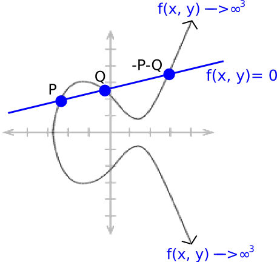

# Elliptic Curve Pairings

[Link](https://crypto.stanford.edu/pbc/notes/elliptic/divisor.html)

## Pairings

See [bilinearity property](pairings_or_bilinear_map.md) for more details.

> $P = G \cdot p, Q = G \cdot q, \text{ and } R = G \cdot r$
>
> From $P, Q, R$, $e$ can verify: $p \cdot q = r$

> [!NOTE]  
> We can encrypt $p$: $p \cdot G = P$ and then can check $P$ to verify the value of $p$ without actually knowing the
> plain value $p$.

## Elliptic Curve Pairings

### Definition

An elliptic curve pairing is a map $\mathbb{G_2} \times \mathbb{G_1} \rightarrow \mathbb{G_t}$, where:

- $\mathbb{G_1}$ is an elliptic curve, where points satisfy an equation of the form $y^2 = x^3 + b$, and where both coordinates are
  elements of $F_p$ (i.e., they are simple numbers, except arithmetic is all done modulo some prime number)
- $\mathbb{G_2}$ is an elliptic curve, where points satisfy the same equation as $\mathbb{G_1}$, except where the coordinates are
  elements of **$F_{p^{12}}$** (i.e., they are the supercharged [complex numbers](quadratic_field.md); we define a new "magic number"
  $w$, which is defined by a 12th degree polynomial like $w^{12} - 18 * w^6 + 82 = 0$)
- $\mathbb{G_t}$ is the type of object that the result of the elliptic curve goes into. In the curves that we look at, $\mathbb{G_t}$
  is $F_{p^{12}}$ (the same supercharged complex number as used in $\mathbb{G_2}$)

The main property that it must satisfy is [bilinearity property](pairings_or_bilinear_map.md), which in this context
means that:

> $e(P, Q + R) = e(P, Q) \cdot e(P, R)$
>
> $e(P + Q, R) = e(P, R) \cdot e(Q, R)$

### How Does it Work?

Let's consider a "line function":

$ax + by + c = 0$

Where $a$, $b$, and $c$ are carefully chosen so that the line passes through points $P$ and $Q$. This also passes through $-P-Q$ (see
the image below). And it goes up to infinity dependent on both $x$ and $y$, so the [divisor](divisor.md) becomes
$[P] + [Q] + [-P-Q] - 3 \cdot [O]$.

For any two functions $F$ and $G$, $({F}\cdot{G}) = ({F}) + ({G})$ so for example if $f(x,y)=P_{x}-x$ then
$((f^{3})=3\cdot[P]+3\cdot[-P]-6\cdot[O])$; $P$ and $-P$ are "triple-counted" to account for the fact that $f^{3}$ approaches $O$ at
those points "three times as quickly" in a certain mathematical sense.

If you "remove the square brackets" from a divisor of a function, the points must add up to $O([P]+[Q]+[-P-Q]-3\cdot[O])$ clearly fits,
as $P+Q-P-Q-3\cdot O=O$ and any divisor that has this property is the divisor of a function.

> [!NOTE]  
> If two functions $F$ and $G$ have the same divisor, then $F = G \cdot k$ for some constant $k$.

### [Tate Pairing](tate_pairing.md)
