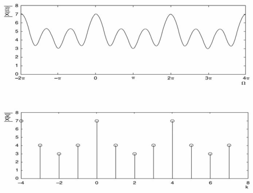
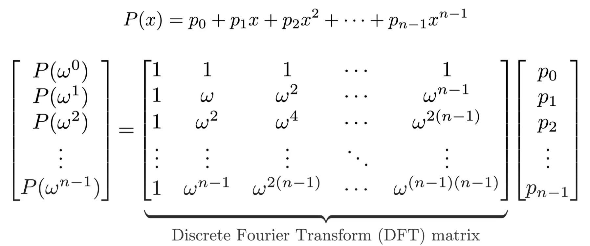
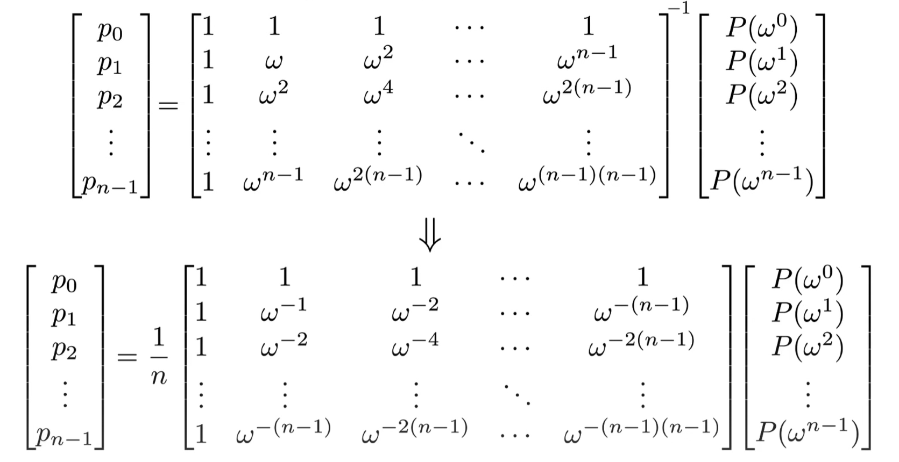

# Fast Fourier Transforms

## Background

Essentially, Fourier Transforms convert data between the
"frequency domain" and the "time domain". It means that if you have a piece of data, the algorithm will transform it into a
collection of sine waves with different frequencies and amplitudes. Then, adding them together would approximate the
original data. See the depiction below.



The Fourier Transforms we discuss are discrete Fourier Transforms over the [finite field](./prime_or_finite_fields.md), rather than the
continuous Fourier Transforms over the *real or complex number* above. And, instead of focusing on the conversion between
"frequency domain" and "time domain", we primarily talk about two operations: **multi-point polynomial evaluation** and its
inverse, **polynomial interpolation**.

First, **multi-point polynomial evaluation** involves evaluating a degree $\lt N$ polynomial at $N$
different points. On the other hand, **polynomial interpolation** involves reconstructing the
polynomial based on its evaluations at $N$ different points.

For the first operation, you can separately evaluate the polynomial at each point by iterating over all the coefficients.
Thus, the total runtime is $O(N^2)$ (considering $N$ coefficients and $N$ points).
For the second operation, you first need to read about [Lagrange interpolation](./lagrange_interpolation.md) to understand how it
works and what Lagrange basis polynomials are:

$$
\begin{aligned}
L_i(x) = \prod_{j=0, j \neq i}^{n} \frac{x - x_j}{x_i - x_j}
\end{aligned}
$$

Compute this function takes $O(N^2)$ time (iterate $j$ take $O(N)$ times, and we need to compute $N$ functions).

Is this slow? Yes, and the Fast Fourier Transforms below will significantly speed up both operations.

## Fast Fourier Transforms []()

To utilize this algorithm, you must operate within a finite field, and the domain must be
a [multiplicative subgroup](./prime_or_finite_fields) of that field. Furthermore, the multiplicative subgroup must
have size $2^n$ in order to create a low-runtime recursive algorithm.

**High level idea:**
FFT works like [merge-sort](https://www.geeksforgeeks.org/merge-sort/) . It takes a problem of size $N$, break it up into two problems
of size $\dfrac{N}{2}$, and do $O(N)$ work to combine two smaller solutions into the bigger one. So, the total run time is $O(NlogN)$.

[](1724428223634)

### Multi-point Evaluation

Suppose that we have an FFT where the given domain is the powers of $w$ in some field, where $w^{2^k} = 1$ ($w$ is the domain
"generator").

For example, consider the finite field $F_{17}$, a polynomial: $f(x) = 1 + 13x + 3x^2 + 3x^3$ (we will write it as \[1, 13, 3, 3\]).
We want to evaluate this polynomial at each point in the domain, i.e., at the multiplicative subgroup of $4$:
$\lbrace 1, 4, 16, 13 \rbrace$.

First, we break up $f(x)$ into two parts, which we will call $evens$ and $odds$:

- $evens$: \[1, 3\] or $evens(x) = 1 + 3x$
- $odds$: \[13, 3\] or $odds(x) = 13 + 3x$

So, we have:

- $f(x) = evens(x^2) + x \cdot odds(x^2)$
- $f(-x) = evens(x^2) - x \cdot odds(x^2)$

Here, both $evens$ and $odds$ are polynomials half the size of $f(x)$ and the set of possible values of $x^2$ is only half the size of
the original domain: \[1, 4, 16, 13\] $\to$ \[1, 16\]. The reason is that:

- $1^2 = 1$
- $4^2 = 16$
- $16^2 = 256 \equiv 1\pmod {17}$
- $13^2 = 169 \equiv 16 \pmod {17}$

Hence, we can use FFT to compute $evens(x)$ or $odds(x)$ for every $x$ in the smaller domain consisting of squares of numbers in the
original domain. And, we've reduced a size - $N$ problem into half-size problem.

After receiving the evaluation of $evens$ and $odds$, we simply do:

- $f[i] = evens[i] + domain[i] \cdot odds[i]$
- $f[N/2 + i] = evens[i] - domain[i] \cdot odds[i]$

for each index $i$ from $0$ to $N/2 - 1$.

Python code for this:

```python
def fft(vals, modulus, domain):
    if len(vals) == 1:
        return vals
    L = fft(vals[::2], modulus, domain[::2])
    R = fft(vals[1::2], modulus, domain[::2])
    o = [0 for i in vals]
    for i, (x, y) in enumerate(zip(L, R)):
        y_times_root = y * domain[i]
        o[i] = (x + y_times_root) % modulus
        o[i + len(L)] = (x - y_times_root) % modulus
    return o
```

We can try running it:

``` bash
>>> fft([1, 13, 3, 3], 17, [1, 4, 16, 13])
[3, 4, 5, 9]
```

### Polynomial Interpolation []()

To compute the inverse FFT, we run the FFT again , but reverse the result (except the first item stays in place) and divide every
value by the length of the list. The reason is that when we use `fft()`, we transform a vector
of $N$ coefficients into a vector of $N$ evaluations. This process can be viewed as converting
a matrix of size $N \times 1$ into another matrix of the same size. To accomplish this,
we perform matrix multiplication between the coefficient matrix and a square matrix of
size $N \times N$. That matrix, in the case of FFT, is called the **Discrete Fourier Transform (DFT)** matrix:

[](1724428255859)



Then, for **polynomial interpolation**, we simply multiply the matrix of $N$ evaluations by the inverse
**DFT** matrix as follows:"



So, the implementation of inverse FFT is simple:

```python
def inverse_fft(vals, modulus, domain):
    vals = fft(vals, modulus, domain)
    return [x * modular_inverse(len(vals), modulus) % modulus for x in [vals[0]] + vals[1:][::-1]]
```

We can use FFT to multiply numbers in time $O(NlogN)$ which $N$ is the length of numbers, faster than $O(N^2)$ schoolbook
multiplication.


## FFTs and Binary Fields

In a binary field, each element is expressed as a polynomial where all of the entries are 0 or 1, eg. $x^3+x+1$. Adding polynomials
is done modulo 2, and subtraction is the same as addition (as $−1=1 \mod2$). We select a irreducible polynomial as a modulus
(e.g., $x^4 + x + 1$) and multiplication is done modulo that modulus.

If you want to run FFT in a binary field, there is a problem:
In binary fields, there are *no multiplicative groups of order* $2^n$ because all the multiplicative groups are order $2^n - 1$.

For example, in the binary field with modulus $x^4+x+1$, if you start calculating successive powers of $x+1$, you cycle back to $1$
after $15$ steps - not $16$. The reason is that the elements list includes zero, but you're never going to reach zero by multiplying
any nonzero value by itself in a field, so the power of $x+1$ cycle through every element but zero.

So how can we halve the size of a domain? Here is the solution.

Given a domain containing $2^k$ values, including zero, we can construct a new half-size domain $D'$ by taking
$x \cdot (x+k)$. because the function $f(x) = x \cdot (x+k)$ returns the same value for $x$ and $x + k$.

| $x$               | 0 | 1 | 2 | 3 | 4 | 5 | 6 | 7 | 8 | 9 | 10 | 11 | 12 | 13 | 14 | 15 |
|-------------------|---|---|---|---|---|---|---|---|---|---|----|----|----|----|----|----|
| $x \cdot (x + 1)$ | 0 | 0 | 6 | 6 | 7 | 7 | 1 | 1 | 4 | 4 | 2  | 2  | 3  | 3  | 5  | 5  |

Let us explain this table:

- With $x = 0$: $x + 1 = 1$ $\to$ $x \cdot (x + 1) = 0 \cdot 1 = 0$
- With $x = 1$: $x + 1 = 1 + 1 = 0 \to x \cdot (x+1) = 1 \cdot 0 = 0$
- ...
- With $x = 15 \iff x = 1111$; $x + 1 = 1111 + 0001 = 1110 = 14$ $\to x \cdot (x + 1) = 1111 \cdot 1110 = 0101 = 5$

So, to do FFT on binary field, we should convert $f(x)$ into:

$$
\begin{aligned}
f(x) = evens(x \cdot (k-x)) + x \cdot odds(x \cdot (k-x))
\end{aligned}
$$

And $f(x + k) = evens((x + k) \cdot (-x)) + (x + k) \cdot odds((x+k) \cdot (-x))$
$= evens(x \cdot (k-x)) + (x + k) \cdot odds(x \cdot (k-x))$.

To convert $f(x)$ to $evens$ and $odds$ above in $O(N \cdot logN)$, we can use the
[freshman's dream](https://en.wikipedia.org/wiki/Freshman%27s_dream) theory that in binary field:

$$
\begin{aligned}
(x + y)^2 = x^2 + y^2
\end{aligned}
$$

Then, do the same things as in the FFT section.

Here is the code for all the implementation that we mentioned above:
[link](https://github.com/ethereum/research/tree/master/binary_fft).

## Reference

[Fast Fourier Transforms](https://vitalik.eth.limo/general/2019/05/12/fft.html)
