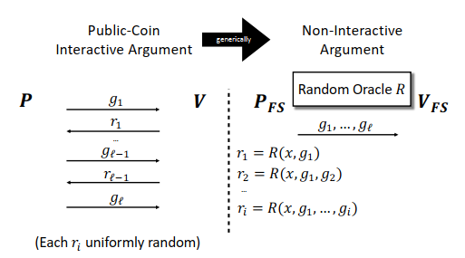

# Fiat Shamir

## Purpose 

The purpose of Fiat-Shamir transform is to take any [IP](ip.md) or [argument](arguments.md) $I$ and transform it into a
non-interactive, publicly verifiable protocol $Q$ in the [ROM](random_oracle_model.md).

## Description

The Fiat-Shamir replaces verifier's messages from [IP](ip.md) with a value derived from the [random oracle](random_oracle_model.md).
Specifically, in round $i$, the value is determined by querying the random oracle, where the query point is the list of messages sent
by the prover in rounds $1,...,i$.

**Example**:  (the value $x$ will be discussed later)

So, the verifier does not need to send any information to the prover, and the prover sends a transcript of the entire protocol
(i.e., a list of all messages exchanged by the prover in the [IP](ip.md), and the value derived from the
[random oracle](random_oracle_model.md#Random%20Oracle)).

## A Concrete Optimization

Fiat-Shamir is often implemented using a technique called: ==hash chaining==. This means that, instead of calculating $r_i$ by hashing
all the preceding prover messages: $g_1,...g_i$, it chooses $r_i$ to be hash only of $(x, i, r_{i-1}, g_i)$.

## Avoiding a Common Vulnerability 

For the Fiat-Shamir transformation to be secure in settings where an adversary can choose the input $x$ to the [IP](ip.md) or
[argument](arguments.md), it is essential that $x$ be appended to the list that is hashed in each round.

For example, in the [GKR protocol](gkr_protocol.md), the verifier $V$ completely ignores the input $x \in \mathbb{F}^n$ until the
final check in the protocol, when $V$ checks that the [MLE](uniqueness_of_multilinear_extension.md) $\tilde x$ of $x$ evaluated at
randomly chosen point $r$ equals some value $c$ derived from previous rounds. Now, to pass the final check, the adversary can choose
any input $x \in \mathbb{F}^n$ such that $\tilde x(r) = c$ (such an input $\tilde x$ can be identified in linear time). The transcript
convinces the verifier to accept the claim that $C(x) = y$. Yet there is no guarantee that $C(x) = y$, as $x$ may be an arbitrary input
satisfying $\tilde x(r) = c$. \
In contrast, if $x$ is appended to the list that is hashed in each round, the $V$ can use it to check whether $x$ in each round is the
same. Then, $V$ can believe that $x$ is the real input.

