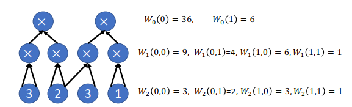
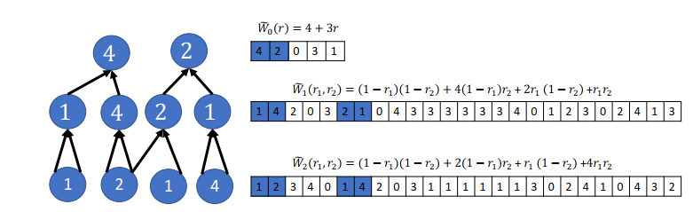

# GKR Protocol

## 1 The GKR Protocol and Its Costs

First, $V$ and $P$ agree on a arithmetic circuit $C$, and the goal is to compute the value of the output gate($s$) of $C$.

Let $S$ is the size (number of gates) of $C$ and $n$ is number of variables. They key feature of **GKR protocol** is that the $P$ runs
in time poly($S$), and the cost to the verifier is $O(dlogS)$, which $d$ is the deep of $C$, and only logarithmically with $S$.

## 2 Protocol Overview

Suppose that $C$ has depth $d$, and number the layer from 0 to $d$ with layer $d$ referring to the input layer, and layer 0 referring
to the output layer.

The first message, $P$ tells $V$ the (claimed) output($s$) of the circuit. The protocol then works its way
in iterations towards the input layer, with one iteration devoted to each layer.

The first iteration uses a [sum-check protocol](sumcheck_protocol.md) to reduce this claim about the outputs of the
circuit to a claim about the gate values at layer 2, and so on. Eventually, $V$ is left with a claim about the inputs to the circuit,
and $V$ can check this claim without any help.

## 3 Protocol Details

Let $S_i$ denote the number of gates at layer $i$ of the circuit $C$. Assume $S_i$ is power of 2 and $S_i = 2^{k_i}$.
So, number the gate at layer $i$ from 0 to $S_i - 1$, and let $W_i : \{0, 1\}^{k_i} \rightarrow F$ denote the function that takes as
input a binary gate label, and outputs the corresponding gate’s value at layer $i$.

### Example

Let $in_{1,i}, in_{2,i}$ denote functions that if gate $a$ at layer $i$ compute the sum of gates $b$ and $c$ at layer $i + 1$ then
$in_{1,i}(a) = b, in_{2,i}(a) = c$.
Denote two function:

- $add_i$ , take as input $(a, b, c)$ return 1 if and only if $(b, c) = (in_{1,i}(a),in_{2,i}(a))$ and gate $a$ is addition.
- $mult_i$ is the same, but gate $a$ is multiplication.

For example, which the Figure above, $mult_0$ evaluates to 1 on the following inputs: $(0,(0,0),(0,1))$ and $(1,(1,0),(1,1))$ and
evaluates to 0 for all others.

### Detailed Description

The symbol $\tilde f$ means the MLE of the function $f$.

The GKR protocol consists of $d$ iterations, one for each layer of the circuit. Each iteration $i$ starts with $P$ claiming a value
for $\tilde W_i(r_i)$ for some point in $r_i \in F^{k_i}$.

At the start of the first iteration, let $D: \{0, 1\}^{k_0} \rightarrow F$ denote the function that maps the label of an output gate
to the claimed value of that output. Then verifier can pick a random point $r_0 \in F^{k_0}$ and check if
$\tilde D(r_0) = \tilde W_0(r_0)$ (i.e., if the **MLE** of the claimed outputs equals the **MLE** of the correct outputs when
evaluated at a randomly chosen point), then it is safe for the verifier to believe that
all of the claimed outputs are correct. But to evaluate $\tilde W_0(r_0)$, verifier need to claim about $\tilde W_1$, and so on.

**Applying the [Sum-Check Protocol](sumcheck_protocol.md)**

**Lemma:** We have an explicit expression for $\tilde W$:

$$
\begin{aligned}
\tilde W_i(z) = \sum_{b, c \in \{0, 1\}^{k_{i+1}}} \tilde{add_i}(z, b, c) (\tilde W_{i +1}(b)+\tilde W_{i +1}(c)) +
\tilde{mult_i}(z, b, c) (\tilde W_{i +1}(b)\cdot\tilde W_{i +1}(c))
\end{aligned}
$$

#### Description of the GKR protocol

1. At the start of the protocol, $P$ sends a function $D: \{0,1\}^{k_0} \rightarrow F$ claimed to equal $W_0$.
2. $V$ picks a random $r_0 \in F^{k0}$ and lets $m_0 \leftarrow \tilde D(r_0)$. The remainder of the protocol is devoted to confirming
   that $m_0 = \tilde W_0(r_0)$.
3. For $i = 0, 1, ..., d-1$:
    - Define the $(2k_{i+1})$-variate polynomial:
      $f_{r_i}^{(i)}(b,c):=\tilde{add_i}(r_i, b, c)(\tilde W_{i +1}(b)+\tilde W_{i +1}(c))+\tilde{mult_i}(r_i,b,c)(\tilde W_{i +1}(b)
      \cdot\tilde W_{i+1}(c))$
    - P claims that $\sum_{b,c \in \{0,1\}^{k_{i+1}}} f_{r_i}^{(i)}(b,c) = m_i$.
    - So that $V$ may check this claim, $P$ and $V$ apply the [sum-check protocol](sumcheck_protocol.md) to
      $f_{r_i}^{(i)}$, up until $V’s$ final check in that protocol, when $V$ must evaluate $f_{r_i}^{(i)}$ at randomly chosen point
      $(b^∗,c^∗) \in F^{k_{i+1}} \times F^{k_{i+1}}$.
    - Let $l$ be the unique line satisfying $l(0) = b^∗$ and $l(1) = c^∗$. $P$ sends a univariate polynomial $q$ of degree at most
      $k_{i+1}$ to $V$, claimed to equal $\tilde W_{i+1}$ restricted to $l$.
    - $V$ now performs the final check in the [sum-check protocol](sumcheck_protocol.md), using $q(0)$ and $q(1)$ instead
      of $\tilde W_{i+1}(b^∗)$ and $\tilde W_{i+1}(c^∗)$.
    - $V$ chooses $r^∗ \in F$ at random and sets $r_{i+1} = l(r^∗)$ and $m_{i+1} \leftarrow q(r^*)$ (for details, see
      [Section 4.5.2](chapter_4.md#4.5%20Applications%20of%20the%20Super-Efficient%20MATMULT%20IP)).
    - To evaluate $\tilde{add _ i}(r _ i, b^ * , c^ * )$, $\tilde{mult _ i}(r _ i, b^ * , c^ * )$, we can do it in polylogarithmic
      time. We will discuss this
      in [Section 4.6.6](chapter_4.md#4.6.6%20Evaluating%20$%20tilde%20{add}_i$%20and%20$%20tilde%20{mult}_i$%20Efficiently).
4. $V$ checks directly that $m_d = \tilde W_d(r_d)$ using [VSBW13](lagrange_interpolation.md#VSBW13). Note that $\tilde W_d$ is
   the **MLE** of input $x$, and $V$ can compute it in $O(n)$, which $n$ is the size of the input.

**Example**: Compute $\tilde W$ in a circuit over $F_5$ consisting entirely of multiplication gates

## 4 Discussion of Costs and Soundness

### V's runtime

- The total communication cost is $O(S_0 + dlogS)$, where $S_0$ is the number of outputs.
- The time cost to $V$ is $O(n + dlogS + t + S_0)$, where:
  - $t$ is the amount of time required for $V$ to evaluate $\tilde{add_i}, \tilde{mult_i}$ for each layer $i$.
  - $n$ is the time required to evaluate $\tilde W_d(r_d)$.
  - $S_0$ is the time required to read the vector of claimed outputs and evaluate the corresponding **MLE**.
  - $dlogS$ is the time required for $V$ to send messages to $P$ and process and check the messages from $P$.

### P's runtime

- $O(S^3)$.
- Can be improved by using [Lagrange Interpolation](../../terms/lagrange_interpolation.md).

### Round complexity and communication cost

- $O(dlogS)$ rounds.

### Soundness error

- The soundness error is: $O(dlog(S)/|F|)$.

## 5 Evaluating $\tilde {add}_i$ and $\tilde {mult}_i$ Efficiently

The issue of the verifier efficiently evaluating $\tilde {add} _ i$ and $\tilde {mult} _ i$ at a random
point $\omega \in F^{k _ i+2k _ {i+1}}$ is a tricky one.

The papers [CMT12](https://arxiv.org/abs/1105.2003), [Tha13](https://arxiv.org/abs/1304.3812) show that the evaluation can be computed
in $O(k_i + k_{i+1}) = O(logS)$ time for a variety of common wiring patterns and specific circuits.
For the circuits where $\tilde {add}_i$ and $\tilde {mult}_i$ cannot be evaluated in time sublinear in the circuit size $S$ leverages
cryptography, there is a cryptographic primitive called a ==polynomial commitment scheme== to force the prover to accurately evaluate
$\tilde {add}_i$ and $\tilde {mult}_i$ on its behalf.
