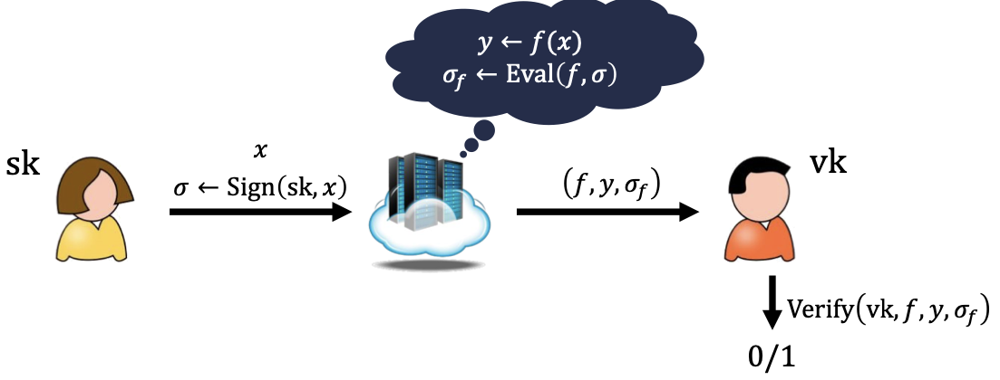

# Homomorphic Encryption 

Homomorphic encryption is a type of encryption technique that allows computations to be performed on ciphertext, resulting in an
encrypted result that, when decrypted, matches the result of the operations performed on the plaintext.

## How it Works

Traditional encryption methods typically prevent any operations from being performed on the encrypted data without first decrypting it.
However, homomorphic encryption enables computations to be carried out directly on encrypted data.

Here's a simplified overview of how it works:

1. **Encryption**: The plaintext is encrypted using a homomorphic encryption algorithm, resulting in ciphertext.
2. **Computation**: Mathematical operations (such as addition or multiplication) can be performed directly on the ciphertext, without
   decrypting it.
3. **Decryption**: The encrypted result of the computation is decrypted, yielding the same result as if the operations were performed
   on the plaintext.

## Types of Homomorphic Encryption

There are different levels of homomorphic encryption, each allowing different types of computations to be performed:

- **Partially Homomorphic Encryption (PHE)**: Supports only one type of operation (either addition or multiplication) while preserving
  the security of the data.
- **Somewhat Homomorphic Encryption (SHE)**: Supports a limited number of both addition and multiplication operations.
- **[Fully Homomorphic Encryption (FHE)](fully_homomorphic_encryption.md)**: Supports an unlimited number of addition and
  multiplication operations, making it possible to perform any computation on the encrypted data.

## Applications

Homomorphic encryption has various applications in privacy-preserving computation, secure outsourcing of computations, and secure
multi-party computation. Some specific applications include:

- **Secure Cloud Computing**: Users can store their data in encrypted form on a cloud server and perform computations on the encrypted
  data without revealing the plaintext to the server.
- **Privacy-Preserving Data Analysis**: Researchers can perform analyses on encrypted sensitive data without compromising the privacy
  of individuals.
- **Secure Outsourcing**: Companies can outsource computations to third-party servers while ensuring the privacy and confidentiality of
  their data.

### Confidentiality for Computations

Assume we have an asymmetric key pair: $pk$ (public key), $sk$ (secret key)

Let's call Alice is the one who wears yellow shirt, and Bob is the one in the orange shirt in the picture above.

So first, Bob publishes his public key. Then Alice can encrypt any message and send it to an untrusted cloud to perform some
computation on the encrypted message, then the result is sent to Bob, Bob then can decrypt using his secret key to get the plain
result.

This is do able by using [fully homomorphic encryption](homomorphic_encryption.md)

#### Properties

**Security**: $ct$ hides $𝑥$
**Compactness**: $|ct_f|$ depends on $|f(x)|$ , not $|x|$ or $|f|$

### Integrity for Computations

Here Alice can sign a message then the cloud can compute some functions on the signed message then Bob can verify the result of it.

#### Properties

**Security**: if $y = f(x)$, cannot convince verifier of $y' \neq f(x)$
**Compactness**: $|\sigma_f|$ depends on $|f(x)|$ , not $|x|$ or $|f|$

## Challenges

While homomorphic encryption offers significant advantages in terms of privacy and security, it also comes with certain challenges:

- **Computational Overhead**: Performing computations on encrypted data is typically much slower and resource-intensive compared to
  performing the same computations on plaintext data.
- **Complexity**: Homomorphic encryption schemes are often complex and require advanced mathematical techniques, making them
  challenging to implement and use.
- **Security**: The security of homomorphic encryption schemes relies on the underlying mathematical assumptions, and vulnerabilities
  or weaknesses in these assumptions could compromise the security of the encrypted data.
