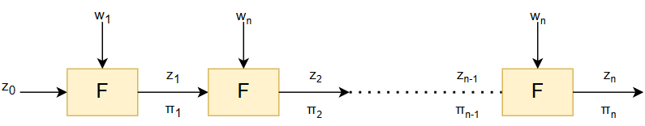

# IVC

IVC – Incrementally Verifiable Computation: allows us to do proofs for long computations
with relatively little memory. A function $F$ is iterated for many times,
generate a proof for each time that proves the computation
*to this point* is correct.

IVC helps to break a long computation into a series of small identical
steps that significantly reduces the prover memory requirements.

## Core Idea of IVC

With initial input $z_0$, an IVC schema allows a prover to produce a proof $\Pi _ i$
for the statement $z _ i = F ^ {(i)}(z _ 0)$ given a proof $\Pi _ {i-1}$ for the
statement $z _ {i-1} = F ^ {(i-1)} (z _ 0)$.

Informally, at step $n$, prover computes a new state $z_n$ and a proof $\Pi_n$
that proves prover has a witness $(z _ {n-1}, w _ n, \Pi _ {n-1})$ such that $z_n$ is correct
relative to the previous state $z _ {n-1}$ and the proof $\Pi _ {n-1}$ is correct relative
to the previous state $z _ {n-1}$.

Then, verifier only needs to verify only one proof $\Pi_n$.

Notice that:  $z_n = F^{(n)}(z_0)$ is the output of IVC. An IVC scheme satisfies
succinctness if the size of the IVC proof $\Pi$ does not grow with the
number of applications $n$.
