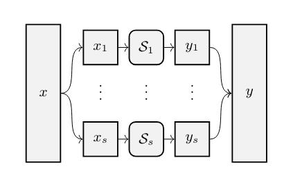
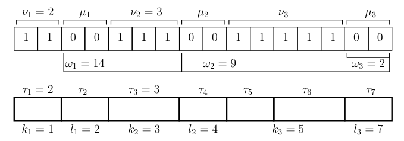

# Kintsugi Strategy

> [!WARNING]
>
> This doc is not verified

References:

+ [Monolith Paper](https://eprint.iacr.org/2023/1025.pdf)

## Overview

A generic strategy for prime numbers, unrepresentable as smaller domain products, involves breaking and
recombining the state after applying a function to each chunk.

Key principles include:

+ Split the integer form of a field element into chunks aligned with powers of two for lookup table in a ZK circuit.
+ Identify chunk value combinations that are absent because $p$ isn't a power of two.
+ Design intra-chunk transformations $S_i$ such that:
  + Impossible chunk combinations never appear (e.g. by making some chunk values fixed points), and
  + They can be implemented in constant time
+ Recombine shuffled chunks into a field element, ensuring that the output remains within the field.

We call this strategy Kintsugi. An illustration is shown above.

## Chunks and Buckets

### Chunks

For a prime $p \geq 5$, we define $p'$ as:

$$p' = \begin{cases} p-1 &\text{if } p \equiv 1 \mod 4, \\
p &\text{otherwise }  
\end{cases}$$

Represent $p'$ in binary form with a length of $\rho = \lceil \log_2(p') \rceil$ as follows:

$$p' = 1\ldots1 \|0\ldots0\|1\ldots1\|\ldots\| \begin{cases} 0\ldots0 &\text{or}\\ 1\ldots1 \end{cases}$$

where $.\|.$ denotes concatenation.

Given $p'$ as before, we denote its 1-/0-sequences as chunks (resp., 1-chunks and 0-chunks).

We obtain:

$$p' = \sum_{i=1}^{\xi} 2^{\omega_i} \cdot (2^{\nu_i} - 1)  \ \ \ \ \ \ (1)$$

where:

+ $\nu_i, \ldots, \nu_\xi$: length of 1-chunk,
+ $\mu_i, \ldots, \mu_\xi$: length of 0-chunk (both from left to right)
+ $\omega_i = \sum_{j \geq i} (\nu_{i+1} + \mu_i)$

### Buckets

For efficiency, we may split each chunk into sub-chunks, called buckets, on which each S-box will then work independently.

> [!NOTE]
> Buckets should not overlap with chunks.

Let $T=\lbrace \tau_1,\ldots,\tau_s \rbrace$ be a bucket decomposition, where $\tau_1, \ldots, \tau_s$ are positive integers such that:

$$\sum_{i=1}^s \tau_i = \rho = \lceil \log_2(p') \rceil$$

The bucket decomposition $T$ is aligned with $p'$ if for every $i \in \lbrace 1,\ldots,\xi \rbrace$ there exist $k_i$, $l_i$ such that:

$$\nu_i = \sum_{j = k_i}^{j\lt l_i} \tau_j$$

This means that for every $i$ the $i$ - th 1-chunk covers buckets from $k_i$ from $l_i$ (exclusive). Such buckets are called 1-buckets.

And

$$\mu_i = \sum_{j = l_i}^{j\lt k_{i+1}} \tau_j$$

Furthermore, the $i$ - th 0-chunk covers buckets from $l_i$ to $k_{i+1}$ (exclusive). These are called 0-buckets.

This decomposition is illustrated (with small buckets) in the figure below with the number 52860, $\xi = 3$ and $s = 7$.

> [!NOTE]
> The buckets are not too small to avoid potential security issues.
>
>The bucket decomposition is efficient if $\tau_i \geq 3$ for each $i \geq 1$.

## The Kintsugi Bar

The nonlinear component $\text{Bar}$, based on $\text{Kintsugi}$ strategy, is defined as follows.

$$x \mapsto C \circ S \ \circ D(x)$$

where the $C$, $S$, and $D$ operations are described in the following.

Let $\tau_1, \tau_2, \ldots, \tau_s$ be an efficient and aligned bucket decomposition for $p$ as in Eq. 1 above.

### Decomposition $D$

The decomposition $D$, i.e.,

$$x \in \mathbb{F}_ p \mapsto(x'_ 1,x'_ 2, \ldots,x'_ s) \in \mathbb{Z}_ {2^{\tau_ 1}} \times \ldots \times \mathbb{Z}_ {2^{\tau_ s}}$$

decomposes the original field element $x \in \mathbb{F}_p$ into $s \gt 1$ buckets $x'_1, x'_2, \ldots, x'_s$ s.t.

$$x = \sum_{i = 1}^{s} 2^{\rho_i} \cdot x'_i $$

over integers, where $\rho_1 = 0$ and $\rho_i = \sum_{j \gt i} \tau_j$.

As the bucket decomposition is aligned, we get that each bucket is either a 1- or 0-bucket.

### S-box $S$

The operations $S$ applies $s$ invertible S-boxes in parallel, i.e.,

$$S(x'_1, x'_2, \ldots, x'_s) = S_1(x'_1) \ \| \ S_2(x'_2) \ \| \ \ldots \ \| \ S_s(x'_s)$$

where $S_ i : \mathbb{Z}_ {2^{\tau_ i}} \to \mathbb{Z}_ {2^{\tau_ i}}$ and we require that:

+ $1^{\tau_i}$ is a fixed point if $S_i$ operates on a 1-bucket of $p'$, and
+ $0^{\tau_i}$ is a fixed point if $S_i$ operates on a 0-bucket of $p'$

Hence, a $z$ - chunk of $p'$ must be mapped via $S_i$ into a $z$ - chunk, where $z \in \lbrace 0, 1 \rbrace$.

### Composition $C$

The operation $C$ is the inverse of the decomposition.

Given
$$(x'_ 1,\ldots,x'_ s)\in \mathbb{Z}_ {2^{\tau_ 1}}\times \mathbb{Z}_ {2^{\tau_ 2}}\times \ldots \times \mathbb{Z}_ {2^{\tau_ s}}$$
as before, it simply computes

$$y = \sum_{i=1}^{s} 2^{\rho_i} \cdot x'_i \mod p \in \mathbb{F}_p$$

where $\rho_1 = 0$ and $\rho_i = \sum_{j>i} \tau_j$.
