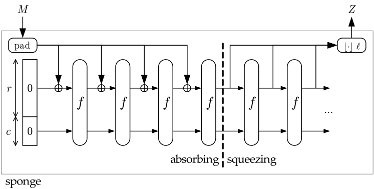
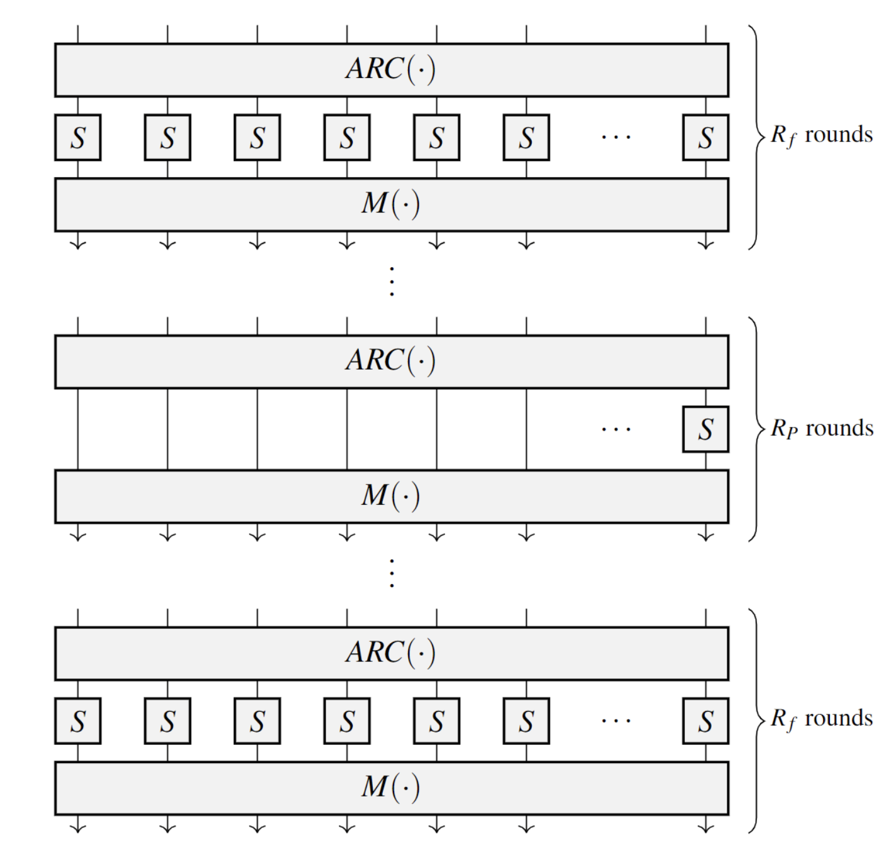
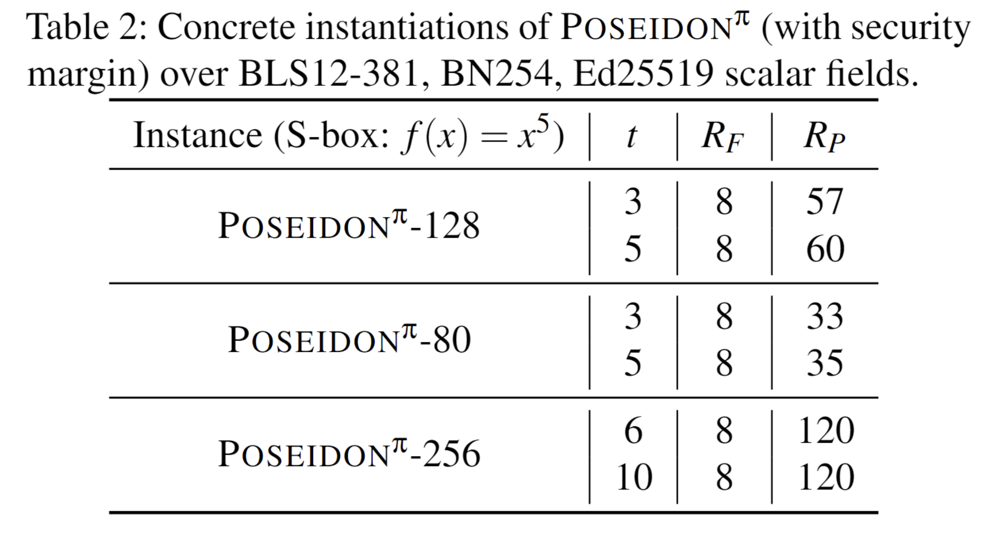

# Poseidon Hash Function

> [!WARNING]
>
> This doc is not verified

Reference: [Poseidon Hash Function](https://eprint.iacr.org/2019/458)

## Motivation

The $\mathrm{POSEIDON}$ hash function family is designed based on the $\mathrm{HADES}$ strategy and aims to improve the calculation
speed and security level of the [R1CS](https://learn.0xparc.org/materials/circom/additional-learning-resources/r1cs%20explainer/)
circuit and AET circuit.

## The $\mathrm{POSEIDON}$ Hash Function 

We propose the hash function $\mathrm{POSEIDON}$, which maps strings over $\mathbb{F}_p$ (for a prime $p \approx 2^n > 2^{31}$) to
fixed-length strings over $\mathbb{F}_p$ ($\mathrm{POSEIDON}: \mathbb{F}^*_p \to \mathbb{F}^o_p$), where $o$ is the output length
measured in $\mathbb{F}_p$ elements (usually $o = 1$). It is constructed by instantiating a sponge function with the
$\mathrm{POSEIDON}^\pi$ permutation.

We sometimes use the notation $p \approx 2^n$ and $N = n\cdot t \approx \log_2(p) \cdot t$ to denote the approximate size of the texts
in bits.

### Sponge Construction for $\mathrm{POSIEDON}^\pi$

---

#### Sponges

---

A sponge construction builds upon an internal permutation, which is defined by two parameters, the rate (or arity in the context of
tree hashing) $r$ and the capacity (or inner part) $c$. The rate determines the throughput, the capacity is crucial for the security
level. This means when fixing the size of the internal permutation to $N$ bits, a tradeoff between throughput and security has to be
made.

Here is an example, where the construction is used to compute the hash output $h_1\ \parallel\ h_2$ of the block message
$m_1\ \parallel\ m_2\ \parallel\ m_3\ \parallel\ m_4$,
where $m_i$ and $h_i$ are $r$-bit values. The initial state $I$ contains all zeros.

#### Sponge Security

---
Given the size $N$ of the permutation and a security level $s$, we can hash $r = N - 2s$ bits per call to the permutation. Following
this strategy, we choose the round's number of the inner permutation $\mathrm{POSEIDON}^\pi$ to ensure that a permutation does not
exhibit non-generic properties up to $2^M$ queries, where $M$ is the desired security level. For this, we set the capacity to $2M$ and
denote by $\mathrm{POSEIDON}-M$ a hash function that provides $M$ bits of security against collision and preimage attacks.

#### $\mathrm{POSEIDON}^\pi$ Sponges

---

We provide several $\mathrm{POSEIDON}$ instances for different use cases, but they all use the sponge construction in the same way:

1. Depending on the use case, determine the value of the capacity element and apply input padding if needed.
2. Split the obtained input into chunks of size $r$.
3. Apply the permutation $\mathrm{POSEIDON}^\pi$ to the capacity element and the first chunk.
4. Until no more chunks are left, add them into the state and apply the permutation.
5. Output $o$ output elements out of the rate part of the state. If needed, iterate the permutation more times.

### The $\mathrm{HADES}$ Design Strategy for Hashing

---

In $\mathrm{HADES}$, we mix rounds with full S-box layers and rounds with partial S-box layers. The motivation to have different types
of rounds is that full S-box layers are expensive in software and ZK-proof systems but are good protection against statistical attacks
when partial layers are relatively economical, but in some cases, they are similarly good as full ones against algebraic attacks.

#### Details on the $\mathrm{HADES}$ Strategy

---

The $\mathrm{HADES}$ design strategy consists of $R_f$ rounds in the beginning, in which S-boxes are applied to the full state. After
these rounds, $R_p$ rounds in the middle contain only a single S-boxes in each round, and the rest of the state goes through the
nonlinear layer unchanged. Finally, $R_f$ rounds at the end are applied by again using S-boxes for the full state.

The idea of this approach is to provide arguments for the security against statistical attacks using the $R_F=2R_f$ rounds with full
S-box layers at the beginning and the end together with the wide trail strategy. On the other hand, the $R_p$ rounds with a partial
S-box layer are a more efficient way to increase the degree of the overall function and are mainly used for arguments against algebraic
attacks.

#### The Round Function

---

Each round function consists of 3 parts:

1. $AddRoundConstants$, denoted by $ARC(\cdot)$.
2. $SubWords$, denoted by $\mathrm{S-box}(\cdot)$ or by $SB(\cdot)$.
3. $MixLayer$, denoted by $M({\cdot})$.

The $MixLayer$ operation is the linear layer, and it consists of multiplying the state a $t\times t$
[MDS matrix](https://en.wikipedia.org/wiki/MDS_matrix), to apply the wide
trail strategy.

In total, we get:

$`
\underbrace{ARC\to SB\to M}_\mathrm{first\ round}\to
\dots\ \to\underbrace{ARC\to SB\to M}_\mathrm{(R-1)-th\ round}\to
\underbrace{ARC\to SB\to M}_\mathrm{R-th\ round}
`$

While $ARC(\cdot)$ and $M(\cdot)$ are the same in each round, the number of S-boxes is different:

- $R_f+R_f=R_F$ rounds have full S-box layer, i.e., $t$ S-box functions, and
- $R_p$ rounds have partial S-box layer, i.e., 1 S-box and $(t-1)$ identity functions.

#### Interaction Between Full and Partial Rounds

---

If we use the same number of full rounds as the partial rounds in the middle, it will not decrease the security, but the costs will be
higher. However, if we replace $t$ partial round with one full round, the costs in our target application will be similar. However, the
security may be decreased because of a significantly lower degree of 1 full round compared to $t$ partial rounds.

### The Permutation Family $\mathrm{POSEIDON}^\pi$

---
The combination of full and partial rounds allows us to make strong arguments about security while exploiting the smaller number of
S-boxes in the partial rounds to gain efficiency.

The primary application is hashing in large prime fields, hence $\mathrm{POSEIDON}^\pi$ takes inputs of $t \ge 2$ words in
$\mathbb{F}_p$, where $p$ is a prime of size $p\approx 2^n > 2^{30}$.

#### The S-Box Layer

---

For our target applications, we focus on the $\alpha$-power S-box, defined by $\mathrm{S-box}(x) = x^\alpha$, where $\alpha \ge 3$ is
the smallest positive integer that satisfies $\mathrm{gcd}(\alpha,\ p-1) =1$. These permutations are called
$x^\alpha-\mathrm{POSEIDON}^\pi$.

Examples are given by $\alpha = 3\ (x^3-\mathrm{POSEIDON}^\pi)$ if $p\ne1$ mod $3$, or $\alpha=5\ (x^5-\mathrm{POSEIDON}^\pi)$ if
$p=1\ \mathrm{mod}\ 3$ and $p\ne1\ \mathrm{mod}\ 5$.

We focus on the S-box $x^5$ because it is suitable for two of the most prime fields in ZK applications, concrete the prime subfields of
the scalar field of the [BLS12-381](./bls12-381.md) and $\mathrm{BN254}$ curves.

#### The Linear Layer

---

A $t\times t$ MDS matrix with elements in $\mathbb{F}_p$ exists if $2t+1\le p$.

Given $p$ and $t$, there are several ways to construct an MDS matrix.
One of them is using a [Cauchy matrix](https://en.wikipedia.org/wiki/Cauchy_matrix).
For $x_i, y_i \in \mathbb{F}_p$, where $i\in [1,\ t]$, the entries of the matrix $\mathcal{M}$ are defined by:

$$
\mathcal{M}_{i,\ j} = \frac{1}{x_i+y_j}
$$

where the entries of $`\{x_i\}_{1\le i\le t}`$ and $`\{y_j\}_{1\le j\le t}`$ are pairwise distinct and $x_i +y_j \ne0$, where $`i\in
\{1,...t\}`$, and $`j\in \{1,...t\}`$.

#### Avoiding Insecure Matrices

---

Not all the MDS matrices have the same security level. In particular, the matrix $\mathcal{M}$ must prevent the possibility to set up:

1. invariant (or iterative) subspace trails (or equivalently, truncated differentials) with inactive S-boxes over $t-1$ rounds, or
2. invariant (or iterative) subspace trails with active S-boxes for any number of rounds.

Regarding the first point, let $\mathcal{S}^i$ be the subspace s.t no S-box is active in the first $i$ consecutive rounds, that is

$\mathcal{S}^{(i)}:=\{v \in \mathbb{F}^t\ |\ [\mathcal{M}^j \cdot v]_0=0\in \mathbb{F}, i < j\}$, where

- $[x]_0$ denotes the first word of $x\in \mathbb{F}^t,\ \mathcal{S}^{(0)} = \mathbb{F}^t$,
- $\texttt{dim}(\mathcal{S}^{(i)}) \ge t-i$.

For each pair of texts $(x,\ y)$ in the same coset of $\mathcal(S)^i$, no S-boxes are active in the first $i$ rounds. Hence, a
truncated differential can be set up for the first $i \le t-1$ rounds. The matrix $\mathcal{M}$ must be chosen s.t no subspace trails
with inactive/active S-boxes can be set up for more than $t-1$ rounds.

We suggest the following method to generate matrices:

1. Randomly select pairwise distinct $`\{x_i\}_{1\le i\le t}`$ and $`\{y_j\}_{1\le j\le t}`$,
   where $x_i+y_j\ne 0$, $`i \in \{1, ..., t\}`$,$`j \in \{1, ..., t\}`$.
2. Determine if the matrix is secure using this [Algorithm](https://extgit.iaik.tugraz.at/krypto/linear-layer-tool). For a secure
   matrix, no infinite long (invariant and/or iterative) subspace trails can be set up for all rounds with partial S-box layers.
3. Repeat this procedure until a secure matrix is found.

To summarize, this approach allows us to ensure that our MDS matrices do not exhibit vulnerabilities, and our instantiations are thus
secure against this specific type of attack.

## Concrete Instantiations of $\mathrm{POSEIDON}^\pi$

### Main Instances

---

We present $\mathrm{POSEIDON}^\pi$ permutations for such prime fields. The S-box function is $x^5$ for all cases.

The security level $M$ of 80 and 128 bits corresponds to a 255-bit capacity. We focus on two possible widths $t=3$ and $t=5$,
corresponding to popular cases of 2-to-1 and 4-to-1 compression functions. In the Merkle tree case, this corresponds to trees of arity
2 and 4, respectively. The round numbers for 80 and 128 bits are given here.

All our MDS matrices are Cauchy matrices.

The round constants and matrices are generated by using the [Grain LFSR](https://eprint.iacr.org/2009/109.pdf). This method ensures
that with the same parameter, different encryption will use distinct round constants due to the dependence on the specific instance.
Note that by using the Grain LFSR and instance-specific seed values, this approach is reminiscent of nothing-up-my-sleeve (NUMS)
numbers. Indeed, letting the attacker freely choose round constants and/or matrices may lead to attacks.

Some elements like round constants, matrices, test vectors, and scripts are available
[here](https://extgit.iaik.tugraz.at/krypto/hadeshash).

### Domain Separation for $\mathrm{POSEIDON}$

---

$\mathrm{POSEIDON}$ can be adapted for various applications. A single instance might not be ideal, and some protocols require distinct
functions. To address this, the approach suggests incorporating the specific use case within the function itself (since it has ample
space) and using padding to differentiate inputs of varying lengths. While the exact format for this separation isn't critical for
security, a standardized method is recommended for consistency across different implementations.

Concretely, we propose:

- Merkle tree (all leaves are present, up to 23 arity). The capacity is $2^{arity} - 1$.
- Merkle tree (some leaves may be empty). The capacity value equals the bitmask of which leaf are present.
- Variable-Input-Length hashing. The capacity value is $2^{64} + (o-1)$ where $o$ is the input length. The padding consists of one
  field element being 1, and the remaining elements being 0.
- Constant-Input-Length hashing. The capacity value is $lenght\cdot (2^{64}) + (o-1)$ where $o$ is the output length. The padding
  consists of field elements being 0.
- Encryption. The capacity value is $2^{32}$. The padding consists of field elements being 0.
- Future uses. The capacity value is $identifier\cdot (2^{32})$. The padding depends on the application.

## $\mathrm{POSEIDON}$ In Zero-Knowledge Proof Systems

This hash function is designed to be friendly to zero-knowledge applications. We aim to minimize the proof generation time, the proof
size, and the specific verification time.

### SNARKs with $\mathrm{POSEIDON}^\pi$

---

You should read about SNARK [here](./zkSNARK.md).

In SNARKS, the prime field is the scalar field of some pairing-friendly elliptic curve. The primitive $\mathrm{POSEIDON}^\pi$ can be
represented as a circuit with few gates, but the parameters of $\mathrm{POSEIDON}^\pi$ have been determined first by $p$. After $p$ is
fixed, we check if $x^\alpha$ is invertible in $\mathrm{GF}(p)$, which is true if $p$ mod $\alpha \ne 1$.

### PLONK

---

You should read about PLONK [here](../docs/plonk.md).

In PLONK, $\mathrm{POSEIDON}$ is used as a permutation function, specifically for the S-box operation within the circuit. The prover
complexity for a $\mathrm{POSEIDON}^\pi$ permutation with the S-box $x^5$ of width $w$ and $R$ rounds is $11(w(w+6)+3)R$ point
multiplication, and the proof has seven group elements and seven field elements.

We suggest optimizing the PLONK compiler as follows:

- Define a separate polynomial for each S-box line.
- Get rid of wire layout polynomials.
- Express round transitions as a system of affine equations over polynomial values at adjacent point.

The optimized PLONK compiler makes $(w+11)R$ point multiplications for a single permutation call. The proof consists of $(w+3)$ group
elements and $2w$ field elements. This might bring a 25-40x increase in performance depending on $w$.

### STARKs with $\mathrm{POSEIDON}^\pi$

---

You should read about STARK [here](./zkSTARK.md).

The primitive $\mathrm{POSEIDON}^\pi$ can be represented as a program with few registers, a small number of steps, and low degree.
Setting $w=t$, we get $T = R_F +[R_P/t]$ and $wT = tR_F+R_P$. The complexity is as follows:

- $24(tR_F+R_P)\cdot\log_2(tR_F+R_P)$ operations for the prover,
- a prover memory in $\Omega(63\cdot(tR_F+R_P))$,
- a communication (verifier time) of $63\cdot(t+\log_2^2(24(tR_F+R_P)))$.
