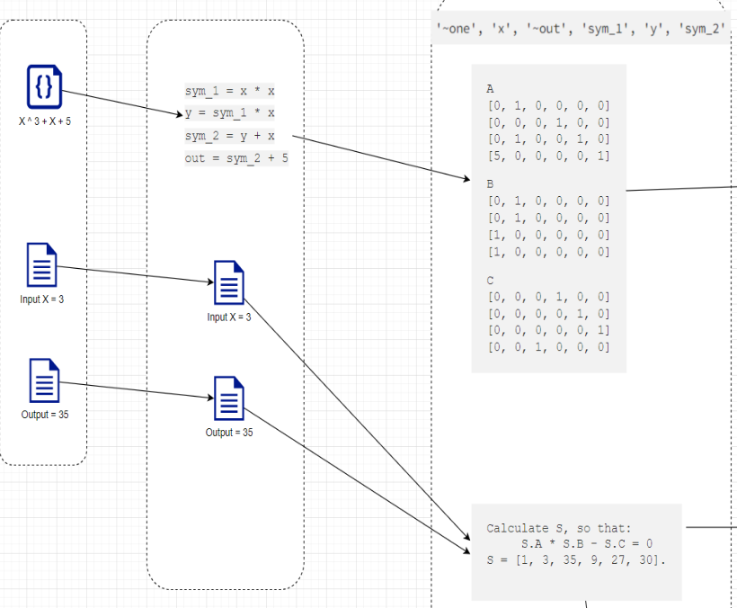

# R1CS

## R1CS

The R1CS (Rank One Constraint System) structure consists of sparse matrices 
$A, B, C$. An R1CS instance
consists of public inputs and outputs $x$ and is satisfied by a witness $W$ if:
$(A \cdot Z) \circ (B \cdot Z) = C \cdot Z$ where $Z = (W, x, 1)$.

For example: 

In this picture, we consider $S$ as our assignment $Z$ above. Here, the public
input and output is $out$, the witness $W$ is $(sym_1, y, sym_2, x)$ and $one$ 
is $1$.

For further details, see this [slide](../presentations/zk_overall.pptx).

## Relaxed R1CS

The relaxed R1CS structure consists of sparse matrices $A, B, C$. In addition,
its instance consists of an error vector $E$, a scalar $u$ and public inputs 
and outputs $x$. An instance $(E, u, x)$ satisfied by a witness $W$ if:
$(A \cdot Z) \circ (B \cdot Z) = u \cdot (C \cdot Z) + E$, where $Z = (W, x, u)$.

Any R1CS instance can be expressed as a relaxed R1CS instance by
augmenting it with $u=1$ and $E = 0$.

## Committed Relaxed R1CS

Consider a finite field $\mathbb{F}$ and a commitment scheme $Com$ over $\mathbb{F}$.
The committed Relaxed R1CS structure consists of sparse matrices 
$A, B, C$. Its instance is a tuple 
$(\bar E, u, \bar W, x)$, where $\bar E$ and $\bar W$ are commitments
, $u$ is a scalar, $x$ is public IO. An instance $(\bar E, u, \bar W, x)$ is 
satisfied by a witness $(E, r_E, W, r_W)$ if:
- $\bar E = Com(E, r_E)$
- $\bar W = Com(W, r_W)$
- $(A \cdot Z) \circ (B \cdot Z) = u \cdot (C \cdot Z) + E$  where $Z = (W, x, u)$.