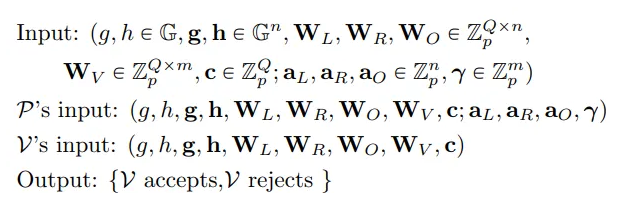

# Uniform Reference String (URS)

URS stands as an alternative category within the realm of [CRS](common_reference_string.md). Unlike **CRS**, it does not encode the
relation and does not necessarily give succinctness of the scheme. Instead, it focuses on achieving agreement between the prover and
verifier on specific randomness and public parameters.

For example:

In this representation, the common part between the prover’s input ($P$) and the verifier’s input ($V$) is the
[CRS](common_reference_string.md) for the Bulletproofs construction. Notably, the $W$ terms are linear in the size of the relation ,
but do not encode it explicitly, hence a URS.
