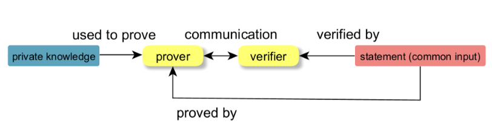
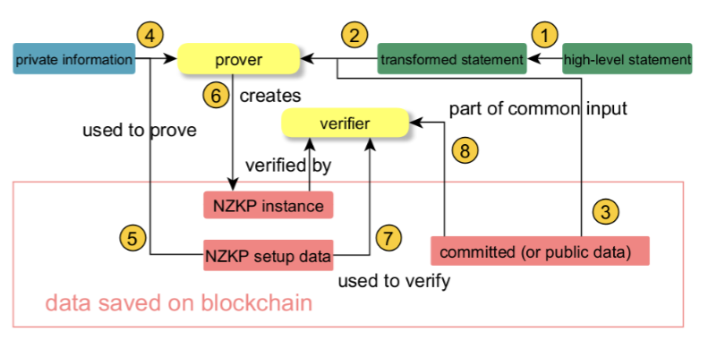

# Zero knowledge proof (ZKP)

[seminar-innovative-internet-technologies.pdf](../articles/seminar-innovative-internet-technologies/NET-2022-07-1_08.pdf)

<!-- TOC -->

* [Zero knowledge proof (ZKP)](#zero-knowledge-proof-zkp)
  * [Definition](#definition)
  * [Applications](#applications)
  * [Properties](#properties)
    * [Completeness](#completeness)
    * [Soundness](#soundness)
    * [Zero knowledge](#zero-knowledge)
  * [Types](#types)
    * [Interactive ZKPs](#interactive-zkps)
    * [Non-interactive ZKPs](#non-interactive-zkps)
  * [Blackbox Workflow of a ZKP](#blackbox-workflow-of-a-zkp)
  * [Up-to-date technologies](#up-to-date-technologies)

<!-- TOC -->

## Definition

* Problem: $x \in L$ ? Given language $L$ and input $x$
* $x$ and $L$ are public
* [witness](witness.md) is the secret information

A ZKP system consists of the above decision problem and two programs *verifier* and *prover* so that: the *verifier* can
verify that [argument](arguments.md) without knowing the witness.

## Applications

## Properties

### Completeness

For every $x \in L$ the *truthful* prover can convince the verifier with **HIGH** probability (e.g. $~100\%$).

*perfect completeness* = $~100\%$.

### Soundness

For every $x \notin L$ the *untruthful* prover can convince the verifier with **LOW** probability (e.g. $~0\%$).

### Zero knowledge

* Perfect zero knowledge: The verifier cannot gain anything.
* Computational zero knowledge: The verifier cannot gain anything polynomially bounded computation time except with a
  negligible small probability difference.

## Types

### Interactive ZKPs

The prover and verifier need to communicate with each other in multiple rounds to reach the final conclusion.

### Non-interactive ZKPs

The proofs must be verifiable by any verifiers without any interaction with the prover.

A must where the proofs must be publicly verifiable like in blockchain.

Normally converting from
[zkSNARK](zkSNARK.md)
[zkSTARK](zkSTARK.md)

## Blackbox Workflow of a ZKP

1. The [statement](statement.md) over the common input is transformed into the input type usable by the zero knowledge
   proof.
2. Some low level representation like boolean or arithmetic circuits.
3. This problem representation is then used by the prover to either do an interactive proof or to generate the
   non-interactive proof over the common input(3) and its private information(4) using the proving key of the setup
   data (5).
4. The verifier checks this (non-)interactively using (the common verification key (7) of the setup data and) the input
   data of the proof (8).

## Up-to-date technologies

<https://l2beat.com/scaling/summary#active>
